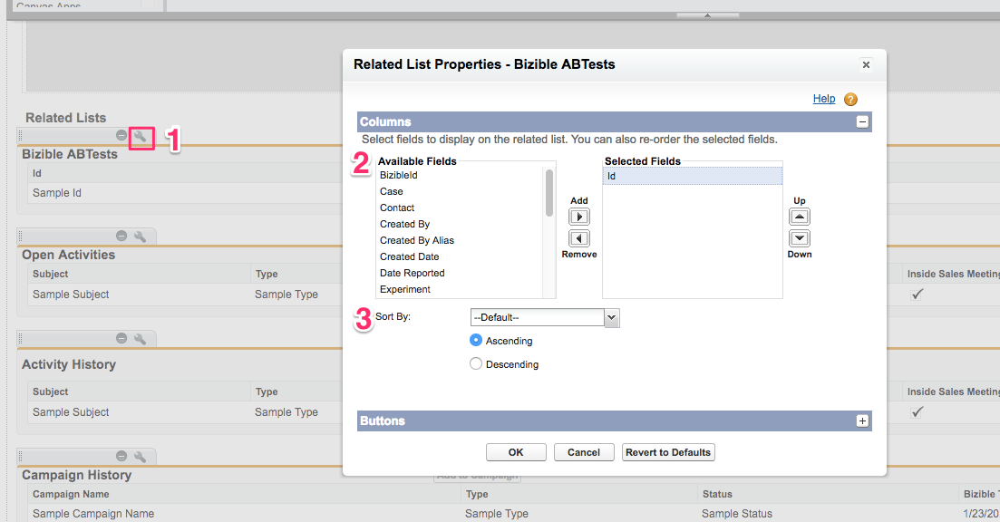

# Configuración e informes de pruebas A/B {#a-b-testing-set-up-and-reporting}

La variable [!DNL Marketo Measure] La integración de la prueba A/B le permite realizar un seguimiento del impacto en los ingresos de su [Optimizar](https://optimizely.com/){target=&quot;_blank&quot;} y experimentos de sitios de VWO. En estas guías se proporcionan instrucciones sobre cómo agregar [!DNL Marketo Measure] secciones Prueba A/B al posible cliente, [!UICONTROL Contacto], Case y [!UICONTROL Oportunidad] diseños de página. También cubriremos las prácticas generales de informes y recomendaciones para ejecutar [!DNL Marketo Measure] Tipos de informes A/B.

## Configurar {#set-up}

Agregue la variable [!DNL Marketo Measure] Secciones de prueba A/B sobre posible cliente, contacto, caso y oportunidad. [!DNL Marketo Measure] La integración de la prueba A/B le permite realizar un seguimiento del impacto en los ingresos de su [Optimizar](https://optimizely.com/){target=&quot;_blank&quot;} y [VWO](https://vwo.com/){target=&quot;_blank&quot;} experimentos en el sitio.

1. Verifique que está utilizando el paquete [!DNL Marketo Measure] v3.9 o posterior. Para ello, vaya a [!UICONTROL Salesforce] >[!UICONTROL Configurar] > [!UICONTROL Paquetes instalados].
1. Edite el diseño de la página de posibles clientes y añada la variable **[!DNL Marketo Measure]Pruebas A/B** Lista relacionada a la página.

   

1. Haga clic en el [!UICONTROL Llave] botón. Elimine el campo &quot;Id&quot; de stock de la lista de campos Seleccionados. Agregar **[!UICONTROL Experimento]**, **[!UICONTROL Variación]** y **[!UICONTROL Fecha de informe]** campos. Cambiar &quot;[!UICONTROL Ordenar por]&quot; **[!UICONTROL Fecha de informe]** y seleccione **[!UICONTROL Descendente]** en la lista desplegable .

   

1. En [!UICONTROL Botones], desmarcar **[!UICONTROL Nuevo]**.

   

1. Póngase en contacto con su [!DNL Marketo Measure] rep o [Asistencia de Marketo](https://nation.marketo.com/t5/support/ct-p/Support){target=&quot;_blank&quot;} para habilitar la función.

## Informes {#reporting}

Los clientes tienen acceso a un par de [!DNL Marketo Measure] Tipos de informes A/B que le permiten informar sobre pruebas A/B en relación con posibles clientes, contactos y oportunidades:

* [!DNL Marketo Measure] A/BTests
* [!DNL Marketo Measure] A/BTests con contacto
* [!DNL Marketo Measure] A/BTests con posible cliente
* [!DNL Marketo Measure] Pruebas A/BT con oportunidad

Los tipos de informes A/B se utilizan para informar sobre qué posible cliente o contacto u oportunidad se ha expuesto a una prueba A/B. Además, estos informes pueden mostrar la cantidad de ingresos vinculada a una oportunidad que se expuso a una prueba A/B.

Es importante tener en cuenta que Optimizely/VWO es una plataforma de variación de contenido y no un canal de marketing. Por lo tanto, estas [!DNL Marketo Measure] Los tipos de informes A/B se utilizan de forma diferente a los informes de puntos de contacto del comprador. Los tipos de informes de puntos de contacto del comprador se utilizan para comprender qué canal de marketing (p. ej., publicidad de pago, direccionamiento web, social) ha conducido un posible cliente o contacto a una página específica. Sin embargo, [!DNL Marketo Measure] Los tipos de informes A/B no se pueden usar para informar sobre cómo una variación influyó en un posible cliente u oportunidad. Además, como una variación de prueba A/B no es un canal, los detalles sobre la variación no aparecerán en el punto de contacto del Comprador.

Estos son algunos campos comunes que recomendamos utilizar al informar sobre una prueba A/B para ayudar a aumentar la claridad y la perspectiva:

* Posible cliente convertido
* Experimento
* ID del experimento
* Variación
* ID de variación
* Fecha de informe

## [!DNL Salesforce] Informes de ejemplo {#salesforce-example-reports}

**[!DNL Marketo Measure]Prueba A/B con posible cliente**

**[!DNL Marketo Measure]Prueba A/B con oportunidad**

