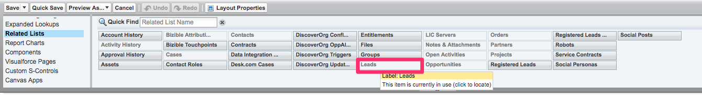

# Resumen de marketing basado en cuentas {#account-based-marketing-overview}

A continuación se ofrece una breve descripción general de ABM, los componentes de la [!DNL Marketo Measure] Función ABM y cómo añadirla a su [!DNL Salesforce] diseño de página. Para obtener más información sobre ABM, consulte [esta página](https://www.marketo.com/account-based-marketing/){target="_blank"}.

Para navegar directamente a las instrucciones para configurar ABM dentro de su [!DNL Salesforce] ejemplo, por favor [haga clic aquí](/help/advanced-marketo-measure-features/account-based-marketing/account-based-marketing-overview.md#setting-up-abm-page-layout-in-salesforce){target="_blank"}.

## Qué es ABM {#what-is-abm}

El marketing basado en cuentas, ABM, es una estrategia de marketing en la que se dirige y vende a empresas y cuentas en su conjunto, no solo como individuos. [!DNL Marketo Measure] ayuda a los equipos de marketing y ventas a ejecutar estrategias ABM exitosas con su funcionalidad de asignación de cliente potencial a cuenta y su puntuación de participación predictiva.

Para que nuestro modelo de marketing basado en cuentas empiece a rellenarse en su CRM, [!DNL Marketo Measure] necesita que se cumplan los siguientes criterios:

* Su CRM necesita al menos 25 cuentas que tengan al menos una oportunidad ganada cerrada, para que podamos evaluar mejor los aspectos comunes de una cuenta/oportunidad &quot;exitosa&quot; para su negocio.
* En la otra cara de la moneda, su CRM necesita al menos 25 cuentas sin ninguna oportunidad ganada cerrada (todas las opps deben estar en nuestra categoría de etapa &quot;abierta&quot; o en una categoría &quot;perdida cerrada&quot; - esto nos ayuda a medir lo que hace una cuenta de menor grado en su organización.

>[!NOTE]
>
>Las cuentas &quot;malas&quot; anteriores deben estar abiertas durante al menos 12 meses sin acumular una opp Cerrada Ganada; esa es nuestra guía básica para saber si una opp se ha quedado obsoleta o no para los fines del modelo.

## Asignación de cliente potencial a cuenta {#lead-to-account-mapping}

La asignación de plomo a cuenta es una parte crucial de un enfoque eficaz de gestión por actividades. Con la asignación de posible cliente a cuenta, los posibles clientes o posibles clientes se agrupan en la misma cuenta de compañía a medida que interactúan con la marca. Esto le permite dirigirse a particulares de la misma compañía y venderlos de forma coherente. No hay más [!DNL Salesforce] necesaria para comenzar a beneficiarse de esta función. El [!DNL Marketo Measure] Asignación de clientes potenciales a cuentas con cinco métodos de coincidencia diferentes:

* Sitio web principal a Sitio web de cuenta
* Enviar dominio de correo electrónico al dominio del sitio web de cuentas
* Nombre de la compañía del posible cliente al nombre de cuenta
* Compañía directora en el dominio del sitio web de cuentas
* Hacer coincidir el dominio de la dirección de correo electrónico del posible cliente con la cuenta a través de la dirección de correo electrónico del contacto

>[!NOTE]
>
>Se intenta hacer coincidir cada posible cliente con una cuenta en el orden preferencial de métodos anterior. Una vez que se establece una coincidencia, AccountId se establece inmediatamente en el posible cliente y no se comparará con otro método. Si el posible cliente ya tiene un AccountId válido, se omite el posible cliente.

## Puntuación de participación predictiva {#predictive-engagement-score}

El [!DNL Marketo Measure] La puntuación de participación predictiva, o PES, es un valor dinámico que ilustra el compromiso de una cuenta en particular con sus esfuerzos de marketing. Esta puntuación es útil para segmentar cuentas a destinatario. Es una herramienta valiosa para identificar cuentas a las que dirigirse de forma más eficaz y eficiente.

Hay muchos componentes que entran en el algoritmo que calcula el PES. La actualización y la edad influyen en gran medida en los cambios de puntuación, junto con la actividad del último punto de contacto o las vistas de página. Añadir nuevos contactos a una cuenta también afecta a PES. A continuación se muestra una lista de algunas entradas de PES:

* Número total de vistas de página desde la cuenta
* Cantidad promedio de vistas de página
* Número promedio de personas en la cuenta
* Antigüedad de la última vista de página
* Edad promedio de las vistas de página
* Número de personas en la cuenta
* Páginas importantes específicas y si ha habido una visita en los últimos 30/60/90 días
* Si la cuenta tiene una operación perdida/ganada cerrada
* Qué probabilidades hay de que se cierre perdido/ganado

>[!NOTE]
>
>Puede observar un grado de &quot;N/A&quot; o &quot;-&quot; (el símbolo del guión) en su Puntuación de participación predictiva para algunas cuentas.

_Una calificación de &quot;N/A&quot; simplemente significa que no tenemos datos suficientes aún por esa razón para que nuestro modelo genere una calificación verdadera - con más datos, una calificación será dada eventualmente._
_Un grado de &quot;-&quot; (el símbolo de guión) significa que esta cuenta aún no ha sido procesada por nuestro proceso ABM, debido a limitaciones de tiempo, procesos ocasionalmente incumplidos, etc. Si cree que una cuenta debe tener una calificación basada en otras cuentas o marcos de tiempo similares, póngase en contacto con y deje que [!DNL Marketo Measure] Lo sé._

## Configuración del diseño de página ABM en [!DNL Salesforce] {#setting-up-abm-page-layout-in-salesforce}

Para empezar a utilizar PES, simplemente debe añadir el campo PES y la lista relacionada a los diseños de página adecuados en [!DNL Salesforce].

1. Vaya a **[!UICONTROL Configurar]** > **[!UICONTROL Personalizar]** > **[!UICONTROL Cuentas]** > **[!UICONTROL Diseño de página]**. A continuación, seleccione el diseño de página que desee editar.
1. Ir a [!UICONTROL Campos] y mueva el campo &quot;Puntuación de participación predictiva&quot; a la sección Información de la cuenta.

   

1. Finalmente, vaya a [!UICONTROL Listas relacionadas] y mueva la Lista relacionada &quot;Posibles clientes&quot; al diseño de página.

   

1. A continuación, vaya a **[!UICONTROL Configurar]** > **[!UICONTROL Personalizar]** > **[!UICONTROL Posibles clientes]** > **[!UICONTROL Diseño de página]** y seleccione los diseños de página adecuados que desee editar.
1. Clic **[!UICONTROL Campos]** y añada el [!UICONTROL Cuenta] campo en el que se ve que cabe en la página.

   

¡Ya está todo listo!

