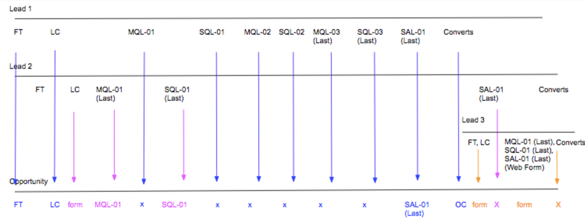

# Escenarios de fase de boomerang {#boomerang-stage-scenarios}

A continuación se presentan algunos ejemplos de escenarios de Boomerang Stage para comprender cómo [!DNL Marketo Measure] creará puntos de contacto en cada situación.

## Escenarios de posible cliente únicos {#single-lead-scenarios}

**Escenario 1: Puntos de contacto estándar de Boomerang para un posible cliente**

Este es el escenario más simple de Boomerang. La línea superior (denominada Lead 1) representa el recorrido individual de los posibles clientes y cómo aparecen sus puntos de contacto en el registro de posibles clientes. La línea de base (denominada Oportunidad) muestra cómo se traducen los puntos de contacto de los posibles clientes en la Oportunidad. La progresión de los puntos de contacto se explicará en la ocurrencia cronológica, de izquierda a derecha.

En este escenario, un cliente ha elegido tener su **MQL** y **SQL** escenarios rastreados con Boomerangs. Cada posición de punto de contacto de Boomerang se etiquetará con el escenario y el número en que se produce (MQL-01, SQL-01, MQL-02.. etc). El último punto de contacto de boomerang para esa fase también tendrá &quot;(Último)&quot; en la posición del punto de contacto.

A continuación, el posible cliente 1 se convierte en un contacto con una oportunidad, que se considera el contacto OC.

**Escenario 2: Puntos de contacto Boomerang Y etapas personalizadas para un posible cliente**

En esta situación, un cliente solo ha elegido realizar el seguimiento de la variable **Etapa SQL** con puntos de contacto boomerang. Las etapas de MQL y SAL aún se están rastreando, pero con la variable [!DNL Marketo Measure] función de escenario personalizado.

Observe que la posición del punto de contacto MQL no está etiquetada con un número. Esto se debe a que no se seleccionó para rastrearse con puntos de contacto de Boomerang. Al crear puntos de contacto para escenarios incluidos en el modelo personalizado, pero no se rastrean con Boomerang, [!DNL Marketo Measure] tomará la última ocurrencia desde esa etapa.

En el caso de la fase SAL, [!DNL Marketo Measure] ignora las dos primeras instancias de este paso. [!DNL Marketo Measure] solo crea un punto de contacto SAL para la variable _last_ ocurrencia. En el ejemplo anterior, esto sucede justo antes del punto de contacto OC.

Se está realizando un seguimiento del escenario SQL con puntos de contacto de Boomerang y se han creado y etiquetado tres puntos de contacto en consecuencia.

A continuación, el posible cliente 1 se convierte en un contacto con una oportunidad, que se considera el contacto OC.

**Escenario 3: Cuando los posibles clientes no alcanzan ni omiten un escenario**

Este escenario utiliza los mismos criterios que el escenario 2. Un cliente solo ha elegido realizar el seguimiento del escenario SQL con puntos de contacto boomerang. MQL y SAL siguen siendo rastreados, pero con la variable [!DNL Marketo Measure] función de escenario personalizado.

En este escenario, el posible cliente nunca pasa realmente a la fase SAL. Se convierte en un Contacto antes de llegar a la etapa de SAL, esencialmente &quot;saltando&quot; el escenario de SAL. En esta situación, [!DNL Marketo Measure] supondrá que la SAL se produce con el punto de contacto OC, y tanto la posición SAL como OC aparecerán en el mismo punto de contacto.

A continuación, el posible cliente 1 se convierte en un contacto con una oportunidad, que se considera el contacto OC.

## Escenarios con varios posibles clientes {#scenarios-with-multiple-leads}

Los siguientes escenarios son donde los escenarios de Boomerang pueden complicarse más, ya que estamos viendo cómo múltiples posibles clientes pueden influir en el recorrido de Oportunidades.

La línea superior (denominada Lead 1, en azul) representa el recorrido de cada posible cliente y cómo aparecen sus puntos de contacto en el registro de posible cliente. Lo mismo se aplica al Lead 2 (en rosa) y al Lead 3 (en naranja). La línea de base (denominada Oportunidad) muestra cómo se traducen ambos puntos de contacto de posibles clientes en Oportunidad. La progresión de los puntos de contacto se explicará en la ocurrencia cronológica, de izquierda a derecha.

**Escenario 1: [!UICONTROL Tres posibles clientes con oportunidad]**

En esta situación, un cliente ha elegido realizar el seguimiento de la variable **MQL** y **Fases SAL** con puntos de contacto boomerang. El paso SQL se está rastreando en las etapas personalizadas estándar.

Los puntos de contacto FT y LC de la Oportunidad provendrán del Lead 1 (azul), ya que se produjeron antes de FT y LC del Lead 2 (rosa). El punto de contacto LC para el posible cliente 2 aparecerá como punto de contacto &quot;Formulario&quot; en la oportunidad.

El MQL-01 (Último) de Lead 2 se convertirá en el primer MQL en la oportunidad. El MQL-01 de Lead 1 no aparecerá como punto de contacto en la oportunidad porque el MQL de Lead 2 se produjo primero. Sin embargo, MQL-02 y MQL-03 de Lead 1 aparecerán en la oportunidad.

Tenga en cuenta que el escenario SQL se está rastreando con etapas personalizadas y no con etapas boomerang. Aunque hay tres ocurrencias del escenario SQL entre Lead 1 y Lead 2, solo la última ocurrencia SQL se incluirá como punto de contacto en la oportunidad.

El punto de contacto SAL-01 (último) del Lead 1 se transfiere como punto de contacto en la oportunidad. A continuación, el posible cliente 1 se convierte en un contacto con una oportunidad, que se considera el contacto OC. El punto de contacto SAL-01 (último) del posible cliente 2 se creará como punto de contacto porque se produjo esta transición de fase _after_ el toque OC.

Los puntos de contacto FT, LC y MQL del líder 3, SQL, SAL (naranja) se produjeron después del punto de contacto OC en la oportunidad. Estos puntos de contacto se incluirán en la oportunidad, pero se considerarán &quot;toques intermedios&quot;.

Cuando el posible cliente 2 y 3 se convierte en contactos, [!DNL Marketo Measure] no creará otro punto de contacto OC porque solo puede haber una fase de creación de oportunidades.

**Escenario 2: [!UICONTROL Tres posibles clientes con oportunidad]**

En esta situación, un cliente ha elegido realizar el seguimiento de la variable **MQL**, **SQL** y **SAL** escenarios con puntos de contacto boomerang.

Todos los puntos de contacto del Lead 1 se incluirán en la oportunidad, de FT a SAL-01 (Último). El punto de contacto LC de Lead 2 se incluirá como punto de contacto de formulario entre los puntos de contacto LC y MQL-01 en la oportunidad.

El MQL-01 (Último) de Lead 2 acaba siendo el punto de contacto MQL-04 (Último) sobre la oportunidad. Debido a que este escenario está buscando múltiples recorridos de posibles clientes dentro de una oportunidad, la colocación y numeración de los puntos de contacto de los posibles clientes puede cambiar cuando se traduzcan como puntos de contacto en la oportunidad. Del mismo modo, el SQL-01 (último) del posible cliente 2 se convierte en el SQL-04 (último) de la Opp. SAL-01 (Último) de Lead 2 también se convierte en el SAL-02 (Último) de la Oportunidad.

Además, tenga en cuenta que solo hay 2 puntos de contacto SAL incluidos en la oportunidad. [!DNL Marketo Measure] no intentará forzar o crear puntos de contacto para transiciones de escenario si no han ocurrido realmente.

El recorrido de punto de contacto del Lead 3 comienza justo antes de que se produzca el contacto con OC, pero mucho después de que el Lead 1 y el Lead 2 tuvieran su contacto con FT y LC. En este caso, la FT y la LC del Lead 3 aparecerán como un punto de contacto del formulario en la oportunidad. A continuación, el posible cliente 1 se convierte en un contacto con una oportunidad, que se considera el contacto OC.

Los toques MQL, SQL y SAL del posible cliente 3 ocurren al mismo tiempo, después del contacto OC. Dado que se produjeron después del punto de contacto OC, este punto de contacto aparecerá como Formulario/Contacto medio en la oportunidad en lugar de como una transición de escenario de Boomerang.

**Escenario 2a: puntos de contacto de Boomerang de visita web**

En esta situación, un cliente ha elegido realizar el seguimiento de la variable **MQL**, **SQL** y **SAL** escenarios con puntos de contacto boomerang. Este escenario es casi idéntico al anterior, con algunas excepciones.

Todos los puntos de contacto del Lead 1 se incluirán en la oportunidad, de FT a SAL-01 (Último). El punto de contacto LC de Lead 2 se incluirá como punto de contacto de formulario entre los puntos de contacto LC y MQL-01 en la oportunidad.

El MQL-01 (Último) del posible cliente 2 (Visita web) no se creará como punto de contacto en el Opp. Esto se debe a que este punto de contacto fue una visita web que se produce después de la última incidencia del escenario SQL y no ayuda a impulsar la oportunidad hacia adelante.

El paso del posible cliente 1 cambia a SAL y, a continuación, se convierte en un contacto con una oportunidad; en este caso, la posición SAL-01 (último) y OC se combinarán en el mismo punto de contacto.

El contacto FT,LC del posible cliente 3 se creará como un punto de contacto del formulario en la opción Opp. Solo las acciones de relleno del formulario se crearán como puntos de contacto después del contacto OC. Por este motivo, las transiciones de las etapas SQL-01 (último) y SAL-01 (último) para el posible cliente dos no se crearán como puntos de contacto porque estos puntos de contacto eran visitas web.

Los toques de MQL, SQL y SAL del posible cliente 3 se incluirán como punto de contacto porque se trataba de una acción de rellenado de formularios.

**Escenario 3: Ponderación de atribución de Boomerang**

En esta situación, un cliente ha elegido realizar el seguimiento de la variable **MQL**, **SQL** y **SAL** escenarios con puntos de contacto boomerang.

Los puntos de contacto FT y LC de la Oportunidad provendrán del Lead 1 (azul), ya que se produjeron antes de FT y LC del Lead 2 (rosa). El punto de contacto LC para el posible cliente 2 aparecerá como punto de contacto &quot;Formulario&quot; en la oportunidad.

El MQL-01 (Último) de Lead 2 se convertirá en el primer MQL en la oportunidad. El MQL-01 de Lead 1 no aparecerá como punto de contacto en la oportunidad porque el MQL de Lead 2 se produjo primero.

El SQL-01 (último) del posible cliente 2 se convertirá en SQL-01 en la oportunidad. El SQL-01 del posible cliente 1 no aparecerá como punto de contacto en la oportunidad porque el SQL-01 del posible cliente 2 se produjo primero.

Observe que Lead 1 boomerangs entre MQL y SQL un par de veces antes de finalmente alcanzar la fase SAL. SQL-01, MQL-02, SQL-02, MQL-03, SQL-03 _will not_ se incluyan como puntos de contacto sobre la oportunidad, ya que estas transiciones de fase no ayudan a impulsar la oportunidad en el recorrido.

El punto de contacto SAL-01 (último) del posible cliente 1 será el siguiente punto de contacto que se incluirá en la Opp. A continuación, el posible cliente 1 se convierte en un contacto con una oportunidad, lo que crea el punto de contacto OC.

El FT y LC del líder 3, y el punto de contacto MQL, SQL y SAL, aparecerán como un formulario que afecta a la oportunidad.

El punto de contacto SQL-01 (último) del posible cliente 2 no se incluirá como punto de contacto en el punto de contacto Opp porque se produjo después del punto de contacto OC. Además, se produjo la transición de etapa SQL del posible cliente 2 _después de la transición final de la fase SAL_, y no ayuda a impulsar el recorrido de oportunidad.

## Escenarios de oportunidad {#opportunity-scenarios}

**Escenario 1: contactos con oportunidad y seguimiento de boomerang**

En esta situación, un cliente ha elegido realizar el seguimiento de la variable **Transiciones de fase de demostración y negociación** en el **Contacto**. Cada escenario de boomerang puede recibir hasta dos puntos de contacto. La diferencia entre las transiciones de etapa en una transición de Contacto frente a etapa en un posible cliente es que las transiciones de etapa de contacto pueden aparecer como puntos de contacto de Boomerang en la oportunidad _after_ el punto de contacto OC. Esto no ocurre en el caso de las transiciones de etapa que se producen en el posible cliente, ya que aparecerán como un punto de contacto del formulario.

En este ejemplo, las transiciones de la fase de demostración y negociación de Contact 1 se incluyen como puntos de contacto Demo-01 y Negociación-01 en la oportunidad. Se produce la transición de etapa de demostración del Contacto 2 _after_ Contacte con el punto de contacto 1 y aparecerá como el punto de contacto Demo-02 (último) de la oportunidad.

Observe que no hay una segunda transición a la fase de negociación; la oportunidad salta inmediatamente de Demo-02 (Último) se mueve a Close Won. En este caso, [!DNL Marketo Measure] incluirá la transición de negociación con el punto de contacto de Closed Won.
