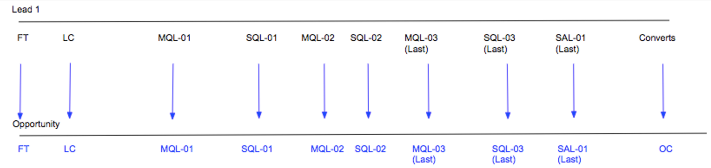
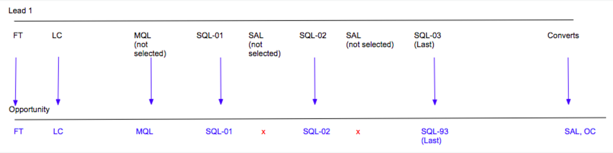
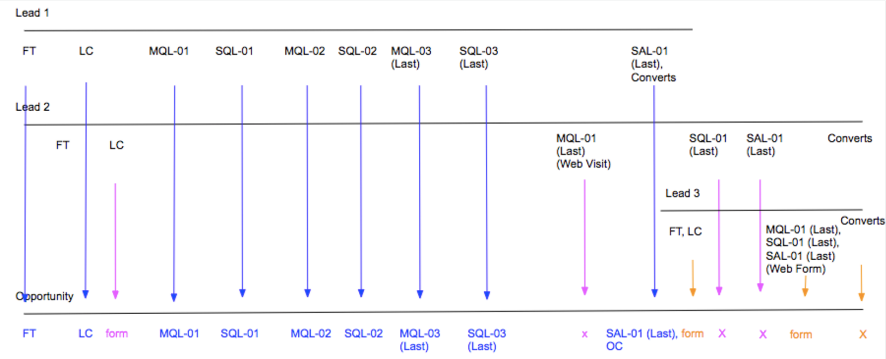

# Escenarios de fases de Boomerang {#boomerang-stage-scenarios}

>[!AVAILABILITY]
>
>La función Boomerang solo está habilitada para clientes de nivel 3. Para solicitar un nivel de cuenta superior, póngase en contacto con el equipo de cuenta de Adobe (su administrador de cuentas).

A continuación se muestran algunos ejemplos de escenarios del Escenario Boomerang para comprender cómo [!DNL Marketo Measure] creará puntos de contacto en cada situación.

## Escenarios de posible cliente único {#single-lead-scenarios}

**Escenario 1: puntos de contacto estándar de boomerang para un posible cliente**

Este es el escenario más simple de Boomerang. La línea superior (con la etiqueta Posible cliente 1) representa el recorrido de cada posible cliente y cómo aparecen sus puntos de contacto en el registro de posibles clientes. La línea inferior (con la etiqueta Oportunidad) muestra cómo los puntos de contacto de los posibles clientes se traducen en la oportunidad. La progresión de los puntos de contacto se explicará en caso de ocurrencia cronológica, de izquierda a derecha.

En esta situación, un cliente ha elegido que su **MQL** y **SQL** Las etapas se rastrean con Boomerangs. Cada posición de punto de contacto de Boomerang se etiquetará con la etapa y el número en el que se produce (MQL-01, SQL-01, MQL-02. etc). El último punto de contacto boomerang para esa etapa también tendrá &quot;(último)&quot; en la posición del punto de contacto.

El posible cliente 1 se convierte en un contacto con una oportunidad, que se considera el contacto OC.

**Escenario 2: puntos de contacto boomerang y etapas personalizadas para un posible cliente**

En esta situación, un cliente ha elegido rastrear únicamente la variable **Fase SQL** con puntos de contacto boomerang. Las fases MQL y SAL se siguen rastreando, pero con el [!DNL Marketo Measure] Función de escenario personalizada.

Observe que la posición del punto de contacto de MQL no está etiquetada con un número. Esto se debe a que no se seleccionó para rastrearse con puntos de contacto Boomerang. Al crear puntos de contacto para las fases incluidas en el modelo personalizado, pero que no se rastrean con Boomerang, [!DNL Marketo Measure] tomará la última ocurrencia de esa etapa.

En el caso de la fase SAL, [!DNL Marketo Measure] ignora las dos primeras ocurrencias de esta fase. [!DNL Marketo Measure] solo crea un punto de contacto SAL para _último_ Ocurrencia. En el ejemplo anterior, esto sucede justo antes del punto de contacto OC.

La etapa SQL se rastrea con puntos de contacto boomerang, y se han creado y etiquetado tres puntos de contacto en consecuencia.

El posible cliente 1 se convierte en un contacto con una oportunidad, que se considera el contacto OC.

**Escenario 3: cuando los posibles clientes no llegan a una fase u la omiten**

Este escenario utiliza los mismos criterios que el escenario 2. Un cliente solo ha elegido rastrear la fase SQL con puntos de contacto boomerang. MQL y SAL aún se siguen rastreando, pero con el [!DNL Marketo Measure] Función de escenario personalizada.

En este escenario, el posible cliente nunca pasa realmente a la fase de SAL. Se convierte en un Contacto antes de que llegue a la fase de SAL, esencialmente &quot;saltándose&quot; la fase de SAL. En esta situación, [!DNL Marketo Measure] supondrá que la SAL se produce con el punto de contacto de OC y que tanto la posición de SAL como la de OC aparecen en el mismo punto de contacto.

El posible cliente 1 se convierte en un contacto con una oportunidad, que se considera el contacto OC.

## Escenarios con varios posibles clientes {#scenarios-with-multiple-leads}

Los siguientes escenarios son donde las etapas de boomerang pueden complicarse más, ya que estamos viendo cómo múltiples posibles clientes pueden influir en el recorrido de oportunidad.

La línea superior (con la etiqueta Posible cliente 1 en azul) representa el recorrido de cada posible cliente y cómo aparecen sus puntos de contacto en el registro de posibles clientes. Lo mismo se aplica al plomo 2 (en rosa) y al plomo 3 (en naranja). La línea inferior (con la etiqueta Oportunidad) muestra cómo los puntos de contacto de estos posibles clientes se traducen en la oportunidad. La progresión de los puntos de contacto se explicará en caso de ocurrencia cronológica, de izquierda a derecha.

**Escenario 1: [!UICONTROL Tres posibles clientes con oportunidad]**

En esta situación, un cliente ha elegido realizar el seguimiento de **MQL** y **Fases SAL** con puntos de contacto boomerang. Las fases personalizadas estándar están realizando un seguimiento de la fase SQL.

Los puntos de contacto FT y LC de la oportunidad procederán del posible cliente 1 (azul), porque se produjeron antes de la FT y la LC del posible cliente 2 (rosa). El punto de contacto LC para el posible cliente 2 aparecerá como un punto de contacto de &quot;Formulario&quot; en la oportunidad.

El MQL-01 (último) del posible cliente 2 se convertirá en el primer MQL de la oportunidad. El MQL-01 del posible cliente 1 no aparecerá como punto de contacto en la oportunidad porque el MQL del posible cliente 2 se produjo primero. Sin embargo, el MQL-02 y el MQL-03 del posible cliente 1 aparecerán en la oportunidad.

Tenga en cuenta que la fase SQL se rastrea con fases personalizadas y no con fases boomerang. Aunque hay tres incidencias de la fase SQL entre el posible cliente 1 y el posible cliente 2, solo la última incidencia SQL se incluirá como punto de contacto en la oportunidad.

El punto de contacto SAL-01 (último) del cliente potencial 1 se transfiere como punto de contacto en la oportunidad. El posible cliente 1 se convierte en un contacto con una oportunidad, que se considera el contacto OC. El punto de contacto SAL-01 (último) del posible cliente 2 se creará como punto de contacto porque se produjo esta transición de fase _después_ el toque OC.

Los puntos de contacto FT, LC y MQL, SQL, SAL (naranja) del posible cliente 3 se produjeron después del punto de contacto OC en la oportunidad. Estos puntos de contacto se incluirán en la oportunidad, pero se consideran &quot;toques intermedios&quot;.

Cuando el posible cliente 2 y 3 se convierten en contactos, [!DNL Marketo Measure] no creará otro punto de contacto de OC porque solo puede haber una etapa de creación de oportunidad.

**Escenario 2 - [!UICONTROL Tres posibles clientes con oportunidad]**

En esta situación, un cliente ha elegido realizar el seguimiento de **MQL**, **SQL**, y **SAL** fases con puntos de contacto boomerang.

Todos los puntos de contacto del cliente potencial 1 se incluirán en la oportunidad, desde FT hasta SAL-01 (último). El punto de contacto LC de Lead 2 se incluirá como punto de contacto de formulario entre los puntos de contacto LC y MQL-01 en la oportunidad.

El MQL-01 (último) del posible cliente 2 termina siendo el punto de contacto MQL-04 (último) de la oportunidad. Debido a que este escenario busca varios recorridos de posibles clientes dentro de una oportunidad, el posicionamiento y la numeración de los puntos de contacto de los posibles clientes pueden cambiar cuando se traducen como puntos de contacto en la oportunidad. Del mismo modo, el SQL-01 (último) del posible cliente 2 se convierte en el SQL-04 (último) del Opp. El SAL-01 (último) del posible cliente 2 también se convierte en el SAL-02 (último) de la oportunidad.

Además, observe que solo hay 2 puntos de contacto SAL incluidos en la oportunidad. [!DNL Marketo Measure] no intentará forzar/crear puntos de contacto para transiciones de fase si realmente no se han producido.

El recorrido del punto de contacto de Lead 3 comienza justo antes de que se produzca el contacto con OC, pero mucho después de que Lead 1 y Lead 2 tuvieran su contacto FT y LC. En este caso, FT y LC de Lead 3 aparecerán como un punto de contacto de formulario en la oportunidad. El posible cliente 1 se convierte en un contacto con una oportunidad, que se considera el contacto OC.

Los toques de MQL, SQL y SAL del posible cliente 3 se producen al mismo tiempo, después del contacto con OC. Dado que se produjeron después del punto de contacto de OC, este punto de contacto aparecerá como un formulario/contacto central en la oportunidad en lugar de como una transición de etapa Boomerang.

**Escenario 2a - Puntos de contacto de visita web de Boomerang**

En esta situación, un cliente ha elegido realizar el seguimiento de **MQL**, **SQL**, y **SAL** fases con puntos de contacto boomerang. Este escenario es casi idéntico al anterior, con algunas excepciones.

Todos los puntos de contacto del cliente potencial 1 se incluirán en la oportunidad, desde FT hasta SAL-01 (último). El punto de contacto LC de Lead 2 se incluirá como punto de contacto de formulario entre los puntos de contacto LC y MQL-01 en la oportunidad.

El MQL-01 (último) (visita web) del posible cliente 2 no se creará como punto de contacto en la Opp. Esto se debe a que este punto de contacto era una visita web que se produce después de la última aparición de la fase SQL y no ayuda a sacar adelante la oportunidad.

La etapa del posible cliente 1 cambia a SAL y, a continuación, se convierte en un contacto con una oportunidad; en este caso, la posición SAL-01 (última) y OC se combinarán en el mismo punto de contacto.

El contacto FT,LC de Lead 3 se creará como punto de contacto de Form en el Opp. Solo las acciones de rellenado de formulario se crearán como puntos de contacto después del contacto con OC. Por este motivo, las transiciones de fase SQL-01 (último) y SAL-01 (último) para el posible cliente dos no se crearán como puntos de contacto porque estos puntos de contacto fueron visitas web.

Los toques de MQL, SQL y SAL del posible cliente 3 se incluirán como punto de contacto porque era una acción de rellenado de formulario.

**Escenario 3: ponderación de atribución boomerang**

En esta situación, un cliente ha elegido realizar el seguimiento de **MQL**, **SQL**, y **SAL** fases con puntos de contacto boomerang.

Los puntos de contacto FT y LC de la oportunidad procederán del posible cliente 1 (azul), porque se produjeron antes de la FT y la LC del posible cliente 2 (rosa). El punto de contacto LC para el posible cliente 2 aparecerá como un punto de contacto de &quot;Formulario&quot; en la oportunidad.

El MQL-01 (último) del posible cliente 2 se convertirá en el primer MQL de la oportunidad. El MQL-01 del posible cliente 1 no aparecerá como punto de contacto en la oportunidad porque el MQL del posible cliente 2 se produjo primero.

El SQL-01 (último) del cliente potencial 2 se convertirá en SQL-01 en la oportunidad. El SQL-01 en el posible cliente 1 no aparecerá como punto de contacto en la oportunidad porque el SQL-01 en el posible cliente 2 se produjo primero.

Tenga en cuenta que el posible cliente 1 se interpone entre MQL y SQL un par de veces antes de alcanzar finalmente la fase SAL. SQL-01, MQL-02, SQL-02, MQL-03, SQL-03 _no_ se incluirán como puntos de contacto en la oportunidad, ya que estas transiciones de fase no ayudan a impulsar la oportunidad en el recorrido.

El punto de contacto SAL-01 (último) del posible cliente 1 será el siguiente punto de contacto que se incluirá en la Opp. A continuación, Lead 1 se convierte en un contacto con una oportunidad y crea el punto de contacto de OC.

FT y LC del posible cliente 3, y el punto de contacto MQL, SQL y SAL, aparecerán como un formulario que toca la oportunidad.

El punto de contacto SQL-01 (último) del posible cliente 2 no se incluirá como punto de contacto en la Opp porque se produjo después del punto de contacto de OC. Además, se produjo la transición de fase SQL del posible cliente 2 _después de la transición final de la fase SAL_ y no ayuda a impulsar el recorrido de oportunidades.

## Escenarios de oportunidad {#opportunity-scenarios}

**Escenario 1: contactos con oportunidad y seguimiento de bumerán**

En esta situación, un cliente ha elegido realizar el seguimiento de **Transiciones de fase de demostración y negociación** en el **Contacto**. Cada fase boomerang puede recibir hasta dos puntos de contacto. La diferencia entre las transiciones de fase de un contacto y las transiciones de fase de un posible cliente es que las transiciones de fase de contacto pueden aparecer como puntos de contacto Boomerang en la oportunidad _después_ el punto de contacto OC. Esto no es así para las transiciones de fase que se producen en el posible cliente, ya que aparecerán como un punto de contacto de formulario.

En este ejemplo, las transiciones de fase de demostración y negociación de Contact 1 se incluyen como puntos de contacto de Demo-01 y Negotiation-01 en la oportunidad. Se produce la transición de la fase de demostración de Contact 2 _después_ Contact 1, y aparece como el punto de contacto Demo-02 (último) en la oportunidad.

Observe que no hay una segunda transición a la fase Negociación; la oportunidad salta inmediatamente de Demo-02 (Último) se mueve a Cerrar ganado. En este caso, [!DNL Marketo Measure] incluirá la transición Negociación con el punto de contacto Cerrado obtenido.
