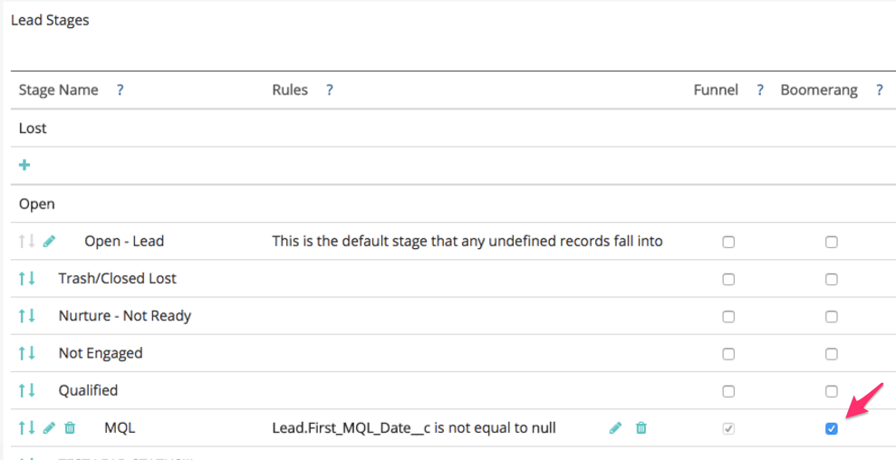

# Configuración de fases de Boomerang {#setting-up-boomerang-stages}

>[!AVAILABILITY]
>
>La función Boomerang solo está habilitada para clientes de nivel 2. Para solicitar un nivel de cuenta superior, póngase en contacto con el equipo de cuenta de Adobe (su administrador de cuentas).

Para habilitar las fases [!UICONTROL Boomerang] para tu cuenta, debes ser administrador de cuenta. O bien, se puede habilitar si se pone en contacto con el [Soporte técnico de Marketo](https://nation.marketo.com/t5/support/ct-p/Support){target="_blank"}. Una vez habilitada la función, siga estas instrucciones para configurarlas.

## Configuración de escenario boomerang {#boomerang-stage-setup}

1. Vaya a [!UICONTROL Asignación de etapas]. En la columna titulada &quot;[!UICONTROL Boomerang]&quot;, seleccione las casillas situadas junto a las fases que desee rastrear.

   

1. Vaya a la pestaña [!UICONTROL Configuración de atribución] e introduzca el número de puntos de contacto para cada fase que desee ver. Permitimos un máximo de 10. El valor predeterminado es 1.

   

1. Haga clic en **[!UICONTROL Guardar]**.

   >[!NOTE]
   >
   >Conceda un margen de 24 a 48 horas para que sus datos se vuelvan a procesar según estos cambios.

## Configuración de escenario boomerang con atribución de modelo personalizado {#boomerang-stage-setup-with-custom-model-attribution}

1. Vaya a [!UICONTROL Asignación de etapas]. En la columna titulada &quot;[!UICONTROL Boomerang]&quot;, seleccione las casillas situadas junto a las fases que desee rastrear.

   

1. Si también desea que estas fases de Boomerang se incluyan en el modelo personalizado y reciban crédito de atribución, asegúrese de seleccionar también la casilla debajo de la columna &quot;[!UICONTROL Modelo personalizado]&quot;.

   

1. Vaya a la pestaña [!UICONTROL Configuración de atribución]. Determine cómo le gustaría ponderar la atribución para las etapas de boomerang. Las opciones son ponderar la atribución en la primera incidencia, la última o dividirla uniformemente en todas las incidencias.

   

1. Introduzca el número de incidencias de cada fase que desee ver. Podemos permitir un máximo de diez. El valor predeterminado es 1.

   

1. Establezca el porcentaje de atribución que desee asignar a las etapas de boomerang que ha incluido en el modelo personalizado. Asegúrese de que la atribución total de todas las etapas sume el 100 %. Haga clic en **[!UICONTROL Guardar y procesar]**.

   

   >[!NOTE]
   >
   >Conceda un margen de 24 a 48 horas para que sus datos se vuelvan a procesar según estos cambios.
