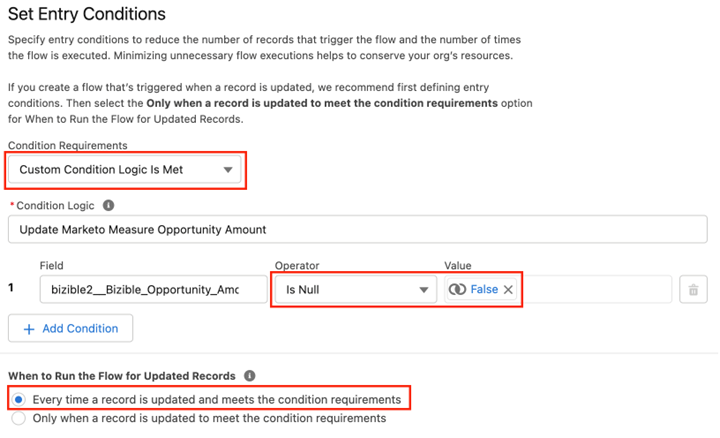

# Uso de un campo de importe de ingresos personalizado {#using-a-custom-revenue-amount-field}

De forma predeterminada, los puntos de contacto de atribución del comprador extraerán el importe de la oportunidad de uno de los dos campos siguientes:

* Importe (valor predeterminado de SFDC)
* [!DNL Marketo Measure] Importe de oportunidad (personalizado)

Si utilizas un campo de importe personalizado en tus oportunidades, necesitaremos configurar un flujo de trabajo para calcular los ingresos del punto de contacto del comprador. Esto requiere un conocimiento más avanzado de [!DNL Salesforce], por lo que puede requerir asistencia de su administrador de SFDC.

Para empezar, necesitaremos la siguiente información:

* Nombre de API del campo Importe

A partir de aquí, empezaremos a crear el flujo de trabajo.

## Creación del flujo de trabajo en Salesforce Lightning {#create-the-workflow-in-salesforce-lightning}

Los siguientes pasos están destinados a los usuarios de Salesforce Lightning. Si sigue utilizando Salesforce Classic, siga estos pasos [se enumeran a continuación](#create-the-workflow-in-salesforce-classic).

1. En Configuración, escriba &quot;Flujos&quot; en el Cuadro de búsqueda rápida y seleccione **Flujos** para iniciar el Generador de flujo. Haga clic en el panel derecho **Nuevo flujo** botón.

   

1. Seleccionar **Flujo activado por registros** y haga clic en **Crear** botón en la parte inferior derecha.

   

1. En la ventana Configurar inicio, seleccione el objeto Oportunidad. En la sección Configurar Déclencheur, seleccione **Se crea o actualiza un registro**.

   

1. En la sección Definir condiciones de entrada, en Requisitos de condición, seleccione **Se Cumple La Lógica De Condición Personalizada**.
   * En el campo de búsqueda, seleccione el campo Importe personalizado.
   * Establecer el operador como **Es nulo** y el valor como **Falso**.
   * Defina los criterios de evaluación en **Cada vez que se actualiza un registro y se cumplen los requisitos de condición**.

   

1. En la sección &quot;Optimizar el flujo para&quot;, seleccione **Actualizaciones rápidas de campos**. Clic **Listo**.

   

1. Para añadir el elemento, haga clic en el icono más (+) y seleccione **Actualizar registro de activación**.

   

1. En la ventana Nuevos registros de actualización, introduzca lo siguiente:

   * Introduzca una etiqueta: el nombre de la API se generará automáticamente
   * En &quot;Cómo buscar registros para actualizar y establecer sus valores&quot;, seleccione **Usar el registro de oportunidad que activó el flujo**.
   * En la sección &quot;Establecer condiciones de filtro&quot;, seleccione **Actualizar siempre el registro** como requisito para actualizar el registro.
   * En &quot;Establecer valores de campo para el registro de campaña&quot;, en el campo, seleccione Importe de oportunidad de Marketo Measure y asigne un valor al campo Importe personalizado.
   * Clic **Listo**.

   

1. Haga clic en **Guardar**. Aparecerá una ventana emergente. Escriba &quot;Flow Label&quot; en la ventana Save the Flow (el nombre de la API de flujo se generará automáticamente). Clic **Guardar** otra vez.

   

1. Haga clic en **Activar** para activar el flujo.

   

## Creación del flujo de trabajo en Salesforce Classic {#create-the-workflow-in-salesforce-classic}

Los siguientes pasos están destinados a los usuarios de Salesforce Classic. Si ha realizado el cambio a Salesforce Lightning, siga estos pasos [se puede encontrar arriba](#create-the-workflow-in-salesforce-lightning).

1. Vaya a **[!UICONTROL Configurar]** > **[!UICONTROL Crear]** > **[!UICONTROL Flujo de trabajo y aprobaciones]** > **[!UICONTROL Reglas de flujo de trabajo]**.

   

1. Seleccionar **[!UICONTROL Nueva regla]**, establezca el objeto como &quot;Oportunidad&quot; y haga clic en **[!UICONTROL Siguiente]**.

   

   

1. Configure el flujo de trabajo. Establezca el nombre de la regla como &quot;Actualizar&quot; [!DNL Marketo Measure] Importe de oportunidad&quot;. Defina los Criterios de evaluación en &quot;Creado&quot; y cada vez que se edite. En Criterios de regla, seleccione el campo Importe personalizado y seleccione el Operador [!UICONTROL como &quot;No es igual a&quot;] y deje el campo &quot;Valor&quot; en blanco.

   

1. Añada una acción de flujo de trabajo. Establecer esta lista desplegable en &quot;[!UICONTROL Nueva actualización de campo].&quot;
   

1. Aquí rellenará la información de campo. En el campo &quot;Nombre&quot;, se recomienda utilizar este nombre:[!DNL Marketo Measure] Importe de Opp.&quot; El &quot;Nombre único&quot; se rellenará automáticamente en función del campo &quot;Nombre&quot;. En la lista de selección &quot;Campo para actualizar&quot;, seleccione &quot;[!DNL Marketo Measure] Importe de oportunidad&quot;. Después de seleccionar el campo, seleccione la casilla &quot;Volver a evaluar las reglas de flujo de trabajo después de cambiar el campo&quot;. En &quot;Especificar nuevo valor de campo&quot;, seleccione &quot;Usar una fórmula para establecer el nuevo valor&quot;. En el cuadro vacío, suelte el nombre de API del campo Cantidad personalizado. Haga clic en **[!UICONTROL Guardar]**.

   

1. Se le volverá a una página de resumen para su flujo de trabajo, asegúrese de &quot;Activar&quot; y ya está listo para comenzar. Para activarlo, haga clic en **Editar** junto al nuevo flujo de trabajo y haga clic en **Activar**.

   Una vez que haya completado estos pasos, las oportunidades deberán actualizarse para almacenar en déclencheur el flujo de trabajo y obtener el nuevo valor de la variable [!UICONTROL oportunidad personalizada] field.

   Esto se puede lograr ejecutando sus oportunidades a través del Data Loader dentro de SFDC. Descubra los detalles sobre el uso del cargador de datos en [este artículo](/help/advanced-marketo-measure-features/custom-revenue-amount/using-data-loader-to-update-marketo-measure-custom-amount-field.md).

Si tiene alguna pregunta, no dude en ponerse en contacto con el equipo de cuenta de Adobe (su administrador de cuentas) o [[!DNL Marketo] Asistencia](https://nation.marketo.com/t5/support/ct-p/Support){target="_blank"}.
