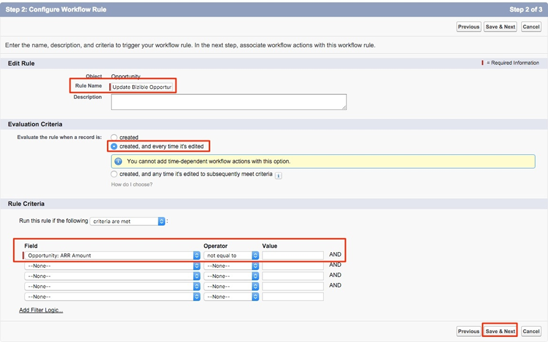

# Uso de un campo de importe de ingresos personalizado {#using-a-custom-revenue-amount-field}

De forma predeterminada, los puntos de contacto de atribución del comprador extraerán el importe de la oportunidad de uno de los dos campos siguientes:

* Importe (valor predeterminado de SFDC)
* [!DNL Marketo Measure] importe de oportunidad (personalizado)

Si utiliza un campo de importe personalizado en sus oportunidades, debemos configurar un flujo de trabajo para calcular los ingresos de Buyer Touchpoint. Se necesitan más conocimientos avanzados sobre [!DNL Salesforce], por lo que puede que necesite la asistencia de su administrador de SFDC.

Para empezar, necesitaremos la siguiente información:

* Nombre de API del campo Importe

A partir de aquí, empezaremos a crear el flujo de trabajo.

## Creación del flujo de trabajo en Salesforce Lightning {#create-the-workflow-in-salesforce-lightning}

Los siguientes pasos son para usuarios de Salesforce Lightning. Si todavía usa Salesforce Classic, esos pasos [se enumeran a continuación](#create-the-workflow-in-salesforce-classic).

1. En Configuración, escriba &quot;Flujos&quot; en el Cuadro de búsqueda rápida y seleccione **[!UICONTROL Flujos]** para iniciar el Generador de flujos. En el panel derecho, haga clic en el botón **[!UICONTROL Nuevo flujo]**.

   

1. Seleccione **[!UICONTROL Flujo activado por registros]** y haga clic en **[!UICONTROL Crear]** en la parte inferior derecha.

   

1. En la ventana Configurar inicio, seleccione el objeto Oportunidad. En la sección [!UICONTROL Configurar Déclencheur], seleccione **[!UICONTROL Se ha creado o actualizado un registro]**.

   

1. En la sección Establecer condiciones de entrada, en [!UICONTROL Requisitos de condición], seleccione **[!UICONTROL Se cumple la lógica de condición personalizada]**.
   * En el campo de búsqueda, seleccione el campo Importe personalizado.
   * Establezca el operador como **Is Null** y el valor como **[!UICONTROL False]**.
   * Establezca los criterios de evaluación en **[!UICONTROL Cada vez que se actualice un registro y se cumplan los requisitos de condición]**.

   

1. En la sección &quot;Optimizar el flujo para&quot;, seleccione **[!UICONTROL Actualizaciones rápidas de los campos]**. Haga clic en **[!UICONTROL Listo]** en la parte inferior derecha.

   

1. Para agregar el elemento, haga clic en el icono de signo más (+) y seleccione **[!UICONTROL Actualizar registro de activación]**.

   

1. En la ventana Nuevos registros de actualización, introduzca lo siguiente:

   * Introduzca una etiqueta: el nombre de la API se generará automáticamente
   * En &quot;Cómo buscar registros para actualizar y establecer sus valores&quot;, seleccione **[!UICONTROL Usar el registro de oportunidad que activó el flujo]**.
   * En la sección &quot;[!UICONTROL Establecer condiciones de filtro]&quot;, seleccione **[!UICONTROL Actualizar siempre el registro]** como requisito de condición para actualizar el registro.
   * En el campo &quot;[!UICONTROL Establecer valores de campo para el registro de campaña]&quot;, en, seleccione el importe de oportunidad de Marketo Measure (**bizible2__Bizible_Opportunity_Amount__c**) y el valor inicial. A continuación, seleccione el campo Importe personalizado.
   * Haga clic en **[!UICONTROL Finalizado]**.

   

1. Haga clic en **[!UICONTROL Guardar]**. Aparecerá una ventana emergente. Escriba &quot;Flow Label&quot; en la ventana Save the Flow (el nombre de la API de flujo se generará automáticamente). Vuelva a hacer clic en **[!UICONTROL Guardar]**.

   

1. Haga clic en el botón **[!UICONTROL Activar]** para activar el flujo.

   

## Creación del flujo de trabajo en Salesforce Classic {#create-the-workflow-in-salesforce-classic}

Los siguientes pasos son para usuarios de Salesforce Classic. Si has cambiado a Salesforce Lightning, esos pasos [se pueden encontrar arriba](#create-the-workflow-in-salesforce-lightning).

1. Vaya a **[!UICONTROL Configuración]** > **[!UICONTROL Crear]** > **[!UICONTROL Flujo de trabajo y aprobaciones]** > **[!UICONTROL Reglas de flujo de trabajo]**.

   

1. Seleccione **[!UICONTROL Nueva regla]**, establezca el objeto como &quot;Oportunidad&quot; y haga clic en **[!UICONTROL Siguiente]**.

   

   

1. Configure el flujo de trabajo. Establezca el nombre de la regla como &quot;Actualizar importe de oportunidad [!DNL Marketo Measure]&quot;. Defina los Criterios de evaluación en &quot;Creado&quot; y cada vez que se edite. Para los Criterios de regla, seleccione el campo Importe personalizado, seleccione el Operador [!UICONTROL como &quot;No es igual a&quot;] y deje el campo &quot;Valor&quot; en blanco.

   

1. Añada una acción de flujo de trabajo. Establezca esta lista de selección en &quot;[!UICONTROL Nueva actualización de campo]&quot;.
   

1. Aquí rellenará la información de campo. En el campo &quot;Nombre&quot;, se recomienda usar este nombre: &quot;[!DNL Marketo Measure] Importe de Opp.&quot; El &quot;Nombre único&quot; se rellenará automáticamente en función del campo &quot;Nombre&quot;. En la lista de selección &quot;Campo para actualizar&quot;, seleccione &quot;[!DNL Marketo Measure] Importe de oportunidad&quot;. Después de seleccionar el campo, seleccione la casilla &quot;Volver a evaluar las reglas de flujo de trabajo después de cambiar el campo&quot;. En &quot;Especificar nuevo valor de campo&quot;, seleccione &quot;Usar una fórmula para establecer el nuevo valor&quot;. En el cuadro vacío, suelte el nombre de API del campo Cantidad personalizado. Haga clic en **[!UICONTROL Guardar]**.

   

1. Se le volverá a una página de resumen para su flujo de trabajo, asegúrese de &quot;Activar&quot; y ya está listo para comenzar. Para activarlo, haz clic en **[!UICONTROL Editar]** junto a tu nuevo flujo de trabajo y luego haz clic en **[!UICONTROL Activar]**.

   Una vez que haya completado estos pasos, las oportunidades deberán actualizarse para que el flujo de trabajo almacene en déclencheur el nuevo valor del campo [!UICONTROL oportunidad personalizada].

   Esto se puede lograr ejecutando las oportunidades a través del Cargador de datos dentro de SFDC. Encuentre detalles sobre el uso del cargador de datos en [este artículo](/help/advanced-marketo-measure-features/custom-revenue-amount/using-data-loader-to-update-marketo-measure-custom-amount-field.md){target="_blank"}.

Si tiene alguna pregunta, no dude en ponerse en contacto con el equipo de cuenta de Adobe (su administrador de cuentas) o con [[!DNL Marketo] Asistencia](https://nation.marketo.com/t5/support/ct-p/Support){target="_blank"}.
