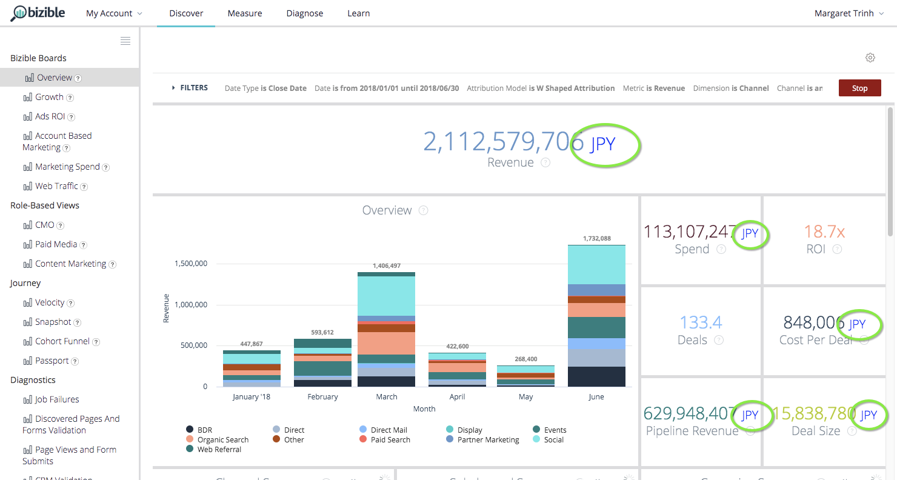

# Informes de Discover {#discover-reporting}

En [!UICONTROL Configuración de usuario], los usuarios tendrán la opción de cambiar la moneda predeterminada a cualquiera de las monedas corporativas que se enumeran. Esto cambiará la visualización de importes como Coste, Ingresos e Ingresos de canalización, por ejemplo, junto con el código de moneda de tres letras.

