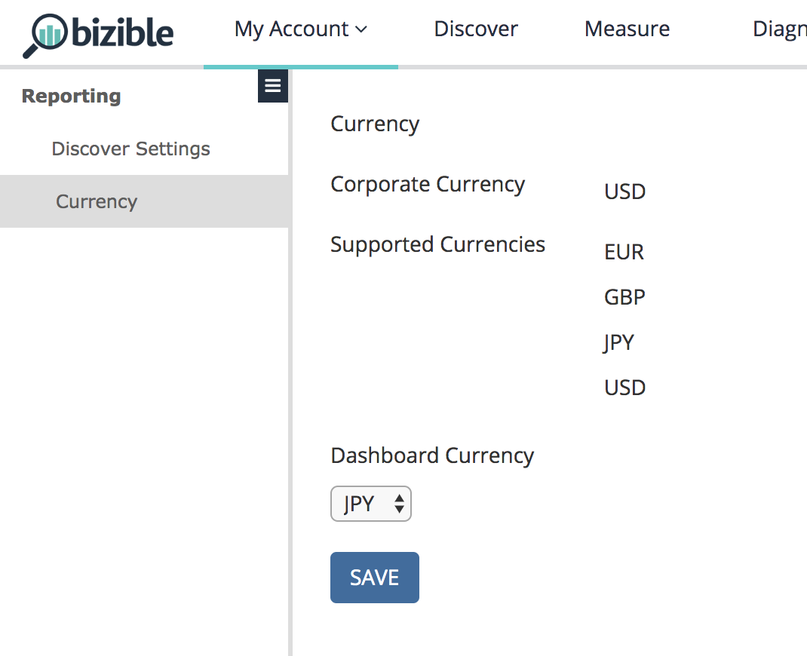

# Configuración {#settings}

Hay dos bits de características independientes vinculados a esta característica, ubicados en la ficha [!UICONTROL Configuración general] de CRM: Varias monedas y Monedas avanzadas.

**Varias monedas**: Habilitado si el cliente utiliza más de una sola moneda.

**Monedas avanzadas**: Un bit adicional que necesita habilitarse si el cliente usa la función &quot;Advanced Currency Management&quot; de Salesforce en la que el usuario puede establecer un intervalo basado en tiempo para las tasas de conversión.

En su [!UICONTROL configuración de usuario] en la aplicación [!DNL Marketo Measure], se mostrará la moneda corporativa y todas las monedas compatibles que se hayan extraído del CRM. Como todos estos valores se extraen del CRM, estos campos son de solo lectura y no se pueden cambiar. La moneda del panel es la moneda predeterminada cada vez que se carga un panel. Puede volver y cambiar la moneda según sea necesario.

