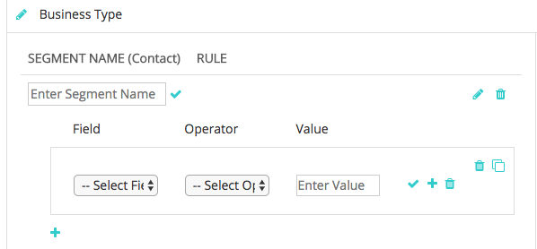

# Segmentación personalizada {#custom-segmentation}

Los segmentos proporcionan la capacidad de filtrar datos en la variable [!DNL Marketo Measure] Tablero de ROI para explorar más en profundidad un conjunto de datos específico. Por ejemplo, un segmento se puede definir por territorio geográfico o por sistema de clasificación.

**¿Por qué la segmentación personalizada?**

La función Segmentación personalizada le permite filtrar los puntos de contacto por una categoría y hasta por cinco segmentos. Según el objeto al que se dirija el guión de retorno de la inversión (posible cliente o contacto), puede crear segmentos basados en los campos encontrados en el objeto posible cliente/contacto. Además, podrá crear segmentos basados en cualquier campo que se encuentre en el objeto de oportunidad.

**¿Cuándo es útil la función Segmentación personalizada?**

La segmentación personalizada se puede utilizar para ver datos de un tipo de registro en particular. Una vez que asigne la lógica del filtro, debería poder ver en la [!DNL Marketo Measure] vista de cascada de demanda del tablero: los mismos datos que vería en su CRM.

**¿Cómo lo configuro?**

Paso 1: Determine qué información desea ver.

Antes de usar esta función, determine por qué información de puntos de contacto desea filtrar. Recuerde usar los valores exactos en su CRM para sus tipos de registro. La configuración filtrará los puntos de contacto de arriba a abajo del canal de marketing.

Paso 2: Inicie sesión y busque la función Segmentos .

* Vaya a [experience.adobe.com/marketo-measure](https://experience.adobe.com/marketo-measure){target="_blank"} e inicie sesión
* En el [!UICONTROL Mi cuenta] , seleccione [!UICONTROL Configuración]
* Select [!UICONTROL Segmentos] desde las opciones de la barra lateral a la izquierda, debajo de la [!UICONTROL Informes] sección

Paso 3: Comprender los componentes.

* Utilice esta leyenda para comprender los distintos iconos que se encuentran en esta página

Paso 4: Agregar reglas de filtro.

* Primero, introduzca el nombre de la categoría. Tipo de negocio es un ejemplo. Haga clic en la marca de verificación cuando haya terminado. Debe introducir un nombre de categoría para poder añadir segmentos
* Haga clic en el signo más para agregar un segmento
* Introduzca un nombre de segmento. Por ejemplo, puede tener un segmento para Nuevas operaciones, Socios, Renovación o Ventas adicionales

* Haga clic en el icono de signo más para mostrar los campos de entrada de la regla. Las opciones de la lista de selección de campos extraen los campos directamente de su CRM

>[!NOTE]
>
>Los campos de fórmula no se pueden usar dentro de las reglas y no aparecerán en la lista de selección. Dado que las fórmulas calculan en segundo plano y no modifican un registro, [!DNL Marketo Measure] no puede detectar si un registro se ajusta a una regla o no.

* La opción Value no es una lista desplegable y su valor debe introducirse manualmente. Asegúrese de comprobar los valores en su organización de Salesforce
* Repita este proceso para las reglas del segmento Oportunidades
* La categoría &quot;Otro&quot; es un segmento predeterminado que captura cualquier punto de contacto no definido. Puede cambiar el nombre predeterminado del segmento
* Haga clic en el icono de la papelera para eliminar una categoría completa o una regla individual de una categoría. También puede hacer clic en el icono de lápiz para editar la categoría o regla
* Verá que tiene un botón &quot;Guardar&quot; y un botón &quot;Guardar y procesar&quot;. Utilice el botón Guardar para guardar el trabajo y los cambios a lo largo del tiempo. Utilice el botón Guardar y procesar SOLO una vez que se haya asegurado de que:

   * La asignación es precisa
   * Ha añadido todos los segmentos que desea rastrear dentro de una categoría
   * Los déclencheur del botón Guardar y procesar [!DNL Marketo Measure] para sincronizar todos los puntos de contacto y aplicar la nueva información añadida. Este proceso tarda 7 días y las reglas no se pueden cambiar durante este periodo

**_Notas adicionales:_**

Si las reglas no están configuradas tanto para posibles clientes/contactos como para oportunidades, solo verá una parte de sus datos. Para obtener más información, si no configura las reglas de Oportunidades, solo verá los datos de posible cliente/contacto sin las Oportunidades asociadas a ellos. Lo mismo ocurre si no se configuran reglas para posibles clientes o contactos; solo se verán oportunidades sin los posibles clientes o contactos asociados.

Cuando haya terminado, haga clic en [!UICONTROL Guardar] primero, compruebe todo y, a continuación, haga clic en [!UICONTROL Guardar y procesar]. Recuerde que no podrá editar la configuración durante siete días al guardar y procesar, como [!DNL Marketo Measure] cambia el formato de los datos durante este tiempo.

**¿Cómo se guardan los informes generados?**

Los informes generados no se pueden guardar directamente en la interfaz de usuario. Sin embargo, [!DNL Marketo Measure] guarda los nombres de los segmentos en la dirección URL para que pueda mantener un registro de cada informe marcando la página.
