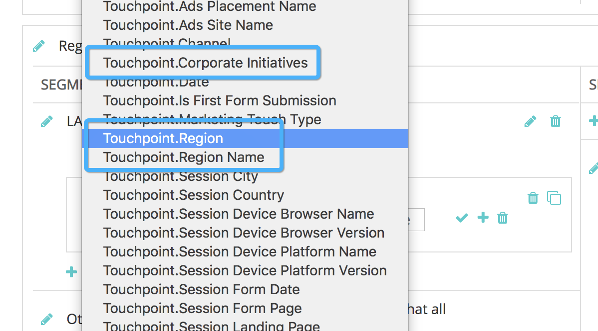

# Campos de puntos de contacto {#touchpoint-fields}

Históricamente, cuando los clientes incorporan con [!DNL Marketo Measure] y, en caso de que no tengamos una integración de etiquetado directo, nuestro equipo de éxito del cliente enseña a nuestros clientes cómo etiquetar correctamente sus páginas de aterrizaje para que utilicen el formato UTM correcto y podamos resolver sus anuncios. Algunos de estos clientes no utilizan UTM, sino que utilizan sus propios parámetros de etiquetado, lo que significa que puede llevar mucho tiempo editar todas las páginas de aterrizaje en todas las redes de anuncios con una nueva estructura de etiquetado que [!DNL Marketo Measure] aplica. Para adaptarse a su estructura de etiquetado, ahora aceptamos parámetros personalizados que se pueden asignar con nuestras definiciones de reglas. El objetivo es adaptarse al uso que hacen los clientes de sus parámetros de seguimiento personalizados, de modo que no tengamos que pedirles que cambien su estructura de URL.

>[!AVAILABILITY]
>
>Ahora disponible con segmentación completa en los niveles 2 y 3.

>[!NOTE]
>
>Se trata de una función avanzada y sólo debe configurarla Professional Services.

## Activación de la función {#enabling-the-feature}

Desde el [!DNL Marketo Measure] En el menú Configuración, vaya a la página Campos de punto de contacto. Desde allí, puede activar la función seleccionando **Sí** bajo **Habilitar campos calculados**. Una vez que esté habilitado, puede crear campos de punto de contacto.

## Cómo. {#how-to}

Para crear un campo calculado, tenga en cuenta que hay tres acciones diferentes que un usuario puede realizar: extracciones, asignaciones y concatenaciones. Estos también se conocen como los operadores para definir un campo calculado.

Extractos

El [!UICONTROL extractos] extrae el valor de un campo desde otra ubicación, como un campo de Campaign, un campo de posible cliente o en un caso de uso más avanzado, [extraer parámetros personalizados de la página de aterrizaje](https://docs.google.com/document/d/1NRViyCsXvPKbCTfGW32Yi2vWBjMDRF7bzkzKj9s2DDA/edit?ts=5e20b482#heading=h.xxwtissvw4){target="_blank"}. It then places it onto a Touchpoint Field (See [Maps To Example](https://docs.google.com/document/d/1NRViyCsXvPKbCTfGW32Yi2vWBjMDRF7bzkzKj9s2DDA/edit?ts=5e20b482#heading=h.xxwtissvw4){target="_blank"} #2).

**#1 de ejemplo**

Hay un campo personalizado en el contacto, campaign_source__c, que el cliente desea soltar en el punto de contacto para fines de creación de informes. Puede definir una regla para crear un campo calculado llamado &quot;Campaign Source&quot; y soltar el valor en ese campo.

Objetivo: Utilice el valor de un campo personalizado y colóquelo en el objeto Touchpoint para facilitar los informes.

* Cree un campo calculado y etiquete &quot;Origen de campaña&quot;
* Defina la regla empezando por la búsqueda del campo Contact.Campaign_Source__c
* Utilice el operador &quot;extract&quot;, ya que es necesario extraer el valor del parámetro
* Para extraer la cadena completa del campo, se utiliza la expresión &quot;(.&#42;)&quot;

   * **(** marca el inicio de la extracción
   * **)** marca el final de la extracción
   * **.&#42;** nos dice que estamos extrayendo la cadena completa

**#2 de ejemplo**

Un caso de uso común que habilita esta función es extraer valores de parámetros personalizados de una cadena de URL. Esto resulta útil si utiliza parámetros que no sean UTM pero desea analizar los valores en campos de punto de contacto.

**Vínculo:** `https://www.adobe.com/blog/marketing-revenue-reporting-overview?promo=5OFF` o `https://www.adobe.com/blog/marketing-revenue-reporting-overview?promo=25OFF`.\
**Objetivo:** Cree un campo personalizado llamado &quot;Código de descuento&quot; y suelte el valor &quot;5OFF&quot; o &quot;25OFF&quot;, independientemente del valor que apruebe.

* Cree un campo calculado y etiquete &quot;Código de descuento&quot;
* Defina la regla empezando por buscar el campo Touchpoint.Session.LandingPage
* Utilice el operador &quot;extract&quot;, ya que es necesario extraer el valor del parámetro
* Para extraer el valor de la promoción, definiremos el valor como &quot;promo=(\w+)&quot;

   * **(** marca el inicio de la extracción
   * **)** marca el final de la extracción
   * **\w** nos dice que estamos extrayendo una &quot;palabra&quot; que incluye 0-9
   * **+** extraerá el valor completo del parámetro sin límite de caracteres
   * Tenga en cuenta que está utilizando una barra diagonal y no una barra diagonal inversa

**#3 de ejemplo**

Pruebe un ejemplo similar en el que extraiga un código de seguimiento como: `https://www.adobe.com/blog/marketing-revenue-reporting-overview?cid=123456`.

**Objetivo:** Cree un campo calculado y etiquete &quot;Adobe Campaign Id&quot; con el valor del parámetro cid.

* Cree un campo calculado y etiquete &quot;Adobe Campaign ID&quot;
* Defina la regla empezando por buscar el campo Touchpoint.Session.LandingPage
* Utilice el operador &quot;extract&quot;, ya que es necesario extraer el valor del parámetro
* Para extraer el valor &quot;123456&quot;, definiremos el valor como &quot;cid=(\d{6})&quot;

   * **(** marca el inicio de la extracción
   * **)** marca el final de la extracción
   * **\d** nos dice que estamos extrayendo un &quot;dígito&quot;
   * **{6}** es el número de caracteres que extraemos

**#4 de ejemplo**

A medida que las páginas de aterrizaje se complican y tiene varios parámetros de seguimiento, es posible que tenga que crear varios campos de punto de contacto y extraer valores varias veces, como, por ejemplo:
`https://www.adobe.com/blog/marketing-revenue-reporting-overview?trackID=123456&country=US&campaign_ID=7890`.

**Objetivo:** Cree varios campos calculados para &quot;País de destino&quot; e &quot;ID de campaña personalizada&quot; con los valores respectivos de los parámetros.

* Cree un campo calculado y etiquete &quot;País de destino&quot;
* Defina la regla empezando por buscar el campo Touchpoint.Session.LandingPage
* Utilice el operador &quot;extract&quot;, ya que es necesario extraer el valor del parámetro
* Para extraer el valor &quot;US&quot;, definiremos el valor como &quot;country=(\w{2})&quot;

   * **(** marca el inicio de la extracción
   * **)** marca el final de la extracción
   * **\w** nos dice que estamos extrayendo una &quot;palabra&quot;
   * **{2}** es el número de caracteres que extraemos

* Cree un campo calculado y etiquete &quot;ID de campaña personalizado&quot;
* Defina la regla empezando por buscar el campo Touchpoint.Session.LandingPage
* Utilice el operador &quot;extract&quot;, ya que es necesario extraer el valor del parámetro
* Para extraer el valor &quot;123456&quot;, definiremos el valor como &quot;campaign_ID=(\d{6})&quot;

   * **(** marca el inicio de la extracción
   * **)** marca el final de la extracción
   * **\d** nos dice que estamos extrayendo un &quot;dígito&quot;
   * **{6}** es el número de caracteres que extraemos

**Mapas a**

El [!UICONTROL se asigna a] El operador crea una tabla de valores que deben traducirse o agruparse en otro valor. Normalmente, adopta la forma de un valor clave donde un código representa un nombre descriptivo y debe asignarse a ese nombre descriptivo.

**#1 de ejemplo**

Hay campañas que ha creado para una &quot;promoción de fin de verano&quot; y una &quot;promoción de Black Friday&quot; que se ejecutan en varios canales. Desea crear un campo calculado llamado &quot;Iniciativa&quot; y desea asignar cualquier punto de contacto con un valor de Iniciativa como &quot;Promoción de fin de verano&quot; o &quot;Promoción de Black Friday&quot; a un valor de Iniciativa como &quot;Promociones&quot;, además de otros valores posibles.

**#2 de ejemplo**

Ahora que hemos aprendido a extraer y asignar campos, combinemos esas acciones para extraer primero un valor de un parámetro y, a continuación, asignarlo a un nombre descriptivo que tenga un poco más de sentido. Empecemos con esta página de aterrizaje: `https://www.adobe.com/blog/marketing-revenue-reporting-overview?BZ=04-01-09-03-10`.

**Objetivo:** Cree varios campos calculados, en los que el primer número se asigne a una región, el segundo a un producto, el tercero a una iniciativa, el cuarto a una persona y el quinto a una plataforma de medios. A continuación, asigne el valor numérico a un &quot;nombre descriptivo&quot;.

* Cree un campo calculado y etiquete &quot;Región&quot;
* Defina la regla empezando por buscar el campo Touchpoint.Session.LandingPage
* Utilice el operador &quot;[!UICONTROL extractos]&quot; ya que tenemos que extraer el valor del parámetro
* Para extraer el valor &quot;04&quot;, definiremos el valor como &quot;BZ=(\d{2})-\d{2}-\d{2}-\d{2}-\d{2}-\d{2}&quot;

   * **(** marca el inicio de la extracción

      * Observe que, como solo extraemos los 4, solo los primeros dígitos tienen el paréntesis de apertura
   * **)** marca el final de la extracción

      * Observe que, como solo extraemos los 4, solo los primeros dígitos tienen el paréntesis cerrado
   * **\d** nos dice que estamos extrayendo un &quot;dígito&quot;
   * **{2}** es el número de caracteres que extraemos

* Haga clic en [!UICONTROL Guardar]. Debe guardar el nuevo campo para que pueda estar disponible para utilizarlo en la siguiente regla.
* A continuación, queremos asignar todos los valores posibles para los primeros dígitos a sus nombres descriptivos
* Cree un campo calculado y etiquete &quot;Region_Name&quot;
* Defina la regla empezando por la búsqueda del campo extraído. En este caso, [!DNL Touchpoint.Region]
* Utilice el operador &quot;[!UICONTROL se asigna a]&quot;, ya que queremos crear una asignación para cada número a su valor
* Se le mostrará una tabla para enumerar cada asignación. Al final, tendrá un aspecto similar al siguiente:
* En función de la asignación y la URL anterior, el valor de región para un punto de contacto con esta página de aterrizaje sería EMEA
* Repita la extracción y la asignación para los 4 conjuntos de dígitos restantes

   * Para extraer el 01, debe definir el valor como &quot;BZ=\d{2}-**(\d{2})**-\d{2}-\d{2}-\d{2}&quot;
   * Para extraer el 09, debe definir el valor como &quot;BZ=\d{2}-\d{2}-**(\d{2})**-\d{2}-\d{2}&quot;
   * Para extraer el 03, debe definir el valor como &quot;BZ=\d{2}-\d{2}-\d{2}-**(\d{2})**-\d{2}&quot;
   * Para extraer los 10, defina el valor como &quot;BZ=\d{2}-\d{2}-\d{2}-\d{2}-\d{2}-**(\d{2})**&quot;

**Concatenaciones**

El [!UICONTROL concatenaciones] El operador combina valores de varios campos en un único campo. Esto resulta útil para crear un valor personalizado que extrae datos de varios campos para realizar

**#1 de ejemplo**

Existen campos independientes en el objeto de oportunidad para Segment__c y Grade__c que el usuario desea combinar en un único campo del objeto Touchpoint para la creación de informes. Al concatenar los campos, verá valores como Enterprise_A o Mid-Market_B.

## Campos y segmentos de Touchpoint {#touchpoint-fields-and-segments}

Ahora que los valores de la URL se han analizado y existen en el punto de contacto, verá los nuevos campos donde se utilizan los campos de punto de contacto, como la creación de segmentos o la definición de reglas de eliminación de punto de contacto.

La capacidad de crear segmentos mediante campos de Touchpoint está disponible con esta versión del producto. Los segmentos no se podían crear con campos de Touchpoint anteriores.

Para facilitar la creación de segmentos, ahora es posible crear segmentos dinámicos a partir de los campos de punto de contacto que se crearon. Por ejemplo, si ha creado un campo de punto de contacto que ha analizado una región geográfica, en lugar de crear un segmento para cada región posible, puede configurar un segmento y crearemos segmentos para cada instancia en la que aparezca un nuevo valor. Esto es extremadamente útil si un atributo como código postal necesitaba analizarse y utilizarse como segmento.

Su configuración se parecería a la captura de pantalla siguiente. El nombre del segmento extrae dinámicamente el valor del campo de punto de contacto utilizando llaves para buscar el campo.

La regla hace referencia al mismo campo de punto de contacto y busca valores que &quot;no son iguales a nulos&quot;.

## Preguntas frecuentes {#faq}

**¿Hay un número máximo de campos de punto de contacto que podamos crear?**

Hay un límite de 100 campos.

**No veo mi nuevo campo de Touchpoint que acabo de crear en la lista de selección. ¿Dónde está?**

No olvide guardar las reglas después de crearlas. Si no ve el nuevo campo, compruebe si se ha guardado. Debe guardar el nuevo campo para que pueda estar disponible para utilizarlo en la siguiente regla.

>[!NOTE]
>
>Debido al nivel de complejidad, un campo de punto de contacto que utilice el operador &quot;se asigna a&quot; no está disponible para utilizarse en otro campo de punto de contacto.

**¿Qué expresión debo usar para extraer varios parámetros de una sola página de aterrizaje?**

Al igual que en la #4 Extraer ejemplo, debe crear varios campos para extraer cada uno de los parámetros. Por lo tanto, si tiene cinco valores diferentes, creará cinco campos de punto de contacto para extraer cada uno de ellos.

**¿Por qué no veo mis nuevos campos en? [!DNL Marketo Measure] esquema?**

Se necesita trabajo adicional para exponer los nuevos campos en la [!DNL Marketo Measure] esquema de Data Warehouse. Por el momento, los campos se exponen a través de la configuración y los ajustes para que pueda utilizar los campos de punto de contacto en la creación de segmentos o en la creación de reglas de eliminación de puntos de contacto.

**¿Cómo puedo validar que mi expresión de extracción es válida y extraer el valor correcto?**

Hay una herramienta en línea ([[!DNL https]://regex101.com/](https://regex101.com/){target="_blank"}) que puede ejecutar y probar la expresión. La expresión aparecerá en verde si es válida o en rojo si no lo es. Además, la variable [!UICONTROL explicación] en la parte superior derecha es útil y le dice lo que está extrayendo.

