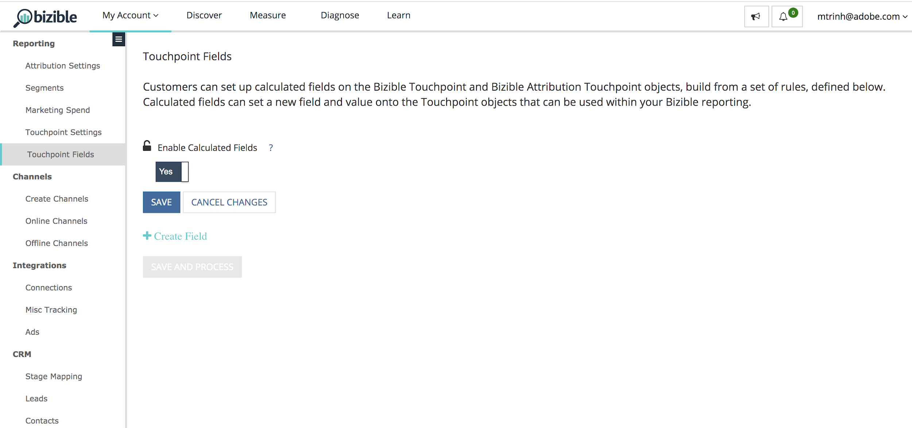
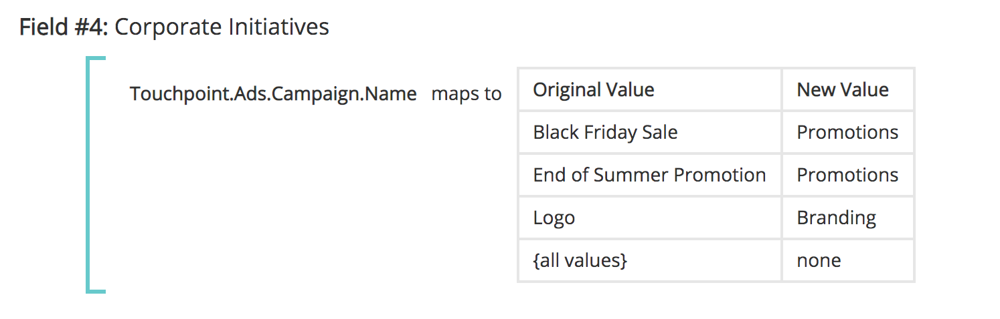

# Campos de Touchpoint {#touchpoint-fields}

Históricamente, cuando los clientes se incorporan con [!DNL Marketo Measure] y en el caso de que no tengamos una integración de etiquetado directo, nuestro equipo de éxito del cliente enseña a nuestros clientes cómo etiquetar adecuadamente sus páginas de aterrizaje para que utilicen el formato UTM correcto y podamos resolver sus anuncios. Algunos de estos clientes no utilizan UTM, sino que utilizan sus propios parámetros de etiquetado, lo que significa que puede llevar mucho tiempo editar todas sus páginas de aterrizaje en todas sus redes de publicidad con una nueva estructura de etiquetado que [!DNL Marketo Measure] exige. Para adaptarse a su estructura de etiquetado, ahora aceptamos parámetros personalizados que se pueden asignar con nuestras definiciones de reglas. El objetivo es adaptarse al uso por parte de los clientes de sus parámetros de seguimiento personalizados, de modo que no tengamos que exigirles que cambien su estructura de URL.

>[!AVAILABILITY]
>
>Disponible ahora con Segmentación completa en Nivel 2 y Nivel 3.

>[!NOTE]
>
>Se trata de una función avanzada que solo debe configurar Professional Services.

## Activación de la función {#enabling-the-feature}

En el [!DNL Marketo Measure] Menú Configuración , vaya a la página Campos de punto de contacto . Desde allí, puede activar la función seleccionando **Sí** under **Habilitar campos calculados**. Una vez activada, puede crear los campos de Touchpoint.

## Cómo {#how-to}

Para crear un campo calculado, tenga en cuenta que hay tres acciones diferentes que un usuario puede realizar: extrae, asigna a y concatena. También se conocen como operadores para definir un campo calculado.

Extractos

El operador extrae el valor de un campo de otra ubicación, como: un campo de campaña, un campo de posible cliente o en un caso de uso más avanzado, [extraer parámetros personalizados de la página de aterrizaje](https://docs.google.com/document/d/1NRViyCsXvPKbCTfGW32Yi2vWBjMDRF7bzkzKj9s2DDA/edit?ts=5e20b482#heading=h.xxwtissvw4){target="_blank"}. It then places it onto a Touchpoint Field (See [Maps To Example](https://docs.google.com/document/d/1NRViyCsXvPKbCTfGW32Yi2vWBjMDRF7bzkzKj9s2DDA/edit?ts=5e20b482#heading=h.xxwtissvw4){target="_blank"} 2).

**Ejemplo 1**

Hay un campo personalizado en el Contacto, campaign_source__c, que el cliente desea incluir en el Touchpoint para generar informes. Puede definir una regla para crear un campo calculado denominado &quot;Origen de campaña&quot; y colocar el valor en ese campo.

Objetivo: Utilice el valor de un campo personalizado y colóquelo en el objeto Touchpoint para facilitar la creación de informes.

* Crear un campo calculado y etiquetarlo como &quot;Fuente de campaña&quot;
* Defina la regla empezando por buscar el campo Contact.Campaign_Source__c
* Utilice el operador &quot;extracts&quot; (extractos) ya que necesitamos extraer el valor del parámetro
* Para extraer la cadena completa del campo, se utiliza la expresión &quot;(.&#42;)&quot;

   * **(** marca el inicio de la extracción
   * **)** marca el final de la extracción
   * **.&#42;** nos dice que estamos extrayendo la cadena completa

**Ejemplo 2**

Un caso de uso común que esta función habilita es extraer valores de parámetros personalizados de una cadena de URL. Esto resulta útil si utiliza parámetros que no sean UTM, pero desea analizar los valores en campos de punto de contacto.

**Vínculo:** `https://www.adobe.com/blog/marketing-revenue-reporting-overview?promo=5OFF` o `https://www.adobe.com/blog/marketing-revenue-reporting-overview?promo=25OFF`.\
**Objetivo:** Cree un campo personalizado llamado &quot;Código de descuento&quot; y suelte el valor &quot;5OFF&quot; o &quot;25OFF&quot;, independientemente del valor que se pase.

* Crear un campo calculado y etiquetarlo como &quot;Código de descuento&quot;
* Defina la regla empezando por la búsqueda del campo Touchpoint.Session.LandingPage
* Utilice el operador &quot;extracts&quot; (extractos) ya que necesitamos extraer el valor del parámetro
* Para extraer el valor de la promoción, definiremos el valor como &quot;promo=(\w+)&quot;

   * **(** marca el inicio de la extracción
   * **)** marca el final de la extracción
   * **\w** nos dice que estamos extrayendo una &quot;palabra&quot; que incluye 0-9
   * **+** extraerá el valor completo del parámetro sin límite de caracteres
   * Tenga en cuenta que está utilizando una barra diagonal y no una barra invertida

**Ejemplo 3**

Pruebe un ejemplo similar en el que extraigamos un código de seguimiento como: `https://www.adobe.com/blog/marketing-revenue-reporting-overview?cid=123456`.

**Objetivo:** Cree un campo calculado y etiquete &quot;Adobe Campaign Id&quot; con el valor del parámetro cid.

* Crear un campo calculado y etiquetarlo como &quot;Adobe Campaign Id&quot;
* Defina la regla empezando por la búsqueda del campo Touchpoint.Session.LandingPage
* Utilice el operador &quot;extracts&quot; (extractos) ya que necesitamos extraer el valor del parámetro
* Para extraer el valor &quot;123456&quot;, definiremos el valor como &quot;cid=(\d{6})&quot;

   * **(** marca el inicio de la extracción
   * **)** marca el final de la extracción
   * **\d** nos dice que estamos extrayendo un &quot;dígito&quot;
   * **{6}** es el número de caracteres que extraemos

**Ejemplo 4**

A medida que las páginas de aterrizaje se complican y tiene varios parámetros de seguimiento, es posible que tenga que crear varios campos de punto de contacto y extraer valores varias veces, como:
`https://www.adobe.com/blog/marketing-revenue-reporting-overview?trackID=123456&country=US&campaign_ID=7890`.

**Objetivo:** Cree varios campos calculados para &quot;País objetivo&quot; e &quot;Id. de campaña personalizado&quot; con los valores respectivos de los parámetros.

* Crear un campo calculado y etiquetarlo como &quot;País objetivo&quot;
* Defina la regla empezando por la búsqueda del campo Touchpoint.Session.LandingPage
* Utilice el operador &quot;extracts&quot; (extractos) ya que necesitamos extraer el valor del parámetro
* Para extraer el valor &quot;US&quot;, definiremos el valor como &quot;country=(\w{2})&quot;

   * **(** marca el inicio de la extracción
   * **)** marca el final de la extracción
   * **\w** nos dice que estamos extrayendo una &quot;palabra&quot;
   * **{2}** es el número de caracteres que extraemos

* Crear un campo calculado y etiquetarlo como &quot;ID de campaña personalizado&quot;
* Defina la regla empezando por la búsqueda del campo Touchpoint.Session.LandingPage
* Utilice el operador &quot;extracts&quot; (extractos) ya que necesitamos extraer el valor del parámetro
* Para extraer el valor &quot;123456&quot;, definiremos el valor como &quot;campaign_ID=(\d{6})&quot;

   * **(** marca el inicio de la extracción
   * **)** marca el final de la extracción
   * **\d** nos dice que estamos extrayendo un &quot;dígito&quot;
   * **{6}** es el número de caracteres que extraemos

**Asigna a**

El operador maps to crea una tabla de valores que deben traducirse o agruparse en otro valor. Normalmente, esto toma la forma de un valor clave en el que un código representa un nombre descriptivo y debe asignarse a ese nombre descriptivo.

**Ejemplo 1**

Hay campañas que ha creado para una &quot;promoción de fin de verano&quot; y una &quot;promoción de Black Friday&quot; que se ejecutan en varios canales. Desea crear un campo calculado denominado &quot;Iniciativa&quot; y desea asignar cualquier punto de contacto con una &quot;Promoción de fin de verano&quot; o &quot;Promoción de Black Friday&quot; a un valor de Iniciativa como &quot;Promociones&quot;, además de otros valores posibles.

**Ejemplo 2**

Ahora que hemos aprendido a extraer y asignar campos, combinemos esas acciones para extraer primero un valor de un parámetro y luego asignarlo a un nombre descriptivo que tenga un poco más de sentido. Empecemos con esta página de aterrizaje: `https://www.adobe.com/blog/marketing-revenue-reporting-overview?BZ=04-01-09-03-10`.

**Objetivo:** Cree varios campos calculados, donde el primer número se asigna a una región, el segundo a un producto, el tercero a una iniciativa, el cuarto a una persona y el quinto a una plataforma de medios. A continuación, asigne el valor numérico a un &quot;nombre descriptivo&quot;.

* Crear un campo calculado y etiquetarlo como &quot;Región&quot;
* Defina la regla empezando por la búsqueda del campo Touchpoint.Session.LandingPage
* Utilice el operador &quot;[!UICONTROL extractos]&quot; ya que necesitamos extraer el valor del parámetro
* Para extraer el valor &quot;04&quot;, se definirá como &quot;BZ=(\d{2})-\d{2}-\d{2}-\d{2}-\d{2}-\d{2}&quot;

   * **(** marca el inicio de la extracción

      * Observe que como solo estamos extrayendo el 4, solo los primeros dígitos tienen el paréntesis abierto
   * **)** marca el final de la extracción

      * Observe que como solo estamos extrayendo el 4, solo los primeros dígitos tienen el paréntesis cerrado
   * **\d** nos dice que estamos extrayendo un &quot;dígito&quot;
   * **{2}** es el número de caracteres que extraemos

* Haga clic en [!UICONTROL Guardar]. Debe guardar el nuevo campo antes de que esté disponible para utilizarlo para la regla siguiente.
* A continuación, deseamos asignar todos los valores posibles para los primeros dígitos a sus nombres descriptivos
* Crear un campo calculado y etiquetarlo como &quot;Nombre_región&quot;
* Defina la regla empezando por la búsqueda del campo extraído. En este caso, Touchpoint.Region
* Utilice el operador &quot;[!UICONTROL asigna a]&quot; ya que queremos crear una asignación para cada número a su valor
* Se le presentará una tabla para enumerar cada asignación. Al final, se verá algo así:
* En función de la asignación y la URL anteriores, el valor de región para un punto de contacto con esta página de aterrizaje sería &quot;EMEA&quot;
* Repita la extracción y la asignación para los 4 conjuntos de dígitos restantes

   * Para extraer el 01, debe definir el valor como &quot;BZ=\d{2}-**(\d{2})**-\d{2}-\d{2}-\d{2}&quot;
   * Para extraer el 09, debe definir el valor como &quot;BZ=\d{2}-\d{2}-**(\d{2})**-\d{2}-\d{2}&quot;
   * Para extraer el 03, debe definir el valor como &quot;BZ=\d{2}-\d{2}-\d{2}-\d{2}-**(\d{2})**-\d{2}&quot;
   * Para extraer el 10, debe definir el valor como &quot;BZ=\d{2}-\d{2}-\d{2}-\d{2}-\d{2}-**(\d{2})**&quot;

**Concatenados**

El operador concatenates combina valores de varios campos en un solo campo. Esto resulta útil para crear un valor personalizado que extraiga datos en varios campos para realizar

**Ejemplo 1**

Existen campos independientes en el objeto de oportunidad para Segment__c y Grado__c que el usuario desea combinar en un solo campo del objeto Touchpoint para generar informes. Al concatenar los campos, verá valores como Enterprise_A o Mid-Market_B.

## Campos y segmentos de Touchpoint {#touchpoint-fields-and-segments}

Ahora que los valores de su URL se han analizado y existen en Touchpoint, verá los nuevos campos dondequiera que se utilicen los campos Touchpoint, como la creación de segmentos o la definición de reglas de Eliminación de Touchpoint.

La capacidad de crear segmentos mediante campos de Touchpoint está disponible con esta versión de producto. Los segmentos no se podían crear con campos de Touchpoint anteriormente.

Para facilitar la generación de segmentos, ahora es posible crear segmentos dinámicos a partir de los campos de punto de contacto creados. Por ejemplo, si creó un Campo de punto de contacto que analizó una región geográfica en lugar de crear un segmento para cada región posible, puede configurar un segmento y crearemos segmentos para cada instancia en la que aparezca un nuevo valor. Esto es extremadamente útil si un atributo como código postal necesita ser analizado y utilizado como segmento.

Su configuración se parecería a la captura de pantalla de abajo. El nombre del segmento extrae dinámicamente el valor del campo de punto de contacto utilizando las llaves para buscar el campo.

La regla hace referencia al mismo Campo de punto de contacto y busca valores que no sean &quot;iguales a null&quot;.

## Preguntas frecuentes {#faq}

**¿Podemos crear un número máximo de campos de punto de contacto?**

Hay un límite de 100 campos.

**No veo mi nuevo Campo de Touchpoint que acabo de crear en la lista de selección. ¿Dónde está?**

No olvide guardar sus reglas después de crearlas. Si no ve el nuevo campo, compruebe si ha guardado. Debe guardar el nuevo campo antes de que esté disponible para utilizarlo con la regla siguiente.

>[!NOTE]
>
>Debido al nivel de complejidad, un Campo de punto de contacto que utilice el operador &quot;mapas a&quot; no está disponible para utilizarse en otro Campo de punto de contacto.

**¿Qué expresión utilizo para extraer varios parámetros de una sola página de aterrizaje?**

Al igual que en el Ejemplo de extracción 4, debe crear varios campos para extraer cada uno de los parámetros. Por lo tanto, si tiene cinco valores diferentes, creará cinco campos de punto de contacto para extraer cada uno de ellos.

**¿Por qué no veo mis campos nuevos en la [!DNL Marketo Measure] esquema?**

Se necesita trabajo adicional para exponer los nuevos campos en la variable [!DNL Marketo Measure] esquema de Data Warehouse. En este momento, los campos se exponen mediante ajustes y configuraciones para que pueda utilizar los campos de Touchpoint a la hora de crear segmentos o crear reglas de eliminación de Touchpoint.

**¿Cómo puedo validar que mi expresión de extracción es válida y extraer el valor correcto?**

Hay una herramienta en línea ([https://regex101.com/](https://regex101.com/){target="_blank"}) que puede ejecutar y probar la expresión. La expresión aparecerá en verde si es válida o en rojo si no es válida. Además, el cuadro de explicación en la parte superior derecha es útil y le dice lo que está extrayendo.

