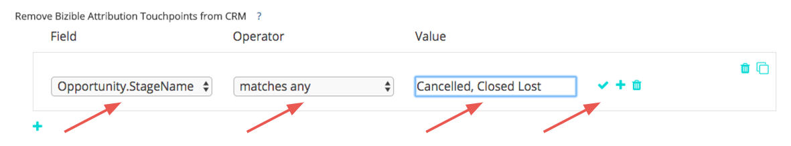

# Eliminación de puntos de contacto y supresión de puntos de contacto {#touchpoint-removal-and-touchpoint-suppression}

Aprenda a eliminar o suprimir puntos de contacto que cumplan criterios específicos de su CRM. Esto puede resultar útil para liberar espacio de datos si tiene [!DNL Salesforce] límites de almacenamiento de datos.

Hay una diferencia clave entre las reglas de eliminación de Touchpoint y las reglas de supresión de Touchpoint:

* Eliminación de Touchpoint - [!DNL Marketo Measure] purgará (es decir, eliminará) cualquier punto de contacto de su CRM que se ajuste a los criterios de la regla. Los datos _lata_ se debe informar sobre dentro de [!DNL Marketo Measure] Tablero de ROI, pero ya no en CRM.
* Supresión de puntos de contacto: similar a la eliminación de puntos de contacto, pero los datos NO se PUEDEN registrar dentro del panel de ROI.

Antes de empezar a crear reglas de eliminación/supresión de puntos de contacto, es aconsejable compartir el plan de implementación con el equipo de marketing y operaciones de ventas. Ya debería tener una idea de qué tipos o valores desea eliminar. Algunos de los casos de uso comunes son:

* Eliminar puntos de contacto de oportunidades perdidas cerradas
* Eliminar puntos de contacto de posibles clientes muy antiguos
* Eliminar puntos de contacto de posibles clientes no cualificados

Una vez guardadas las reglas, [!DNL Marketo Measure] limpiará y redistribuirá el modelo de atribución. Esto significa que los hitos y las posiciones cambiarán, y que el crédito de atribución de su canal cambiará. Esto modificará los datos, por lo que debe ponerse en contacto con el administrador de éxito si necesita ayuda.

`1)` Existen dos secciones para la configuración de eliminación/supresión. Tiene la opción de configurarlo para puntos de contacto del comprador (posibles clientes y contactos) o puntos de contacto de atribución del comprador (contactos, oportunidades y cuentas).

Comience por añadir una regla y seleccionar el Campo que debe definir los criterios.

Elija de una lista de Operadores que se relacionarán con el siguiente conjunto de valores, que agregará en la siguiente columna.

>[!TIP]
>
>Para añadir varios valores en un campo, utilice el operador &quot;coincide con cualquier&quot; con comas que separan cada valor.

>[!TIP]
>
>Para tener en cuenta un valor en blanco o NULL en un campo, simplemente deje el campo [!UICONTROL Valor] casilla vacía. Esto tendrá en cuenta escenarios como la evaluación con un punto de contacto sin URL de formulario.

>[!NOTE]
>
>Los campos de fórmula no se pueden utilizar dentro de las reglas y no aparecerán en la lista de selección. Como las fórmulas calculan en segundo plano y no modifican un registro, [!DNL Marketo Measure] no puede detectar si un registro se ajusta o no a una regla.

`2)` Añada reglas dentro del mismo grupo para utilizar la lógica &quot;AND&quot; en la instrucción.
O bien, agregue nuevas instrucciones fuera del grupo para utilizar la lógica &quot;OR&quot; en la instrucción.

`3)` Si las reglas se vuelven complejas y necesita volver a crear grupos y realizar pequeños cambios en cada instrucción, utilice el [!UICONTROL Clonar] para hacer las cosas más sencillas.

Si cometes un error, no te preocupes. También puede eliminar filas individuales de su instrucción o grupos completos.

`4)` Configure reglas para los puntos de contacto de atribución del comprador si desea que se apliquen a ambos objetos. Nuestra flexibilidad le permite establecer reglas para un objeto o ambos objetos y puede elegir configurarlas para ambos si se aplican.

Para finalizar, [!UICONTROL Guardar y procesar] sus reglas. Si está realizando muchos cambios, asegúrese de Guardar los cambios durante el proceso. [!DNL Marketo Measure] no comenzará a eliminar los puntos de contacto hasta que no haga clic en **Guardar y procesar** botón.

| **Operador** | **Caso de uso** |
|---|---|
| Is Equal To | Valor único: coincidencia exacta |
| Contiene | Valor único: contiene un valor |
| Coincide con Cualquiera | Varios valores: coincidencia exacta |
| Coincide Con Cualquiera (Contiene) | Varios valores: &#42;valor&#42;, &#42;valor, &#42;valor&#42; |

Para los clientes que utilizan Dynamics y desean configurar reglas de supresión basadas en el estado o el código de estado, es necesario el siguiente formato al configurar la regla: `[Object].Statecode` es igual/no igual a `[Status Value]`. Por ejemplo, si el código de estado de Dynamics indica &quot;1&quot; en un contacto y el estado indica &quot;Inactivo&quot;, y desea suprimir todos esos contactos, el siguiente formato sería incorrecto para la regla de supresión: Contact.Statecode es igual a 1. En su lugar, debe utilizar el siguiente formato, ya que el código de estado y el estado funcionan como un par, [!DNL Marketo Measure] lee el valor de Status en nuestra consulta: Contact.Statecode es igual a Inactive.
