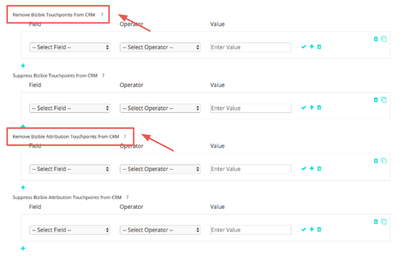

# Eliminación de puntos de contacto y supresión de puntos de contacto {#touchpoint-removal-and-touchpoint-suppression}

Aprenda a eliminar o suprimir puntos de contacto que cumplan criterios específicos de su CRM. Esto puede resultar útil para liberar espacio en los datos si tiene [!DNL Salesforce] límites de almacenamiento de datos.

Hay una diferencia clave entre las reglas de eliminación de puntos de contacto y las reglas de supresión de puntos de contacto:

* Eliminación de puntos de contacto - [!DNL Marketo Measure] depurará (eliminará) cualquier punto de contacto de su CRM que se ajuste a los criterios de la regla. Los datos _can_ debe incluirse en el informe [!DNL Marketo Measure] Tablero de ROI, pero ya no en CRM.
* Eliminación de puntos de contacto : similar a la eliminación de puntos de contacto, pero los datos NO se pueden registrar en el panel de retorno de la inversión.

Antes de empezar a crear reglas de supresión/eliminación de puntos de contacto, es aconsejable compartir el plan de implementación con el equipo de operaciones de marketing y ventas. Ya debería tener una idea de qué tipos o valores desea eliminar. Algunos de los casos de uso comunes son:

* Eliminar puntos de contacto de oportunidades perdidas cerradas
* Eliminar puntos de contacto de posibles clientes muy antiguos
* Eliminar puntos de contacto de posibles clientes no cualificados

Una vez guardadas las reglas, [!DNL Marketo Measure] limpiará y redistribuirá el modelo de atribución. Esto significa que los hitos y las posiciones cambiarán, y el crédito de atribución del canal cambiará. Esto modificará los datos, por lo que debe ponerse en contacto con el administrador de éxito si necesita ayuda.

`1)` Hay dos secciones para la configuración de eliminación/supresión. Tiene la opción de configurarlo para puntos de contacto del comprador (posibles clientes y contactos) o puntos de contacto de atribución del comprador (contactos, oportunidades y cuentas).

Comience agregando una regla y seleccionando el Campo que definirá los criterios.

Elija entre una lista de Operadores que se relacionarán con el siguiente conjunto de valores, que agregará en la siguiente columna.

>[!TIP]
>
>Para añadir varios valores en un campo, utilice el operador &quot;coincide con cualquier&quot; con comas separando cada valor.

>[!TIP]
>
>Para tener en cuenta un valor en blanco o NULL en un campo, simplemente deje vacío el cuadro Valor. Esto tendrá en cuenta escenarios como la evaluación en un punto de contacto sin dirección URL del formulario.

>[!NOTE]
>
>Los campos de fórmula no se pueden usar dentro de las reglas y no aparecerán en la lista de selección. Dado que las fórmulas calculan en segundo plano y no modifican un registro, [!DNL Marketo Measure] no puede detectar si un registro se ajusta a una regla o no.

`2)` Agregue reglas dentro del mismo grupo para usar la lógica &quot;Y&quot; en la instrucción.
O bien, agregue nuevas instrucciones fuera del grupo para utilizar la lógica &quot;O&quot; en la instrucción.

`3)` Si las reglas se vuelven complejas y necesita volver a crear grupos y realizar pequeños cambios en cada instrucción, utilice la opción Clone para que las cosas sean más sencillas.

Si cometes un error, no te preocupes. También puede eliminar filas individuales de la instrucción o grupos completos.

`4)` Configure las reglas para los puntos de contacto de atribución del comprador si desea que se apliquen a ambos objetos. Nuestra flexibilidad le permite establecer reglas para un objeto o para ambos y puede elegir configurarlas para ambos si se aplican.

Para finalizar, guarde y procese sus reglas. Si está realizando muchos cambios, asegúrese de guardar los cambios a lo largo del camino. [!DNL Marketo Measure] no empezará a eliminar los puntos de contacto hasta que haga clic en el botón **Guardar y procesar** botón.

| **Operador** | **Caso de uso** |
|---|---|
| Is Equal To | Valor único: coincidencia exacta |
| Contiene | Valor único: contiene valor |
| Coincide con cualquier | Varios valores: Coincidencia exacta |
| Coincide con Cualquiera (Contiene) | Varios valores - &#42;value&#42;, &#42;valor, &#42;value&#42; |

Para los clientes que utilizan Dynamics y que desean configurar reglas de supresión basadas en estado o código de estado, se requiere el siguiente formato al configurar la regla: `[Object].Statecode` es igual/no igual a `[Status Value]`. Por ejemplo, si el código de estado de Dynamics lee &quot;1&quot; en un contacto y el estado lee &quot;Inactivo&quot; y desea suprimir todos esos contactos, el siguiente formato sería incorrecto para la regla de supresión: Contact.Statecode es igual a 1. En su lugar, desea utilizar el siguiente formato, ya que el código de estado y el estado funcionan como un par, [!DNL Marketo Measure] lee el valor de Status en nuestra consulta: Contact.Statecode es igual a Inactivo.
