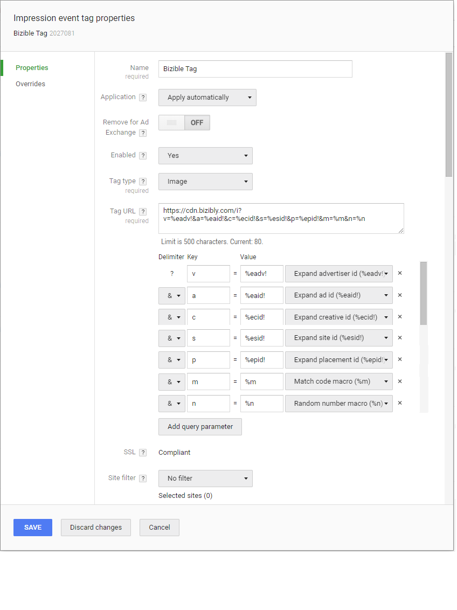

# Configuración de la atribución de visualizaciones del administrador de campañas de DoubleClick {#configuring-doubleclick-campaign-manager-view-through-attribution}

## Medición de la vista mediante atribución {#measuring-view-through-attribution}

>[!IMPORTANT]
>
>Debido a cuestiones de privacidad, las cookies de terceros están a punto de desaparecer. La obsolescencia de las cookies de terceros anunciada por Google Chrome en el tercer trimestre de 2024 marca el final de esta forma de seguimiento. Por consiguiente, Adobe va a dejar de utilizar las funciones de Marketo Measure que dependan de cookies de terceros; en concreto Seguimiento entre dominios y Atribución de visualización, que utilizan la cookie de impresión de Google/DoubleClick. Ninguna otra función de Marketo Measure se verá afectada. El uso de cookies de origen tampoco se verá afectado. En vista de la programación de Google, la fecha prevista de obsolescencia de las dos funciones anteriores es el 1/6/2024. Los datos relacionados recopilados antes de esta fecha permanecen a disposición de los clientes de Adobe.

>[!NOTE]
>
>Si está usando la integración de [!DNL Marketo Measure] y [!DNL DoubleClick Campaign Manager], se necesita una [conexión de API](/help/api-connections/utilizing-marketo-measures-api-connections/integrated-ad-platforms.md#how-to-connect-ad-platforms) para que podamos descargar detalles de las campañas y los elementos creativos para resolver los anuncios.

Para empezar a obtener una insight más granular desde la vista hasta el seguimiento con [!DNL Doubleclick Campaign Manager], es necesario configurar el píxel de seguimiento.

Para obtener más información sobre la funcionalidad de Atribución de visualización [!DNL Marketo Measure], consulte [Preguntas frecuentes sobre la Atribución de visualización a través de Marketo Measure](/help/advanced-marketo-measure-features/view-through-attribution/marketo-measure-view-through-attribution-faq.md).

[!DNL Marketo Measure] se considera una etiqueta de &quot;Piggyback&quot; porque es una llamada de terceros a través de la etiqueta de publicidad de DCM. Las etiquetas Piggyback no funcionan con etiquetas de imagen, solo con etiquetas de iframe o javascript. Según el Soporte de DCM, esto no ha cambiado recientemente y siempre ha sido así. Las etiquetas estándar quedaron obsoletas el 2 de octubre de 2017, pero no afectan a la capacidad de [!DNL Marketo Measure] para rastrear las impresiones.

En el caso de que utilice una jerarquía principal y secundaria en DCM, será necesario aplicar la etiqueta a todos los niveles para el seguimiento de impresiones.

## Cómo añadir la etiqueta de imagen {#how-to-add-the-image-tag}

Agregue la etiqueta a Doubleclick en la configuración Anunciante y cree una Etiqueta de evento de impresión.

1. Agregue el siguiente código como píxel de imagen 1x1.

`https://cdn.bizibly.com/i?v=%eadv!&a=%eaid!&c=%ecid!&s=%esid!&p=%epid!&m=%m&n=%n`

1. Una vez agregado, confirme que los delimitadores se asignan de la siguiente manera. Debe ser automático una vez que se aplique la etiqueta:

   v = %eadv! ID de anunciante [!DNL Expand]\
   a = %eaid! Expandir ID de anuncio\
   c = %ecid! Expandir ID de Creative\
   s = %esid! Expandir ID del sitio\
   p = %epid! Expandir ID de ubicación\
   m = %m Macro de código coincidente\
   n = Macro de número aleatorio %n

   

## Preguntas frecuentes {#faq}

**Q: ¿Es segura la etiqueta de imagen?**

R: Sí. No es una etiqueta de JavaScript, es una etiqueta de imagen.

**Q: ¿Qué permisos necesita el usuario conectado?**

A: dfattraffic, dfareporting, userinfo.email

**Q: ¿Cuánto tiempo puede tomar importar los datos gastados?**

A: hasta 6 horas

**Q: ¿Cuánto tiempo puede tomar importar datos de publicidad?**

A: hasta 6 horas
