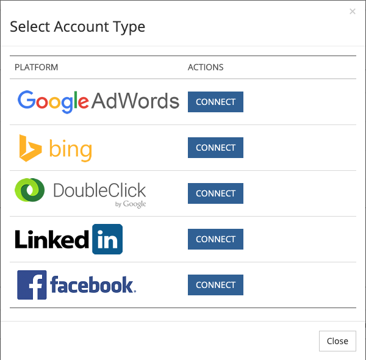

# Plataformas de anuncios integradas {#integrated-ad-platforms}

[!DNL Marketo Measure] tiene conexiones de API con Google AdWords, Microsoft BingAds, [!DNL Facebook] Ads y DoubleClick Campaign Manager. A través de estas conexiones API, [!DNL Marketo Measure] puede extraer fácilmente datos y enviarlos a su CRM junto con la aplicación Comprador externa. No es necesario cargar manualmente los costes ni los datos. En su lugar, las cuentas simplemente tienen que estar conectadas y autorizadas a la aplicación [!DNL Marketo Measure]. [!DNL Marketo Measure] descargará automáticamente los costos de mercadotecnia de las plataformas y los cargará en la aplicación [!DNL Marketo Measure]. Si selecciona habilitar el etiquetado automático para anuncios de AdWords, BingAds o [!DNL Facebook], [!DNL Marketo Measure] adjuntará automáticamente sus parámetros a las direcciones URL de sus anuncios.

## Cómo conectar plataformas de publicidad {#how-to-connect-ad-platforms}

Antes de entrar en detalles específicos de cada plataforma, veremos cómo conectar cualquiera de estas cuentas a [!DNL Marketo Measure]. Primero inicia sesión en la aplicación [!DNL Marketo Measure] y ve a la opción **[!UICONTROL Configuración]** en la ficha **[!UICONTROL Mi cuenta]** en la parte superior izquierda de la pantalla. A continuación, seleccione **[!UICONTROL Conexiones]** en la sección **[!UICONTROL Integraciones]** de la izquierda.

Como se muestra en la siguiente imagen, verá un botón para configurar nuevas conexiones de anuncios.

Después de hacer clic en el botón [!UICONTROL Configurar nueva conexión de anuncios], aparecerá una ventana (que se muestra a continuación) con cuatro tipos de iconos de [!UICONTROL conexión]de anuncios. Haga clic en conectar y aparecerá otra ventana en la que se solicitarán credenciales. Escriba las credenciales y haga clic en [!UICONTROL autorizar] para conectar la cuenta a [!DNL Marketo Measure].

## Google AdWords {#google-adwords}

Cuando crea sus anuncios en [!DNL Google AdWords], se le recomienda que etiquete sus campañas de una de las tres maneras siguientes: etiquetado manual, etiquetado automático o creando una plantilla de seguimiento. El etiquetado manual de la URL de AdWords depende de que defina y añada los parámetros al final de las URL de los anuncios. El etiquetado manual permite que cualquier plataforma que no sea de Google lea fácilmente los datos recopilados por los parámetros.

La plantilla de seguimiento es una herramienta que proporciona Google para agregar lo que denomina parámetros ValueTrack. Funcionan de la misma manera que las UTM y otros parámetros de etiquetado.

## Qué sucede cuando el etiquetado automático está habilitado {#what-happens-when-auto-tagging-is-enabled}

[!DNL Marketo Measure] busca plantillas de seguimiento en su cuenta de [!DNL AdWords]:

* *Opción A*: se encontró la plantilla de seguimiento. [!DNL Marketo Measure] agrega sus parámetros a la plantilla.
* *Opción B*: se encuentra el redireccionamiento de terceros. Si se encuentra una redirección de terceros en la plantilla de seguimiento, [!DNL Marketo Measure] no podrá realizar ninguna acción. Deberá agregar manualmente las etiquetas [!DNL Marketo Measure] al sistema de terceros. Un ejemplo de redireccionamiento de terceros sería una herramienta de gestión de ofertas como Kenshoo o Marin. Más información sobre cómo las [herramientas de administración de ofertas afectan a [!DNL Marketo Measure]](/help/api-connections/utilizing-marketo-measures-api-connections/how-bid-management-tools-affect-marketo-measure.md){target="_blank"}.

* *Opción C*: no se encontró ninguna plantilla de seguimiento. [!DNL Marketo Measure] analizará todas sus direcciones URL de destino de anuncios para los parámetros [!DNL Marketo Measure]. En función del análisis, si:
   * Se han encontrado parámetros: la configuración ha finalizado.
   * No se encontraron los parámetros: [!DNL Marketo Measure] adjuntará sus parámetros al final de las direcciones URL de destino de la publicidad. [!DNL Marketo Measure] anexa nuevos anuncios en un plazo de dos horas a partir de su creación. Tenga en cuenta que los parámetros no se añaden a una plantilla.

Obtenga más información acerca de nuestra [[!DNL AdWords] funcionalidad de etiquetado automático](/help/api-connections/utilizing-marketo-measures-api-connections/understanding-marketo-measure-adwords-tagging.md){target="_blank"}.

## Habilitar el etiquetado automático de [!DNL Marketo Measure] para AdWords {#how-to-enable-marketo-measure-auto-tagging-for-adwords}

Antes de habilitar el etiquetado automático de [!DNL Marketo Measure], **asegúrese de que tiene habilitada una plantilla de seguimiento en el nivel de cuenta, campaña o grupo de publicidad dentro de su cuenta de AdWords. Esto es necesario para cualquier cuenta de AdWords que tenga habilitado el etiquetado automático de [!DNL Marketo Measure].** Al habilitar una plantilla de seguimiento se evitará la pérdida de datos en el historial de rendimiento de anuncios. Tenga en cuenta que habilitar las plantillas de seguimiento en los niveles de palabra clave, vínculo de sitio o anuncio hará que el anuncio pase por el proceso de revisión y aprobación y puede reiniciar potencialmente el historial de rendimiento de los anuncios. Si no hay ninguna plantilla de seguimiento habilitada, [!DNL Marketo Measure] adjuntará los parámetros de seguimiento [!DNL Marketo Measure] directamente a la &quot;URL final&quot; del anuncio, lo que también puede causar la pérdida de datos del historial de anuncios.

Una vez que tenga una plantilla de seguimiento, siga las instrucciones a continuación para habilitar el etiquetado automático de [!DNL Marketo Measure]. Nota: [!DNL Marketo Measure] también etiquetará automáticamente los anuncios en pausa de su cuenta.

1. Inicia sesión en tu cuenta de [!DNL Marketo Measure] en [experience.adobe.com/marketo-measure](https://experience.adobe.com/marketo-measure){target="_blank"}.

1. Vaya a [!UICONTROL Mi cuenta] > [!UICONTROL Configuración] > [!UICONTROL Integraciones] > [!UICONTROL Conexiones].

   

1. Haga clic en el icono de lápiz junto a la cuenta de AdWords que tendrá habilitado el etiquetado automático de [!DNL Marketo Measure].

   

1. En la esquina superior derecha, cambie el conmutador **[!UICONTROL Etiquetado automático]** a **[!UICONTROL Sí]**. En la parte inferior de la página, haz clic en **[!UICONTROL Más información]** para expandir el cuadro de texto y haz clic en **[!UICONTROL Guardar]**. Se ha completado la configuración del etiquetado automático.

   

## Cómo configurar una plantilla de seguimiento en AdWords con [!DNL Marketo Measure] parámetros {#how-to-set-up-a-tracking-template-in-adwords-with-marketo-measure-parameters}

Tenga en cuenta que debe agregar plantillas de seguimiento a nivel de [!UICONTROL Cuenta], [!UICONTROL Campaña] o Grupo de publicidad en AdWords. Si agrega Plantillas de seguimiento a los niveles de Palabra clave, Vínculo de sitio o Anuncio, su anuncio deberá pasar por el proceso de revisión y aprobación y se arriesga a reiniciar el historial de rendimiento de sus anuncios. Más información sobre [crear plantillas de seguimiento](https://support.google.com/adwords/answer/6076199?hl=en#tracking){target="_blank"}.

1. Inicie sesión en su cuenta de [!DNL Google AdWords].
1. Vaya a la vista [!UICONTROL Campañas] desde la barra de navegación izquierda
1. Vaya a &quot;[!UICONTROL Configuración]&quot;, también en la barra de navegación izquierda
1. Cambiar a la vista &quot;[!UICONTROL Configuración de la cuenta]&quot; en la parte superior
1. Expanda la sección &quot;[!UICONTROL Seguimiento]&quot;
1. Pegue una de las siguientes cadenas de texto en la plantilla de seguimiento para establecer el valor de la plantilla:

   * Si tiene signos de interrogación en TODAS las direcciones URL, utilice el siguiente texto:

   `{lpurl}&_bt={creative}&_bk={keyword}&_bm={matchtype}&_bn={network}&_bg={adgroupid}`

   * Si no tiene signos de interrogación en ninguna de las direcciones URL, agregue el siguiente texto:

   `{lpurl}?_bt={creative}&_bk={keyword}&_bm={matchtype}&_bn={network}&_bg={adgroupid}*`

   Para evitar que se produzcan errores al etiquetar manualmente las direcciones URL, normalmente se recomienda generar los parámetros de UTM automáticamente. Esto no tiene que significar el etiquetado automático con AdWords o [!DNL Marketo Measure] parámetros, existen varias herramientas que simplifican el proceso al generar automáticamente los parámetros para la URL en función de la información que proporcione.

   >[!TIP]
   >
   >Si se produce un error que indica que la plantilla de seguimiento no es válida, intente borrar la caché del explorador y volver a intentarlo, lo que a menudo soluciona el problema.

## Cómo generar automáticamente etiquetas de UTM para [!DNL Google AdWords] {#how-to-automatically-generate-utm-tags-for-google-adwords}

Al principio, puede parecer difícil crear etiquetas de UTM, pero hay muchas herramientas disponibles para crear fácilmente direcciones URL con parámetros de UTM. Puede utilizar cualquiera de los siguientes recursos o buscar más herramientas en la web. Tenga en cuenta que [!DNL Marketo Measure] no respalda ni garantiza nada con estas plataformas y herramientas.

**[!DNL Google URL]generador**

El Generador de URL de Google es una herramienta estándar para crear direcciones URL con formato correcto mediante etiquetas UTM. Introduzca la dirección URL y el valor deseado de cada parámetro y haga clic en &quot;[!UICONTROL Generar dirección URL]&quot;. Es una herramienta ideal si solo tiene que etiquetar un puñado de direcciones URL. Obtenga acceso a la herramienta [aquí](https://support.google.com/analytics/answer/1033867?hl=es){target="_blank"}.

**Hoja de cálculo de Google generada por EpikOne**

Esta hoja de cálculo tiene una fórmula que genera automáticamente las direcciones URL de destino etiquetadas. Es una buena herramienta si necesita etiquetar un gran número de vínculos. Obtenga acceso a la hoja de cálculo [aquí](https://spreadsheets.google.com/ccc?key=p7c_HKcmspSUfEYSO0gskKw&hl=en){target="_blank"}.

**Herramienta de etiquetado de vínculos de Rafflecopter**

La hoja de cálculo creada por Rafflecopter es una versión modificada de la hoja de cálculo [!DNL EpikOne's]. También contiene una fórmula que generará automáticamente vínculos de destino etiquetados para que los utilice.

Cada una de estas herramientas tiene instrucciones detalladas sobre cómo utilizarla y modificarla para adaptarla a sus necesidades. La herramienta está disponible [aquí](https://docs.google.com/spreadsheets/d/1QCIr1WUJQHE68cA4VTks2XE7nxuryaUymCEy_23-Oew/edit#gid=0){target="_blank"}.

**Crear increíbles UTM con Effin**

Esta herramienta es una extensión de Chrome que le permite generar rápidamente etiquetas UTM. Lo encuentro [aquí](https://chrome.google.com/webstore/detail/effin-amazing-utm-builder/eoaapiimcaimddnfhfnifgkinmpcbccp?hl=en){target="_blank"}.

## Anuncios de Bing {#bing-ads}

Bing Ads es una plataforma integrada que le permite habilitar el etiquetado automático de direcciones URL o usar una herramienta de terceros, como [!DNL Marketo Measure], para etiquetar anuncios. [!DNL Bing Ads] también depende de los parámetros de UTM.

Nuestra integración es compatible con los siguientes tipos de anuncios:

* Anuncio de texto
* Anuncio móvil
* Anuncio de texto ampliado

La función de etiquetado automático de Bing Ads agrega los siguientes parámetros de UTM:

* Utm_source
* Utm_medium
* Utm_term

El etiquetado automático de Bing Ads también agrega el siguiente parámetro personalizado:

`_bt={adid}`

La cadena tendría este aspecto:

`{lpurl}?_bt={adid}&utm_term={keyword}&utm_source=Bing_Yahoo&utm_medium=CPC`

Es importante tener en cuenta que [!DNL Bing Ads] le permite agregar aún más parámetros utilizando sus etiquetas personalizadas en las direcciones URL finales para obtener más granularidad, si lo desea.

Si se desea, se puede usar una plantilla de seguimiento, pero no es necesario que [!DNL Bing Ads] y [!DNL Marketo Measure] se integren. Esto se debe a que [!DNL Bing] permite que los anuncios se editen sin cambiar el historial, por lo que [!DNL Marketo Measure] puede actualizar la dirección URL de destino.

El etiquetado automático debe habilitarse a través de [!DNL Marketo Measure] para que los parámetros personalizados [!DNL Marketo Measure] se puedan anexar automáticamente. No hay riesgo de perder el historial de rendimiento de anuncios anteriores con Bing Ads.

Visite el sitio web [[!DNL Bing Ads]](https://advertise.bingads.microsoft.com/en-us/blog/post/august-2016/upgraded-urls-now-available-in-bing-ads-an-easier-way-to-manage-your-tracking-urls){target="_blank"} para obtener más información sobre cómo agregar etiquetas en su plataforma.

## Anuncios publicitarios de Facebook {#facebook-ads}

La integración de [!DNL Marketo Measure] con [!DNL Facebook] le permite descargar automáticamente información de publicidad y etiquetar la dirección URL con sus parámetros. [!DNL Marketo Measure] extraerá la información de la campaña y del conjunto de anuncios mediante el etiquetado automático. El conjunto de anuncios rellenará el campo Nombre del grupo de anuncios. Para obtener más información sobre la configuración de etiquetas de URL en la plataforma [!DNL Facebook], visite la página [!DNL Facebook] [empresa](https://www.facebook.com/business/help/1016122818401732/?ref=u2u){target="_blank"}.

Antes de habilitar el etiquetado automático con [!DNL Facebook Ads], es importante exportar el historial de rendimiento anterior como CSV. En este momento, cuando [!DNL Marketo Measure] etiqueta [!DNL Facebook Ads] con su parámetro _bf, [!DNL Facebook] lee los anuncios como completamente nuevos y borra el historial de rendimiento. Por lo tanto, es importante exportar un registro del rendimiento anterior si eso es algo de valor para usted y su organización.

Tenga en cuenta que puede conectar su cuenta de [!DNL Facebook] en cualquier momento a la aplicación [!DNL Marketo Measure] y no se perderán datos. Solo cuando el etiquetado automático esté habilitado se borrará el historial de rendimiento.

Consulte [este artículo](https://www.facebook.com/business/help/393890194130036){target="_blank"} de Facebook para obtener más información sobre la exportación de [!DNL Facebook] informes de publicidad.

## Contenido patrocinado por linkedIn {#linkedin-sponsored-content}

La integración de LinkedIn permite que [!DNL Marketo Measure] etiquete las direcciones URL de destino en el contenido patrocinado de [!DNL LinkedIn], lo que en última instancia permite que [!DNL Marketo Measure] siga a un usuario a través de todo su recorrido de puntos de contacto y asigne la actividad de nuevo a la campaña y creativo de [!DNL LinkedIn] específicos. Esto proporciona información a los clientes sobre el ROI de su actividad [!DNL LinkedIn]. [!DNL Marketo Measure] buscará elementos creativos con un recurso compartido [!DNL LinkedIn] único y agregará un parámetro `?_bl={creativeId}` al final del mismo.

Dado que los recursos compartidos de [!DNL LinkedIn] se pueden usar en varias campañas y elementos creativos, pedimos a los clientes que no copien, clonen ni dupliquen elementos creativos existentes para que puedan mantener su exclusividad. Si se encuentran Recursos compartidos y se detectan para que solo se usen en un Creativo, [!DNL Marketo Measure] puede etiquetar el Recurso compartido tal cual sin tener que volver a crear ningún Creativo o Recurso compartido y todo el historial de anuncios (impresiones, clics, recursos compartidos) permanecerá.

Tan pronto como se encuentre que un recurso compartido se comparte entre varios elementos creativos, [!DNL Marketo Measure] tendrá que pasar por un proceso de pausar, copiar y volver a etiquetar para crear un conjunto único. [!DNL Marketo Measure] pausará y archivará los elementos creativos activos, lo que significa que también se archivarán los elementos creativos que contengan las impresiones, los clics y los recursos compartidos en medios sociales.

## Plataformas no integradas {#non-integrated-platforms}

Para las plataformas que no están integradas con [!DNL Marketo Measure], no se puede utilizar la funcionalidad de etiquetado automático de [!DNL Marketo Measure]. Los parámetros deberán añadirse manualmente.
