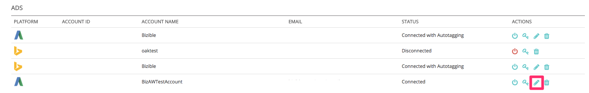

# Plataformas de publicidad integradas {#integrated-ad-platforms}

[!DNL Marketo Measure] tiene conexiones API con Google AdWords, Microsoft BingAds, [!DNL Facebook] Anuncios y DoubleClick Campaign Manager. A través de estas conexiones de API, [!DNL Marketo Measure] es capaz de extraer fácilmente datos y enviarlos a su CRM junto con la aplicación de Comprador externa. No es necesario cargar manualmente los costos o los datos. En su lugar, sus cuentas simplemente necesitan estar conectadas y autorizadas a la variable [!DNL Marketo Measure] aplicación. [!DNL Marketo Measure] descargará automáticamente sus costes de marketing desde las plataformas y los cargará en la variable [!DNL Marketo Measure] aplicación. Si selecciona habilitar el etiquetado automático para AdWords, BingAds o [!DNL Facebook] Publicidades, [!DNL Marketo Measure] adjuntará automáticamente sus parámetros a las direcciones URL de sus publicidades.

## Cómo conectar plataformas de publicidad {#how-to-connect-ad-platforms}

Antes de entrar en detalles específicos de cada plataforma, analizaremos cómo conectar cualquiera de estas cuentas a [!DNL Marketo Measure]. Inicie sesión por primera vez en [!DNL Marketo Measure] y vaya a la **[!UICONTROL Configuración]** en la **[!UICONTROL Mi cuenta]** en la parte superior izquierda de la pantalla. A continuación, seleccione **[!UICONTROL Conexiones]** en el **[!UICONTROL Integraciones]** a la izquierda.

Como se muestra en la imagen siguiente, verá un botón para configurar nuevas conexiones de anuncios.

Después de hacer clic en el botón [!UICONTROL Configurar nueva conexión de anuncios] , aparece una ventana (que se muestra a continuación) con cuatro anuncios [!UICONTROL connect]tipos de iones. Haga clic en conectar y aparecerá otra ventana pidiendo credenciales. Introduzca las credenciales y haga clic en [!UICONTROL authorization] para conectar la cuenta a [!DNL Marketo Measure].

## Google AdWords {#google-adwords}

Cuando cree sus publicidades en [!DNL Google AdWords], se le recomienda etiquetar sus campañas de una de las tres maneras siguientes: etiquetado manual, etiquetado automático o creando una plantilla de seguimiento. El etiquetado manual de la dirección URL de AdWords depende de que defina y agregue los parámetros al final de las direcciones URL de los anuncios. El etiquetado manual permite que cualquier plataforma que no sea de Google lea fácilmente los datos recopilados por los parámetros.

La plantilla de seguimiento es una herramienta que Google proporciona para añadir lo que llama parámetros de ValueTrack . Funcionan de la misma manera que las UTM y otros parámetros de etiquetado.

## Qué sucede cuando el etiquetado automático está habilitado {#what-happens-when-auto-tagging-is-enabled}

[!DNL Marketo Measure] Busca plantillas de seguimiento en su [!DNL AdWords] cuenta:

* *Opción A*: Se encuentra la plantilla de seguimiento. [!DNL Marketo Measure] añade sus parámetros a la plantilla .
* *Opción B*: Se encuentra el redireccionamiento de terceros. Si se encuentra un redireccionamiento de terceros en la plantilla de seguimiento, [!DNL Marketo Measure] no puede realizar ninguna acción. Deberá agregar manualmente la variable [!DNL Marketo Measure] al sistema de terceros. Un ejemplo de redirección de terceros sería una herramienta de gestión de ofertas como Kenshoo o Marin. Obtenga más información sobre cómo [las herramientas de administración de ofertas afectan a [!DNL Marketo Measure]](/help/api-connections/utilizing-marketo-measures-api-connections/how-bid-management-tools-affect-marketo-measure.md){target="_blank"}.

* *Opción C*: No se encuentra ninguna plantilla de seguimiento. [!DNL Marketo Measure] analizará todas las direcciones URL de destino de publicidad para [!DNL Marketo Measure] parámetros. En función del análisis, si:
   * Se encuentran parámetros: la configuración ha finalizado.
   * No se encuentran los parámetros: [!DNL Marketo Measure] adjuntará sus parámetros al final de las direcciones URL de destino de anuncio. [!DNL Marketo Measure] anexa nuevos anuncios en un plazo de dos horas tras su creación. Tenga en cuenta que los parámetros no se agregan a una plantilla.

Obtenga más información sobre nuestra [[!DNL AdWords] funcionalidad de etiquetado automático](/help/api-connections/utilizing-marketo-measures-api-connections/understanding-marketo-measure-adwords-tagging.md){target="_blank"}.

## Cómo activar [!DNL Marketo Measure] Etiquetado automático para palabras publicitarias {#how-to-enable-marketo-measure-auto-tagging-for-adwords}

Antes de activar [!DNL Marketo Measure] etiquetado automático, **asegúrese de que tiene habilitada una plantilla de seguimiento en el nivel de cuenta, campaña o grupo de publicidad dentro de su cuenta de AdWords. Esto es necesario para cualquier cuenta de AdWords que tenga [!DNL Marketo Measure] etiquetado automático habilitado.** Al habilitar una plantilla de seguimiento, se evita cualquier pérdida en los datos del historial de rendimiento de la publicidad. Tenga en cuenta que si se habilitan las plantillas de seguimiento en los niveles de palabra clave, vínculo de sitio o anuncio, la publicidad pasará por el proceso de revisión y aprobación y puede reiniciar potencialmente el historial de rendimiento de su publicidad. Si no hay ninguna plantilla de seguimiento habilitada, [!DNL Marketo Measure] adjuntará la variable [!DNL Marketo Measure] seguimiento de parámetros directamente a la &quot;URL final&quot; de la publicidad, que también puede causar la pérdida de datos del historial de anuncios.

Una vez que haya configurado una plantilla de seguimiento, siga las instrucciones que se indican a continuación para habilitar [!DNL Marketo Measure] Etiquetado automático. Nota: [!DNL Marketo Measure] también etiquetará automáticamente cualquier publicidad pausada en su cuenta.

1. Inicie sesión en su [!DNL Marketo Measure] cuenta en [experience.adobe.com/marketo-measure](https://experience.adobe.com/marketo-measure){target="_blank"}.

1. Vaya a [!UICONTROL Mi cuenta] > [!UICONTROL Configuración] > [!UICONTROL Integraciones] > [!UICONTROL Conexiones].

   

1. Haga clic en el icono de lápiz que aparece junto a la cuenta de AdWords que tendrá [!DNL Marketo Measure] etiquetado automático habilitado.

   

1. En la esquina superior derecha, active la casilla **[!UICONTROL Autoetiquetado]** cambiar a **[!UICONTROL Sí]**. En la parte inferior de la página, haga clic en **[!UICONTROL Más información]** para expandir el cuadro de texto y haga clic en **[!UICONTROL Guardar]**. Se ha completado la configuración del etiquetado automático.

   

## Cómo configurar una plantilla de seguimiento en AdWords con [!DNL Marketo Measure] Parámetros {#how-to-set-up-a-tracking-template-in-adwords-with-marketo-measure-parameters}

Tenga en cuenta que debe agregar plantillas de seguimiento en la variable [!UICONTROL Cuenta], [!UICONTROL Campaign] o Nivel de grupo de publicidad en AdWords. Si agrega plantillas de seguimiento al nivel de palabra clave, vínculo de sitio o anuncio, su publicidad deberá pasar por el proceso de revisión y aprobación y se arriesgará a reiniciar el historial de rendimiento de sus publicidades. Más información sobre [creación de plantillas de seguimiento](https://support.google.com/adwords/answer/6076199?hl=en#tracking){target="_blank"}.

1. Inicie sesión en su [!DNL Google AdWords] Cuenta.
1. Vaya a su [!UICONTROL Campañas] vista desde la barra de navegación izquierda
1. Vaya a &quot;[!UICONTROL Configuración]&quot;, también en la barra de navegación izquierda
1. Cambie a la &quot;[!UICONTROL Configuración de la cuenta]&quot; vista en la parte superior
1. Expanda el &quot;[!UICONTROL Seguimiento]&quot;
1. Pegue una de las siguientes cadenas de texto en la plantilla de seguimiento para establecer el valor de la plantilla:

   * Si tiene signos de interrogación en TODAS sus direcciones URL, use el siguiente texto de URL:

   `{lpurl}&_bt={creative}&_bk={keyword}&_bm={matchtype}&_bn={network}&_bg={adgroupid}`

   * Si no tiene signos de interrogación en ninguna de sus direcciones URL, agregue el siguiente texto URL:

   `{lpurl}?_bt={creative}&_bk={keyword}&_bm={matchtype}&_bn={network}&_bg={adgroupid}*`

   Para evitar que se produzcan errores al etiquetar manualmente las direcciones URL, normalmente se recomienda generar los parámetros de UTM automáticamente. Esto no tiene que significar el etiquetado automático con AdWords o [!DNL Marketo Measure] , existen varias herramientas que simplifican el proceso generando automáticamente los parámetros de la URL en función de la información proporcionada.

   >[!TIP]
   >
   >Si aparece un error que indica que la plantilla de seguimiento no es válida, intente vaciar la caché del explorador y vuelva a intentarlo. Esto suele solucionar el problema.

## Cómo generar automáticamente etiquetas de UTM para [!DNL Google AdWords] {#how-to-automatically-generate-utm-tags-for-google-adwords}

Las etiquetas de UTM pueden parecer difíciles de crear al principio, pero hay muchas herramientas disponibles para crear fácilmente direcciones URL con parámetros de UTM. Puede utilizar cualquiera de los siguientes recursos o buscar en la web más herramientas. Tenga en cuenta que [!DNL Marketo Measure] no respalda ni garantiza nada con estas plataformas y herramientas.

**[!DNL Google URL]Generador**

El Generador de URL de Google es una herramienta estándar para crear direcciones URL con formato correcto mediante etiquetas UTM. Simplemente introduzca la dirección URL y el valor deseado de cada parámetro y haga clic en[!UICONTROL Generar URL]&quot;. Esta es una herramienta ideal si solo tiene un puñado de direcciones URL para etiquetar. Acceder a la herramienta [here](https://support.google.com/analytics/answer/1033867?hl=en){target="_blank"}.

**Hoja de cálculo de Google generada por EpikOne**

Esta hoja de cálculo tiene una fórmula que generará automáticamente direcciones URL de destino etiquetadas. Se trata de una buena herramienta que se puede utilizar si es necesario etiquetar un gran número de vínculos. Acceso a la hoja de cálculo [here](https://spreadsheets.google.com/ccc?key=p7c_HKcmspSUfEYSO0gskKw&amp;hl=en){target="_blank"}.

**Herramienta de etiquetado de vínculos de Rafflecopter**

La hoja de cálculo creada por Rafflecopter es una versión modificada de [!DNL EpikOne's] hoja de cálculo. También contiene una fórmula que genera automáticamente vínculos de destino etiquetados para que los use.

Cada una de estas herramientas tiene instrucciones detalladas sobre cómo utilizarla y modificarla para adaptarla a sus necesidades. La herramienta está disponible [here](https://docs.google.com/spreadsheets/d/1QCIr1WUJQHE68cA4VTks2XE7nxuryaUymCEy_23-Oew/edit#gid=0){target="_blank"}.

**Generador de UTM asombroso de Effin**

Esta herramienta es una extensión de Chrome que le permite generar rápidamente etiquetas de UTM. Encuéntralo [here](https://chrome.google.com/webstore/detail/effin-amazing-utm-builder/eoaapiimcaimddnfhfnifgkinmpcbccp?hl=en){target="_blank"}.

## Anuncios de Bing {#bing-ads}

Bing Ads es una plataforma integrada que le permite habilitar el etiquetado automático de direcciones URL o utilizar una herramienta de terceros, como [!DNL Marketo Measure], para etiquetar anuncios. [!DNL Bing Ads] también se basa en parámetros de UTM.

La función de etiquetado automático de Bing Ads agrega los siguientes parámetros de la UTM:

* Utm_source
* Utm_medium
* Utm_term

El etiquetado automático de Bing Ads también agrega el siguiente parámetro personalizado:

`_bt={adid}`

La cadena tendría este aspecto:

`{lpurl}?_bt={adid}&utm_term={keyword}&utm_source=Bing_Yahoo&utm_medium=CPC`

Es importante tener en cuenta que [!DNL Bing Ads] le permite agregar incluso más parámetros utilizando sus etiquetas personalizadas en las direcciones URL finales para obtener más granularidad, si lo desea.

Se puede utilizar una plantilla de seguimiento si se desea, pero no es necesario para [!DNL Bing Ads] y [!DNL Marketo Measure] para integrar. Esto se debe a que [!DNL Bing] permite editar las publicidades sin cambiar el historial, por lo que [!DNL Marketo Measure] puede actualizar la dirección URL de destino.

El etiquetado automático debe habilitarse mediante [!DNL Marketo Measure] para que el [!DNL Marketo Measure] se pueden anexar automáticamente. No existe riesgo de perder el historial de rendimiento de anuncios anteriores con Bing Ads.

Visite la [[!DNL Bing Ads]](https://advertise.bingads.microsoft.com/en-us/blog/post/august-2016/upgraded-urls-now-available-in-bing-ads-an-easier-way-to-manage-your-tracking-urls){target="_blank"} sitio web para obtener más información sobre cómo añadir etiquetas en su plataforma.

## Anuncios publicitarios de Facebook {#facebook-ads}

La variable [!DNL Marketo Measure] integración con [!DNL Facebook] permite descargar automáticamente la información de la publicidad y etiquetar la URL con sus parámetros. [!DNL Marketo Measure] extraerá la información de campaña y conjunto de anuncios mediante nuestro etiquetado automático. El conjunto de anuncios rellenará el campo Nombre del grupo de anuncios . Para obtener más información sobre la configuración de etiquetas URL en la [!DNL Facebook] , visite [!DNL Facebook] [negocio](https://www.facebook.com/business/help/1016122818401732/?ref=u2u){target="_blank"} página.

Antes de activar el etiquetado automático con [!DNL Facebook Ads], es importante exportar el historial de rendimiento anterior como CSV. En este punto, cuando [!DNL Marketo Measure] etiquetas [!DNL Facebook Ads] con su parámetro _bf, [!DNL Facebook] lee los anuncios como nuevos y borra el historial de rendimiento. Por lo tanto, es importante exportar un registro del rendimiento anterior si es algo de valor para usted y su organización.

Tenga en cuenta que puede conectar su [!DNL Facebook] en cualquier momento para [!DNL Marketo Measure] aplicación y no se perderán datos; solo cuando el etiquetado automático esté habilitado se borrará el historial de rendimiento.

[Consulte este artículo](https://www.facebook.com/business/help/393890194130036){target="_blank"} de Facebook para obtener más información sobre la exportación [!DNL Facebook] Informes de publicidad.

## Contenido patrocinado por linkedIn {#linkedin-sponsored-content}

La integración de LinkedIn permite [!DNL Marketo Measure] para etiquetar direcciones URL de destino en [!DNL LinkedIn] Contenido patrocinado, que finalmente permite [!DNL Marketo Measure] para seguir a un usuario a través de su recorrido de punto de contacto completo y volver a asignar la actividad al [!DNL LinkedIn] Campaña y creativo. Esto proporciona a los clientes información sobre el ROI de sus [!DNL LinkedIn] actividad. [!DNL Marketo Measure] buscará creativos con un [!DNL LinkedIn] Compartir y agregar un `?_bl={creativeId}` al final del parámetro.

Porque [!DNL LinkedIn] Los elementos compartidos se pueden usar en varias campañas y elementos creativos. Le pedimos a los clientes que no copien, clonen o dupliquen los elementos creativos existentes para que puedan mantener su exclusividad. Si se encuentran elementos compartidos y se detecta que solo se utilizan en un elemento creativo, [!DNL Marketo Measure] Puede etiquetar el Compartir como está sin tener que volver a crear ningún elemento creativo o compartido y se conservará todo el historial de anuncios (impresiones, clics, compartidos).

Tan pronto como se encuentra una acción compartida que se comparte entre varios elementos creativos, [!DNL Marketo Measure] tendrá que ejecutar un proceso de pausar, copiar y volver a etiquetar para crear un conjunto único. [!DNL Marketo Measure] hará una pausa y archivará los elementos creativos en directo, lo que significa que también se archivará el elemento creativo que contiene las impresiones, los clics y los recursos compartidos sociales.

## Plataformas no integradas {#non-integrated-platforms}

Para plataformas que no están integradas con [!DNL Marketo Measure], el [!DNL Marketo Measure] no se puede usar la funcionalidad de etiquetado automático. Los parámetros deberán añadirse manualmente.
