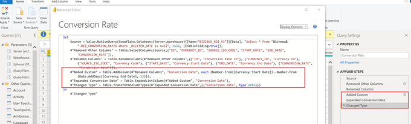

# Plantilla de informe de [!DNL Marketo Measure]: Power BI {#marketo-measure-report-template-power-bi}

## Introducción {#getting-started}

Puede acceder a la plantilla de informe de Power BI [aquí](https://github.com/adobe/Marketo-Measure-BI-Templates){target="_blank"}.

Abra el archivo de Power BI de plantilla de creación de informes de [!DNL Marketo Measure] de Adobe.

Puede encontrar la información específica del servidor, data warehouse y el esquema en la interfaz de usuario de [!DNL Marketo Measure] en la página de información de [!DNL Data Warehouse]. [Aquí](/help/marketo-measure-data-warehouse/data-warehouse-access-reader-account.md){target="_blank"} se detallan las instrucciones para localizar esta página.

Los parámetros QueryFilterStartDate y QueryFilterEndDate se utilizan para limitar la cantidad de datos importados. Estos parámetros deben tener el formato de SQL, puesto que se utilizan en las consultas enviadas a [!DNL Snowflake]. Por ejemplo, si desea limitar los datos a los dos últimos años, QueryFilterStartDate sería dateadd `dateadd`(year,-2,current_date()). Estos parámetros se comparan con los tipos de datos datetime, por lo que se recomienda utilizar dateadd `dateadd`(day,1,current_date()) para que QueryFilterEndDate devuelva todos los datos a la hora actual.

## Conexión de datos {#data-connection}

Los parámetros introducidos al abrir el archivo se utilizan para estructurar consultas nativas que importan tablas del data warehouse. Aún tendrá que configurar una conexión de datos a su instancia de [!DNL Snowflake]. Para ello, necesitará los mismos nombres de servidor y data warehouse junto con su nombre de usuario y contraseña. Los detalles sobre dónde encontrar su nombre de usuario y restablecer la contraseña, si es necesario, están documentados [aquí](/help/marketo-measure-data-warehouse/data-warehouse-access-reader-account.md){target="_blank"}.

## Importación de datos {#data-import}

Para mejorar el rendimiento del informe y aprovechar las posibilidades de transformación de Power Query, configure esta plantilla mediante el método de almacenamiento de importación.

### Parámetros de consulta {#query-parameters}

Para limitar los datos importados en el modelo, cada tabla se configura con una consulta nativa como origen. Las consultas nativas requieren aprobación para ejecutarse, pero debe hacer clic en ejecutar para cada consulta. Este paso solo es necesario la primera vez que se ejecutan las consultas o si cambian los parámetros.

Todas las consultas filtran las filas eliminadas y las tablas de [!UICONTROL hechos] se definen para filtrar en filas con una fecha de modificación entre las fechas de inicio y finalización introducidas como parámetros.

>[!NOTE]
>
>Debido a que los filtros de fecha se aplican a la fecha de modificación de una fila, tenga cuidado al crear informes sobre fechas que se encuentran fuera del intervalo de fechas restringido. Por ejemplo, el intervalo de fecha modificado está limitado a los últimos dos años. Esto puede incluir un evento con una fecha de evento de hace tres años, pero que se ha modificado recientemente. Sin embargo, la creación de informes sobre los eventos de hace tres años devuelve resultados incompletos, ya que no todas las filas se habrán modificado en el lapso de dos años.

Las siguientes tablas se tratan como tablas de hechos; los límites de fecha en la fecha de modificación se han añadido a estas consultas.

* Actividad
* Touchpoint
* Touchpoint de posible cliente
* Touchpoint de atribución
* Coste
* Formulario del sitio
* Sesión
* Miembro de la campaña
* Tarea
* Evento
* Transición de etapa de posible cliente/contacto
* Transición de etapa de oportunidad

Las siguientes tablas se tratan como tablas de dimensiones; no se establecen límites de fecha para estas consultas.

* Cuenta
* Campaña
* Contacto
* Tasa de conversión
* Oportunidad
* Posible cliente
* Fase
* Canal

## Transformaciones de datos {#data-transformations}

Se han aplicado algunas transformaciones a los datos de Power Query. Para ver las transformaciones específicas de cualquier tabla, abra Power Query, vaya a una tabla y observe los Pasos aplicados en la parte izquierda de la ventana. A continuación se describen algunas de las transformaciones específicas.

### Columnas eliminadas {#removed-columns}

Para simplificar el modelo de datos y eliminar datos redundantes e innecesarios, hemos reducido el número de columnas importadas en Power BI desde la tabla de [!DNL Snowflake] original. Las columnas eliminadas incluyen claves externas innecesarias, datos dimensionales desnormalizados que se aplican mejor mediante relaciones con otras tablas del modelo, columnas de auditoría y campos utilizados para procesamiento interno de [!DNL Marketo Measure]. Puede añadir o quitar columnas según sea necesario para sus necesidades comerciales. Vaya al paso “Otras columnas eliminadas” después del paso “Origen” en cualquier tabla, haga clic en el icono de engranaje y actualice las columnas seleccionadas en la lista proporcionada.

>[!NOTE]
>
>* Tenga cuidado al añadir valores de clave externa adicionales. A menudo, Power BI se configura para detectar automáticamente las relaciones en el modelo; añadir valores de clave externa puede provocar vínculos no deseados entre tablas o deshabilitar las relaciones existentes.
>
>* La mayoría de las tablas de Data Warehouse de [!DNL Marketo Measure] contienen datos dimensionales sin normalizar. Hemos trabajado para normalizar y limpiar el modelo en Power BI en la medida de lo posible para mejorar el rendimiento y la precisión de los datos. Tenga cuidado al incluir campos sin normalizar adicionales en tablas de hechos, ya que esto podría interrumpir el filtrado dimensional en todas las tablas y también podría generar una creación de informes inexactos.

### Columnas renombradas {#renamed-columns}

Se ha cambiado el nombre de las tablas y columnas para facilitar su uso y estandarizar las convenciones de nomenclatura. Para ver los cambios de nombre de columna, vaya al paso “Columnas renombradas” después del paso “Otras columnas eliminadas” en cualquier tabla.

### Segmentos renombrados {#renamed-segments}

Dado que los nombres de segmentos se pueden personalizar, tienen nombres de columna genéricos en Data Warehouse de Snowflake. [!DNL BIZ_SEGMENT_NAMES] es una tabla de asignación que enumera el nombre del segmento genérico y su nombre de segmento personalizado asignado, definido en la sección de segmento en la interfaz de usuario de [!DNL Marketo Measure]. La tabla Nombre del segmento se utiliza para cambiar el nombre de las columnas del segmento en las tablas Touchpoint de posible cliente y de atribución. Si no existe ningún segmento personalizado, se mantiene el nombre del segmento genérico.

### Conversión de ID que distingue entre mayúsculas y minúsculas {#case-sensitive-id-conversion}

Los datos de [!DNL Marketo Measure] tienen un par de tablas en las que los valores de clave principal (ID) distinguen entre mayúsculas y minúsculas, concretamente Touchpoint y Campaign. El motor de datos que impulsa la capa de modelado de Power BI no distingue entre mayúsculas y minúsculas, lo que da como resultado valores de ID “duplicados”. Para preservar la distinción entre mayúsculas y minúsculas en estos valores clave, hemos implementado pasos de transformación que adjuntan caracteres invisibles a caracteres en minúsculas, preservando la exclusividad del ID cuando se evalúa en la capa del motor de datos. Encontrará más detalles sobre el problema y los pasos detallados del método que hemos empleado [aquí] (https://blog.crossjoin.co.uk/2019
/10/06/power-bi-and-case-sensitivity/){target="_blank"}. Estos valores de ID con distinción de mayúsculas y minúsculas están etiquetados como “ID de unión” y se utilizan como claves de unión en la capa de relación. Hemos ocultado los ID de unión de la capa de creación de informes, manteniendo los valores de ID originales visibles para su uso en la creación de informes, ya que los caracteres invisibles pueden interferir con las funciones 
de cortar/pegar y el filtrado.

### Filas añadidas {#rows-added}

Para añadir funciones de conversión de moneda a los cálculos del modelo, se ha añadido una columna de tasa de conversión corporativa a las tablas Oportunidad y Coste. El valor de esta columna se añade al nivel de fila y se evalúa uniendo a la tabla Tasa de conversión tanto en la fecha como en el identificador de moneda. Para obtener más información sobre cómo funciona la conversión de moneda en este modelo, consulte la [Conversión de moneda](#currency-conversion) de esta documentación.

La tabla tasa de conversión almacenada en [!DNL Snowflake] contiene un intervalo de fechas para cada conversión. Power BI no permite unir criterios en un cálculo (es decir, entre un intervalo de fechas). Para unir las fechas, añadimos pasos a la tabla Tasa de conversión para expandir las filas, de modo que haya una para cada fecha en el intervalo de fechas de conversión.

## Modelo de datos {#data-model}

Haga clic en la imagen siguiente para ver la versión a tamaño completo.

{target="_blank"}

### Relaciones y flujo de datos {#relationships-and-data-flow}

Los datos de evento, utilizados para crear Touchpoints, se almacenan en [!UICONTROL Sesión], [!UICONTROL Tarea], [!UICONTROL Evento], [!UICONTROL Actividad] y en las tablas de los abonados de la campaña. Estas tablas de eventos se unen a la tabla de Touchpoints a través de sus respectivos ID. Si el evento resultó en un Touchpoint, los detalles se almacenan en la tabla Touchpoint.

Los Touchpoints de posibles clientes y los de atribución se almacenan en sus propias tablas, con un vínculo a la tabla Touchpoint. La mayoría de los datos dimensionales de los Touchpoints de posibles clientes y atribución proceden de su vínculo al Touchpoint correspondiente.

En este modelo, las dimensiones Campaña y Canal están vinculadas al Touchpoint, por lo que todas las creaciones de informes sobre estas dimensiones se realizan a través de este vínculo, lo que significa que la creación de informes dimensionales sobre los datos de evento pueden estar incompletos. Esto se debe a que muchos eventos no tienen vínculos a estas dimensiones hasta que se procesan en puntos de contacto. Nota: Algunos eventos, como las sesiones, tienen vínculos directos a las dimensiones Campaña y Canal. Si se desea crear informes sobre estas dimensiones en el nivel de sesión, se recomienda crear un modelo de datos independiente para este fin.

Los datos de costes se almacenan en diferentes niveles de agregación dentro de la tabla de costes de la Data Warehouse de [!DNL Snowflake]. Para todos los proveedores de publicidad, los datos de nivel de campaña se pueden resumir en el nivel de canal. Por este motivo, este modelo extrae los datos de los costes en función del indicador &quot;campaign_is_aggregatable_cost&quot;. Los costes autoinformados se pueden enviar solo a nivel de canal y no es necesario que tengan datos de Campaña. Para ofrecer una creación de informes de costes más precisos posibles, los costes autoinformados se extraen en función del indicador &quot;channel_is_aggregatable_cost&quot;. La consulta que importa los datos de costes se escribe con la siguiente lógica: si ad_provider = &quot;SelfReported&quot;, channel_is_aggregatable_cost = true; de lo contrario, campaign_is_aggregatable_cost = true.

Los datos de coste y los datos de Touchpoint tienen algunas dimensiones comunes, por lo que ambas tablas de hechos tienen relaciones con las tablas de dimensión de Campaña y Canal.

En el contexto de este modelo, los datos [!UICONTROL Posible cliente], [!UICONTROL Contacto], [!UICONTROL Cuenta] y [!UICONTROL Oportunidad] se consideran datos dimensionales y van unidos directamente con las tablas Touchpoint de [!UICONTROL posible cliente] y Touchpoint de [!UICONTROL atribución].

### Tablas añadidas {#added-tables}

**Fecha**

Dado que Power BI solo permite las relaciones entre las tablas de una columna, se ha añadido una tabla de dimensión Fecha para facilitar la unión necesaria entre las tablas que contienen importes (oportunidad y coste) y la tabla Tasa de conversión. Consulte la sección Conversión de moneda para obtener más información sobre cómo se calculan las conversiones de moneda en este modelo.

**Medidas**

Todas las medidas se han añadido a una tabla de medidas específica. No tiene conexión con el modelo, pero sirve como una sola ubicación para almacenar todas las medidas, para facilitar su uso.

**Modelo de atribución**

Se ha añadido una tabla independiente para almacenar los nombres de los modelos de atribución. Esta tabla se utiliza para crear filtros que permiten al usuario cambiar entre modelos de atribución para cálculos de ingresos atribuidos.

### Conversión de moneda {#currency-conversion}

Las tasas de la tabla Tasa de conversión representan el valor necesario para convertir una cantidad de la moneda corporativa. Las conversiones a cualquier moneda requieren una conversión doble, primero de la moneda original a la divisa corporativa y, a continuación, de la divisa corporativa a la seleccionada. El primer paso de esta cadena en el modelo es añadir una columna con la tasa de conversión a corporativa a las tablas con importes, oportunidades y costes. Estos pasos se detallan en la cabecera Filas añadidas de la sección Transformaciones de datos de este documento. La conversión de la moneda original a la moneda corporativa consiste en dividir el valor por esta columna añadida. El siguiente paso es multiplicar el valor de la moneda corporativa por la tasa de la tabla Tasa de conversión que corresponde a la moneda seleccionada.

* Convertir el valor original al valor en moneda corporativa/tasa de conversión corporativa = valor en moneda corporativa
* Convertir el valor de moneda corporativa al valor de moneda seleccionado en moneda corporativa `*` tasa de conversión de la moneda seleccionada = valor en la moneda seleccionada

Como no es necesario que las tasas de conversión sean estáticas y pueden cambiar según intervalos de fechas especificados, todos los cálculos de conversión de moneda deben realizarse en el nivel de fila. De nuevo, dado que las tasas de conversión pertenecen a un intervalo de fechas específico, el cálculo de búsqueda debe realizarse dentro del DAX de la medida, por lo que la relación puede definirse tanto en el código de moneda como en la fecha.

Las medidas de conversión de moneda de este modelo sustituyen la tasa por un valor de 1.0 si no se puede identificar ninguna tasa de conversión. Se han creado medidas independientes para mostrar el valor de moneda de la medida y avisar si un cálculo incluye más de un valor de moneda (es decir, no se ha podido convertir un valor a la moneda seleccionada).

## Definiciones de datos {#data-definitions}

Se han añadido definiciones al modelo de Power BI para tablas, columnas personalizadas y medidas.

Para ver las definiciones de columnas procedentes directamente de [!DNL Snowflake], consulte la [documentación de data warehouse](/help/marketo-measure-data-warehouse/data-warehouse-schema.md){target="_blank"}.

## Discrepancias entre plantillas y Discover {#discrepancies-between-templates-and-discover}

### Ingresos atribuidos {#attributed-revenue}

Los Touchpoints de posible cliente y de atribución heredan los datos dimensionales del Touchpoint original. El modelo de plantilla de creación de informes obtiene todos los datos dimensionales heredados de la relación con Touchpoint, mientras que en el modelo Discover, los datos dimensionales se desnormalizan en los registros de Touchpoint de posible cliente y de atribución. Los valores generales de ingresos atribuidos o de canalización atribuidos deben alinearse entre los dos informes. Sin embargo, pueden observarse discrepancias cuando los ingresos se desglosan o filtran por datos dimensionales (canal, subcanal o campaña). Si las cantidades de ingresos dimensionales no coinciden entre la plantilla y Discover, es probable que falten registros de Touchpoint o en el conjunto de datos del informe de plantilla. Esto sucede cuando hay un registro de un Touchpoint de posible cliente o de atribución, pero no hay ningún registro correspondiente en la tabla Touchpoint dentro del conjunto de datos importado al informe. Dado que estas tablas se filtran por fecha de modificación, es posible que el registro de Touchpoint de posible cliente/atribución se haya modificado más recientemente que el registro de Touchpoint. Por consiguiente, el Touchpoint de posible cliente/atribución se haya importado al conjunto de datos, mientras que el registro de Touchpoint original no. Para solucionar este problema, amplíe el intervalo de fechas filtrado para la tabla Punto de contacto o considere la posibilidad de eliminar la restricción de fecha en su totalidad. Nota: Touchpoint es una tabla grande, así que considere las alternativas de un conjunto de datos más completo frente a la cantidad de datos que deben importarse.

### Coste {#cost}

La creación de informes sobre costes en las plantillas solo están disponibles a nivel de campaña y canal. Sin embargo, Discover ofrece creación de informes con niveles de granularidad más bajos para algunos proveedores de publicidad (es decir, creativo, palabra clave, de grupos de publicidad, etc.). Para obtener más información sobre cómo se modelan los datos sobre costes en las plantillas, consulte la sección Modelo de datos de esta documentación. Si el filtro de dimensión en [!UICONTROL Discover] se establece en canal o campaña, los costes en los niveles de canal, subcanal y campaña deben alinearse entre Discover y las plantillas de creación de informes.

### Retorno de la inversión {#roi}

Dado que el ROI se calcula a partir de los ingresos atribuidos y el coste, las mismas discrepancias que pueden surgir en cualquiera de estos cálculos pueden surgir en el ROI y por los mismos motivos, como se indica en esas secciones.

### Puntos de contacto {#touchpoints}

Estas métricas, como se muestra en las plantillas de creación de informes, no se reflejan en Discover. Actualmente, no hay ninguna comparación directa posible entre ambos.

### Tráfico web {#web-traffic}

El modelo de datos de plantilla de creación de informes normaliza los datos dimensionales de canal, subcanal y campaña a través de la relación entre Sesión y Touchpoint. Esto es diferente al modelo de datos Discover, que desnormaliza estas dimensiones en la sesión. Debido a esta distinción, los recuentos generales de visitas y visitantes deben coincidir entre Discover y la plantilla de creación de informes. Sin embargo, una vez mostrados o filtrados por dimensión, no se espera que estos números coincidan. Esto se debe a que los datos dimensionales de la plantilla solo están disponibles para eventos web que dieron como resultado un Touchpoint (es decir, eventos no anónimos). Para obtener más información, consulte la sección [Modelo de datos](#data-model) de esta documentación.

Puede haber pequeñas discrepancias en los recuentos totales de formularios del sitio entre [!DNL Discover] y la plantilla. Esto se debe a que el modelo de datos de la plantilla de creación de informes obtiene datos dimensionales para el formulario del sitio mediante una relación con la sesión y, a continuación, con Touchpoint. Hay algunas instancias en las que los datos del formulario del sitio no tienen una sesión correlacionada.

### Posibles clientes y cuentas {#leads-and-accounts}

La creación de informes dimensionales para las cuentas alcanzadas pueden diferir ligeramente entre Discover y la plantilla, esto se debe de nuevo al modelado dimensional proveniente de la relación entre Touchpoint y Touchpoints de posible cliente y de atribución. Consulte los detalles descritos en la sección Ingresos atribuidos para obtener más información.

Todos los recuentos de posibles clientes en Discover se atribuyen a los recuentos de posibles clientes atribuidos y, en la plantilla de creación de informes, la métrica se refiere a posibles clientes alcanzados. Por lo tanto, no existe una comparación directa posible entre los dos informes para esta medida.

### Ruta de participación {#engagement-path}

No hay comparación directa entre el informe [!UICONTROL Ruta de participación] en Discover y la plantilla. El informe en [!DNL Discover] se modela a partir del Punto de contacto, mientras que el informe de la plantilla se modela a partir del Punto de contacto de atribución. La plantilla se centra únicamente en las oportunidades y sus puntos de contactos relacionados, en lugar de mostrarlos a todos.

### Velocidad del acuerdo {#deal-velocity}

No debe haber discrepancias entre este informe en la plantilla y el mosaico Velocidad del acuerdo en el panel Velocidad en Discover.
