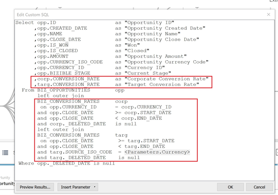
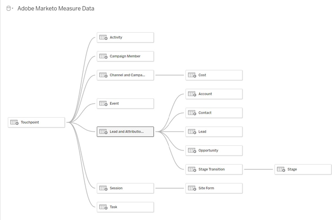

# Plantilla de informe de [!DNL Marketo Measure]: Tableau {#marketo-measure-report-template-tableau}

## Introducción {#getting-started}

Puede acceder a la plantilla de informe de [!DNL Tableau] [aquí](https://github.com/adobe/Marketo-Measure-BI-Templates){target="_blank"}.

Abra el archivo de libro de trabajo de Tableau de plantilla de creación de informes de [!DNL Adobe Marketo Measure].

Debe actualizar los datos de conexión existentes con la información de conexión específica del Snowflake. Haga clic en el botón [!UICONTROL Editar conexión] y siga los pasos descritos en la sección [[!UICONTROL Conexión de datos]](#data-connection) de esta documentación.


## Conexión de datos {#data-connection}

Debe configurar una conexión de datos con la instancia de Snowflake. Para ello, necesita el nombre del servidor junto con su nombre de usuario y contraseña. Los detalles sobre dónde encontrar esta información y restablecer su contraseña, si es necesario, están documentados [aquí](/help/marketo-measure-data-warehouse/data-warehouse-access-reader-account.md){target="_blank"}.


También deberá introducir un comando de SQL inicial. Esto admite el uso de consultas personalizadas en este modelo de datos. El comando a introducir es “Usar esquema `<your schema name>`”. Puede localizar el nombre del esquema en la página [!UICONTROL conexiones de data warehouse]; consulte la documentación a la que se hace referencia arriba.


### Consultas de SQL personalizadas {#custom-sql-queries}

Dado que [!DNL Tableau] aplica filtros de fuente de datos a la consulta general y no a la tabla individual en la que está establecido el filtro, hemos seleccionado utilizar un SQL personalizado para cada tabla del modelo. Esto permite que el modelo filtre las filas eliminadas y duplicadas en el nivel de tabla. Por ejemplo, cuando se aplica como filtro de fuente de datos o sesión._deleted_date es null se añadirá a la cláusula where de la consulta, lo que da como resultado la siguiente consulta.

**Filtros añadidos a la fuente de datos**

```
--A deleted session removes this row completely and the touchpoint data is lost. Select *
   From Touchpoint    tp
      join Session sn
      on tp.session_id = sn.session_id 
 Where tp._deleted_date is null
    and sn._deleted_date is null
```

Sin embargo, esto no es correcto, ya que si se eliminó una sesión, pero no el punto de contacto correspondiente, los datos del punto de contacto se eliminan del conjunto de datos. Queremos que los datos del punto de contacto estén presentes en el conjunto de datos, ya que el punto de contacto no se ha eliminado. Añadir SQL personalizado garantiza que los criterios de filtro se apliquen en el nivel de tabla, lo que da como resultado la siguiente consulta.

**Filtros aplicados mediante SQL personalizado**

```
--A deleted session only removes the session related data, and the touchpoint data is preserved. Select *
   From Touchpoint       tp
      join Session sn
      on tp.session_id          = sn.session_id 
      and sn._deleted_date      is null
  Where tp._deleted_date is null
```

## Transformaciones de datos {#data-transformations}

Se han aplicado algunas transformaciones a los datos de [!DNL Tableau] a partir de su estado original en Snowflake. La mayoría de estas transformaciones se aplican en las consultas de SQL personalizado que generan las tablas en el modelo de [!DNL Tableau]. Para ver el SQL personalizado utilizado para generar una tabla, haga clic con el botón derecho en el nombre de la tabla y seleccione &quot;Editar consulta SQL personalizada&quot;. A continuación se describen algunas de las transformaciones específicas.


### Columnas eliminadas {#removed-columns}

Para simplificar el modelo de datos y eliminar datos redundantes e innecesarios, hemos reducido el número de columnas importadas en Tableau desde la tabla de Snowflake original. Las columnas eliminadas incluyen claves externas innecesarias, datos dimensionales desnormalizados que se utilizan mejor mediante relaciones con otras tablas del modelo, columnas de auditoría y campos utilizados para tareas internas [!DNL Marketo Measure] procesando. Puede añadir o quitar columnas según sea necesario para sus necesidades comerciales, editando la lista de columnas importadas en la sección Seleccionar del SQL personalizado.

>[!NOTE]
>
>La mayoría de las tablas de data warehouse contienen datos dimensionales desnormalizados. Hemos trabajado para normalizar y limpiar el modelo en [!DNL Tableau] lo más posible para mejorar el rendimiento y la precisión de los datos. Tenga cuidado al incluir campos sin normalizar adicionales en tablas de hechos, ya que esto podría interrumpir el filtrado dimensional en todas las tablas y también podría generar una creación de informes inexactos.

### Columnas renombradas {#renamed-columns}

Se ha cambiado el nombre de las tablas y columnas para que sean más fáciles de usar y para estandarizar las convenciones de nomenclatura. Para ver los cambios de nombre de columna, haga referencia a las sentencias de SQL personalizado que crean las tablas.

### Filas añadidas {#rows-added}

Para añadir funciones de conversión de moneda a los cálculos del modelo, hemos añadido una columna de tasa de conversión corporativa y una columna de tasa de conversión de público destinatario a las tablas Oportunidad y Coste. El valor de estas columnas se añade al nivel de fila y se evalúa al unirse a la tabla Tasa de conversión tanto en la fecha como en el identificador de moneda. Dado que Tableau no permite que las tablas de hechos compartan más de una tabla de dimensiones, las tasas de conversión se han añadido directamente a las tablas que lo utilizan. Para obtener más información sobre cómo funciona la conversión de moneda en este modelo, consulte la [Conversión de moneda](#currency-conversion) de esta documentación.



Hay algunos lugares donde dos tablas de [!DNL Snowflake] se han combinado con una unión para crear una tabla en el modelo de datos de [!DNL Tableau]. En estos casos, se ha añadido una columna “Tipo” para indicar de qué tabla de [!DNL Snowflake] procede y designar qué entidad representa la fila. Para obtener más información sobre las tablas que se han combinado, consulte la sección Relación y flujo de datos en esta documentación.


### Nombres de los segmentos {#segment-names}

Dado que los nombres de segmentos se pueden personalizar, tienen nombres de columna genéricos en Data Warehouse de Snowflake. [!DNL BIZ_SEGMENT_NAMES] es una tabla de asignación que enumera el nombre del segmento genérico con el nombre de segmento personalizado al que está asignado, tal como se define en la sección de segmentos en la interfaz de usuario de [!DNL Marketo Measure]. Si utiliza nombres de segmento personalizados y desea actualizar su modelo de [!DNL Tableau] para incorporarlos, utilice esta tabla y cambie el nombre manualmente de las columnas dentro del modelo Tableau. Las columnas del segmento se encuentran en la tabla de puntos de contacto de posible cliente y atribución, y solo será necesario cambiar el nombre una vez.

La columna [!UICONTROL CATEGORÍA] muestra el número de categoría, y la columna SEGMENT_NAME tiene el nombre de segmento personalizado al que se asigna.


Los nombres se pueden actualizar de dos formas. La primera opción es actualizar el SQL personalizado. En este ejemplo, se ha cambiado el nombre de las categorías 1 a 6 en función de la asignación de la tabla Nombres de segmentos.


La otra opción es cambiar el nombre de las columnas directamente en la tabla de [!DNL Tableau].


## Modelo de datos {#data-model}

Haga clic en la imagen siguiente para ver la versión a tamaño completo.

[](/help/bi-report-templates/assets/tableau-data-model.png){target="_blank"}

### Relaciones y flujo de datos {#relationships-and-data-flow}

Los datos de evento, utilizados para crear puntos de contacto, se almacenan en las tablas [!UICONTROL Sesión], [!UICONTROL Tarea], [!UICONTROL Evento], [!UICONTROL Actividad] y [!UICONTROL Miembro de campaña]. Estas tablas de eventos se unen a la tabla de Touchpoints a través de sus respectivos ID. Si el evento resultó en un Touchpoint, los detalles se almacenan en la tabla Touchpoint.

Los puntos de contacto del posible cliente y los puntos de contacto de atribución se combinan en una tabla de este modelo, con un vínculo a la tabla Punto de contacto. Se ha añadido la columna “Tipo de punto de contacto” para designar si una fila es un punto de contacto de posible cliente o de atribución. La mayoría de los datos dimensionales de los Touchpoints de posibles clientes y atribución proceden de su vínculo al Touchpoint correspondiente.

Las transiciones de fase de oportunidad y las transiciones de etapa de posible cliente se combinan en una tabla de este modelo, con un vínculo a la Tabla de punto de contacto [!UICONTROL Posible cliente y atribución]. Se ha añadido la columna “Tipo de transición” para designar si una fila es una transición de etapa de oportunidad o de posible cliente.

Tanto los datos de coste como los de punto de contacto comparten las dimensiones de canal y campaña. Sin embargo, Tableau tiene una capacidad limitada para modelar dimensiones compartidas entre tablas de hechos. Dado que estamos limitados a una sola tabla de dimensiones compartida, los datos de canal y campaña se han combinado en una tabla. Se combinan utilizando una combinación cruzada de las dos dimensiones en una tabla de Tableau: Canal y Campaña. El ID único se crea concatenando los ID de canal y de campaña. Este mismo valor de ID se añade a las tablas Punto de contacto y Coste para crear una relación con esta tabla de dimensión combinada.


En este modelo, las dimensiones Campaña y Canal están vinculadas al Touchpoint, por lo que todas las creaciones de informes sobre estas dimensiones se realizan a través de este vínculo, lo que significa que la creación de informes dimensionales sobre los datos de evento pueden estar incompletos. Esto se debe a que muchos eventos no tienen vínculos a estas dimensiones hasta que se procesan en puntos de contacto.

>[!NOTE]
>
>Algunos eventos, como las Sesiones, tienen vínculos directos a las dimensiones Campaña y Canal. Si se desea crear informes sobre estas dimensiones en el nivel de sesión, se recomienda crear un modelo de datos independiente para este fin.

Los datos de coste se almacenan en diferentes niveles de agregación dentro de la tabla de coste de Snowflake Data Warehouse. Para todos los proveedores de publicidad, los datos de nivel de campaña se pueden resumir en el nivel de canal. Por este motivo, este modelo extrae los datos de los costes en función del indicador &quot;campaign_is_aggregatable_cost&quot;. Los costes autoinformados se pueden enviar solo a nivel de canal y no es necesario que tengan datos de Campaña. Para ofrecer una creación de informes de costes más precisos posibles, los costes autoinformados se extraen en función del indicador &quot;channel_is_aggregatable_cost&quot;. La consulta que importa los datos de costes se escribe con la siguiente lógica: si ad_provider = &quot;SelfReported&quot;, channel_is_aggregatable_cost = true; de lo contrario, campaign_is_aggregatable_cost = true.

En el contexto de este modelo, los datos de Posible cliente, [!UICONTROL Contacto], [!UICONTROL Cuenta] y [!UICONTROL Oportunidad] se consideran datos dimensionales y se unen directamente a la tabla Punto de contacto de posible cliente y de atribución.

### Conversión de moneda {#currency-conversion}

Las tasas de la tabla Tasa de conversión representan el valor necesario para convertir una cantidad de la moneda corporativa. Las conversiones a cualquier moneda requieren una conversión doble, primero de la moneda original a la divisa corporativa y, a continuación, de la divisa corporativa a la seleccionada. El primer paso en esta cadena del modelo es añadir dos columnas con estas tasas de conversión a las tablas con importes, Oportunidad y Coste. Estos pasos se detallan en la sección Filas añadidas de este documento. Como no es necesario que las tasas de conversión sean estáticas y pueden cambiar según intervalos de fechas especificados, todos los cálculos de conversión de moneda deben realizarse en el nivel de fila. La conversión de la moneda original a la moneda corporativa consiste en dividir el valor por la tasa de conversión corporativa y, a continuación, multiplicar por la tasa de conversión de destino. La tasa de conversión de destino está determinada por el valor de parámetro de moneda seleccionado.

* Convertir el valor original al valor en moneda corporativa/tasa de conversión corporativa = valor en moneda corporativa
* Convertir el valor de moneda corporativa al valor de moneda seleccionado en moneda corporativa `*` tasa de conversión de la moneda seleccionada = valor en la moneda seleccionada


Las medidas de conversión de moneda de este modelo sustituyen la tasa por un valor de 1.0 si no se puede identificar ninguna tasa de conversión. Se han creado medidas independientes para mostrar el valor de moneda de la medida y avisar si un cálculo incluye más de un valor de moneda (es decir, no se pudo convertir un valor a la moneda seleccionada). Estas medidas, Moneda de coste y Moneda de ingresos, se incluyen como información sobre herramientas en cualquier imagen que muestre datos de Costes o Ingresos.


## Definiciones de datos {#data-definitions}

Se han añadido definiciones a [!DNL Tableau model] para parámetros, columnas personalizadas y medidas.


Para ver las definiciones de columnas procedentes directamente de [!DNL Snowflake], consulte la [documentación de data warehouse](/help/marketo-measure-data-warehouse/data-warehouse-schema.md){target="_blank"}.

## Discrepancias entre plantillas y Discover {#discrepancies-between-templates-and-discover}

### Ingresos atribuidos {#attributed-revenue}

Los Touchpoints de posible cliente y de atribución heredan los datos dimensionales del Touchpoint original. El modelo de plantilla de creación de informes obtiene todos los datos dimensionales heredados de la relación con Touchpoint, mientras que en el modelo Discover, los datos dimensionales se desnormalizan en los registros de Touchpoint de posible cliente y de atribución. Los valores generales de ingresos atribuidos o de canalización atribuidos deben alinearse entre los dos informes. Sin embargo, pueden observarse discrepancias cuando los ingresos se desglosan o filtran por datos dimensionales (canal, subcanal o campaña). Si las cantidades de ingresos dimensionales no coinciden entre la plantilla y Discover, es probable que falten registros de Touchpoint o en el conjunto de datos del informe de plantilla. Esto sucede cuando hay un registro de un Touchpoint de posible cliente o de atribución, pero no hay ningún registro correspondiente en la tabla Touchpoint dentro del conjunto de datos importado al informe. Dado que estas tablas se filtran por fecha de modificación, es posible que el registro de Touchpoint de posible cliente/atribución se haya modificado más recientemente que el registro de Touchpoint. Por consiguiente, el Touchpoint de posible cliente/atribución se haya importado al conjunto de datos, mientras que el registro de Touchpoint original no. Para solucionar este problema, amplíe el intervalo de fechas filtrado para la tabla Punto de contacto o considere la posibilidad de eliminar la restricción de fecha en su totalidad.

>[!NOTE]
>
>Punto de contacto es una tabla grande, así que considere las alternativas de un conjunto de datos más completo frente a la cantidad de datos que deben importarse.

### Coste {#cost}

La creación de informes sobre costes en las plantillas solo están disponibles a nivel de campaña y canal. Sin embargo, Discover ofrece creación de informes con niveles de granularidad más bajos para algunos proveedores de publicidad (es decir, creativo, palabra clave, de grupos de publicidad, etc.). Para obtener más información sobre cómo se modelan los datos de costes en las plantillas, consulte la [!UICONTROL Modelo de datos] de esta documentación. Si el filtro de dimensión en [!UICONTROL Discover] se establece en canal o campaña, los costes en los niveles de canal, subcanal y campaña deben alinearse entre Discover y las plantillas de creación de informes.

### Retorno de la inversión {#roi}

Dado que el ROI se calcula a partir de los ingresos atribuidos y el coste, las mismas discrepancias que pueden surgir en cualquiera de estos cálculos pueden surgir en el ROI y por los mismos motivos, como se indica en esas secciones.

### Puntos de contacto {#touchpoints}

Estas métricas, como se muestra en las plantillas de creación de informes, no se reflejan en Discover. Actualmente, no hay ninguna comparación directa posible entre ambos.

### Tráfico web {#web-traffic}

El modelo de datos de plantilla de creación de informes normaliza los datos dimensionales de canal, subcanal y campaña a través de la relación entre Sesión y Touchpoint. Esto es diferente al modelo de datos Discover, que desnormaliza estas dimensiones en la sesión. Debido a esta distinción, los recuentos generales de visitas y visitantes deben coincidir entre Discover y la plantilla de creación de informes. Sin embargo, una vez mostrados o filtrados por dimensión, no se espera que estos números coincidan. Esto se debe a que los datos dimensionales de la plantilla solo están disponibles para eventos web que dieron como resultado un punto de contacto (es decir, eventos no anónimos). Para obtener más información, consulte la [Modelo de datos](#data-model) de esta documentación.

Puede haber pequeñas discrepancias en los recuentos totales de formularios del sitio entre [!DNL Discover] y la plantilla. Esto se debe a que el modelo de datos de la plantilla de creación de informes obtiene datos dimensionales para el formulario del sitio mediante una relación con la sesión y, a continuación, con Touchpoint. Hay algunas instancias en las que los datos del formulario del sitio no tienen una sesión correlacionada.

### Posibles clientes y cuentas {#leads-and-accounts}

Los informes dimensionales para las cuentas involucradas pueden diferir ligeramente entre [!DNL Discover] y la plantilla, esto se debe de nuevo al modelado dimensional proveniente de la relación entre Punto de contacto y Punto de contacto de posible cliente y Punto de contacto de atribución. Consulte los detalles descritos en la sección Ingresos atribuidos para obtener más información.

Todos los recuentos de posibles clientes en [!UICONTROL Discover] son recuentos de posibles clientes atribuidos y, en la plantilla de informes, la métrica es [!UICONTROL posibles clientes involucrados]. Por lo tanto, no existe una comparación directa posible entre los dos informes para esta medida.

### Ruta de participación {#engagement-path}

No hay comparación directa entre el informe de [!UICONTROL Ruta de participación] en [!DNL Discover] y la plantilla. El informe en [!DNL Discover] se modela a partir del punto de contacto, mientras que el informe de la plantilla se modela a partir del punto de contacto de atribución. La plantilla se centra únicamente en las oportunidades y sus puntos de contactos relacionados, en lugar de mostrarlos a todos.

### Velocidad del acuerdo {#deal-velocity}

No debe haber discrepancias entre este informe en la plantilla y el mosaico Velocidad del acuerdo en el panel Velocidad en Discover.
