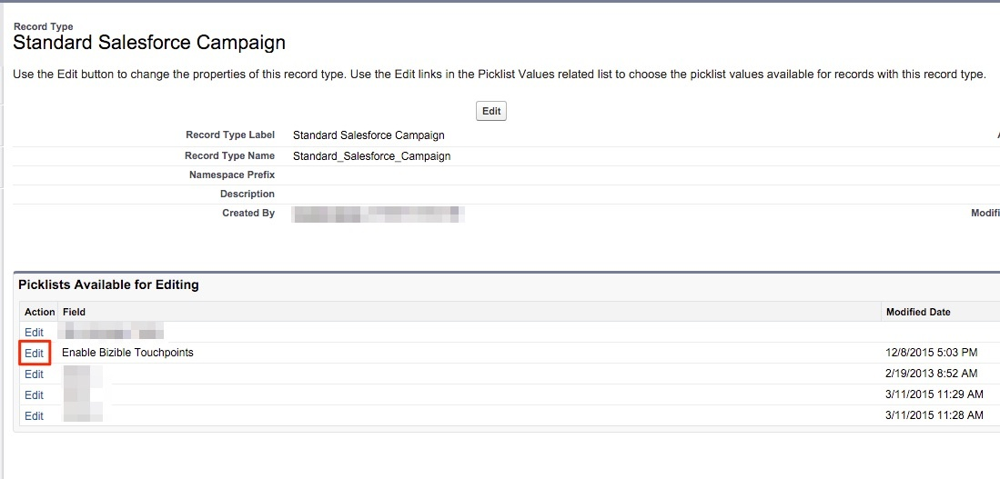

# Configuraciones para varios tipos de registros de campaña {#configurations-for-multiple-campaign-record-types}

**Faltan valores en la lista de selección del campo &quot;Habilitar puntos de contacto del comprador&quot;**

Si su organización de SFDC utiliza varios tipos de registros de campaña, se deben añadir los valores de la lista de selección para &quot;Habilitar puntos de contacto del comprador&quot; en cada tipo de registro. Para añadir las opciones, siga los pasos a continuación.

1. Vaya a **[!UICONTROL Configuración]** > **[!UICONTROL Personalizar]** > **[!UICONTROL Campañas]** > **[!UICONTROL Tipos de registros]**.

   

1. Seleccione los tipos de registro de campaña haciendo clic en la etiqueta **[!UICONTROL Record Type]**, no en el botón [!UICONTROL edit].

   

1. Aquí aparece en pantalla con las listas de selección disponibles para ese tipo de registro. Selecciona **[!UICONTROL Editar]** junto al campo &quot;Habilitar puntos de contacto del comprador&quot;.

   

1. Agregue los tres valores de la agrupación &quot;Valores disponibles&quot; a la agrupación &quot;Valores seleccionados&quot;.

   

1. Establezca el valor predeterminado en &quot;Ninguno&quot; y haga clic en **[!UICONTROL Guardar]**. Repita el proceso para cualquier tipo de registro de campaña adicional.
