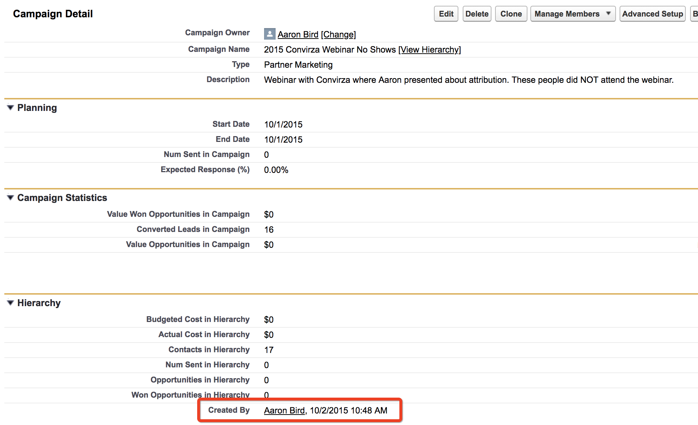

# Sincronización de campañas personalizadas {#custom-campaign-sync}

Hoy, con el [!DNL Marketo Measure] , puede indicar qué campañas incluir como punto de contacto apto. Hay varios obstáculos a esto, ya que existía anteriormente. Una vez que la variable [!DNL Marketo Measure] está instalado en CRM, su equipo de seguridad puede tardar bastante en aprobarlo. Además, existe una falta de flexibilidad en el uso de una sola lista de selección en el objeto de campaña. Con esta nueva función, no es necesario instalar un paquete para empezar a utilizar los registros de miembros de Campaign y Campaign. Se pueden crear reglas para definir exactamente qué registros se pueden crear para definir exactamente qué registros son elegibles.

## Requisitos {#requirements}

* La sincronización de campañas está disponible en todos los niveles
* Para importar datos, sigue siendo necesario conectar su CRM a su [!DNL Marketo Measure] account

## Cómo funciona {#how-it-works}

1. Con los permisos de AccountAdmin, puede navegar hasta **[!UICONTROL Configuración]** > **[!UICONTROL Campañas]** y consulte la interfaz de usuario de reglas de Sincronizar miembros de campaña .
1. Haga clic en el **+** para comenzar a crear una regla.

   

1. Tiene la opción de crear una regla a partir de [!UICONTROL Campaign] o [!UICONTROL Miembro de la campaña] campos. Complete el resto de la regla con el Operador y el Valor que se espera que validemos. En el siguiente ejemplo, se busca una campaña específica por su nombre.

   

   >[!NOTE]
   >
   >Los campos de fórmula no se pueden usar dentro de las reglas y no aparecerán en la lista de selección. Dado que las fórmulas calculan en segundo plano y no modifican un registro, [!DNL Marketo Measure] no puede detectar si un registro se ajusta a una regla o no.

1. Elija la fecha del punto de contacto. La lista de fechas posibles aparecerá una vez que haya introducido un corchete `{` A continuación, puede seleccionar la fecha que desee aplicar a todos los touchpoints creados a partir de la regla.

   

   >[!NOTE]
   >
   >Si utiliza reglas de sincronización de campañas personalizadas, [!DNL Marketo Measure] no leerá ninguna actualización que haya realizado con el botón Actualización masiva de fecha de contacto .

1. Haga clic en la marca de verificación y, a continuación, agregue reglas adicionales para campañas adicionales según sea necesario.

   

   >[!NOTE]
   >
   >Ahora que las reglas se definen junto con la sincronización de CRM, las reglas que se indican comenzarán a entrar en conflicto de forma natural. Si decide seguir utilizando la sincronización de campaña personalizada _y_ Con el tipo de sincronización de CRM, es fundamental crear reglas para que los tipos de sincronización de CRM no se ignoren.

   

   >[!NOTE]
   >
   >Si está considerando la posibilidad de detener el usuario de la variable [!UICONTROL Tipo de sincronización de CRM], es ideal crear reglas que no hagan referencia al &quot;tipo de sincronización&quot; pero _keep_ mantenga los puntos de contacto de CRM actuales. De esta manera, las reglas siguen funcionando si/cuando se realiza el cambio.

Este es un ejemplo de cómo se vería esto, de modo que no se pierdan puntos de contacto de CRM existentes:

## Validación {#validation}

Puede comprobar fácilmente los puntos de contacto del comprador y los registros de punto de contacto de atribución del comprador dentro de la campaña para asegurarse de que las reglas funcionan correctamente. Aquí hay una MTD que [!DNL Marketo Measure] creada con la fecha de Touchpoint dinámica adecuada, extraída de la campaña. El campo Fecha de creación se encuentra en la imagen inferior.

## Pruebas {#testing}

1. La función de sincronización de campañas incluye una función de prueba para que pueda comprobar si las reglas que ha creado se ajustan realmente a los criterios de la campaña. Para empezar, haga clic en el botón [!UICONTROL Prueba] botón. Las reglas deben guardarse primero para poder empezar a realizar pruebas.

   

   Aparecerá una ventana emergente en la que puede introducir un ID de campaña (15 o 18 caracteres del CRM) para probarlo. El punto es introducir el ID de campaña del CRM que estaba intentando sincronizar para asegurarse de que coincide con la regla que ha creado.

   

1. Después de hacer clic en [!UICONTROL Prueba], verá el nombre de la campaña y el número de miembros de la campaña que cumplen los requisitos para acceder a los puntos de contacto. A continuación aparecerá una tabla que muestra todas las reglas que coinciden con su ID de campaña. Solo aparecerán las coincidencias.

   

1. También puede hacer clic en el recuento de miembros para ver una lista de los posibles clientes y contactos y sus identificadores que forman parte de la idoneidad para la regla de Campaign. Este es solo un conjunto de muestras y se mostrará hasta 50 para que pueda tener una idea de qué registros califican.

   
