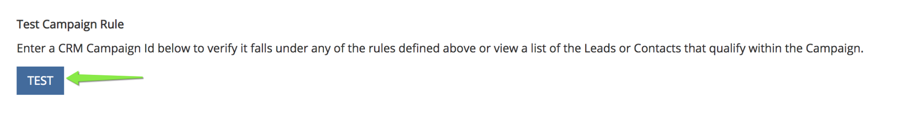

# Sincronización de campañas personalizadas {#custom-campaign-sync}

Hoy, con el paquete [!DNL Marketo Measure] instalado, puede indicar qué campañas incluir como punto de contacto elegible. Existen múltiples obstáculos a esto, tal como existía anteriormente. Una vez que el paquete [!DNL Marketo Measure] esté instalado en CRM, su equipo de seguridad puede tardar un tiempo en aprobarlo. Además, no hay flexibilidad para utilizar una sola lista de selección en el objeto de campaña. Con esta nueva función, no es necesario instalar el paquete para empezar a utilizar los registros de Campaign y de los miembros de Campaign. Se pueden crear reglas para definir exactamente qué registros se pueden crear para definir exactamente qué registros son aptos.

## Requisitos {#requirements}

* La sincronización de campañas está disponible en todos los niveles
* Para poder importar datos, debe conectar su CRM a su cuenta de [!DNL Marketo Measure]

## Cómo funciona {#how-it-works}

1. Con permisos de AccountAdmin, puede navegar a **[!UICONTROL Configuración]** > **[!UICONTROL Campañas]** y ver la IU de las reglas de Sincronizar miembros de campaña.
1. Haga clic en el icono **+** para comenzar a crear una regla.

   

1. Tiene la opción de crear una regla a partir de los campos [!UICONTROL Campaign] o [!UICONTROL Campaign Member]. Complete el resto de la regla con el Operador y el Valor que se espera validar. En el ejemplo siguiente, se busca una campaña específica por su nombre.

   

   >[!NOTE]
   >
   >Los campos de fórmula no se pueden utilizar dentro de las reglas y no aparecerán en la lista de selección. Dado que las fórmulas calculan en segundo plano y no modifican un registro, [!DNL Marketo Measure] no puede detectar si un registro se ajusta o no a una regla.

1. Elija la Fecha de punto de contacto. La lista de fechas posibles aparecerá después de que escriba un corchete angular `{`. A continuación, podrá seleccionar la fecha que desee aplicar a todos los puntos de contacto creados a partir de la regla.

   

   >[!NOTE]
   >
   >Si está usando reglas de sincronización de campañas personalizadas, [!DNL Marketo Measure] no leerá ninguna actualización que haya hecho con el botón Fecha de punto de contacto de actualización masiva.

1. Haga clic en la marca de verificación y luego agregue reglas adicionales para campañas adicionales según sea necesario.

   

   >[!NOTE]
   >
   >Ahora que las reglas se definen junto con la sincronización de CRM, las reglas establecidas empezarán a entrar en conflicto de forma natural. Si elige seguir usando la sincronización de campaña personalizada _y_ el tipo de sincronización de CRM, es fundamental crear reglas para que no se ignoren los tipos de sincronización de CRM.

   

   >[!NOTE]
   >
   >Si está considerando la posibilidad de detener finalmente al usuario del [!UICONTROL Tipo de sincronización de CRM], es ideal crear reglas que no hagan referencia al &quot;Tipo de sincronización&quot;, pero _aún_ mantengan los puntos de contacto de CRM actuales. De esa manera las reglas aún funcionan si/cuando se realiza ese cambio.

Este es un ejemplo de cómo sería, para que no se pierdan los puntos de contacto de CRM existentes:

## Validación {#validation}

Puede comprobar fácilmente los puntos de contacto del comprador y los registros de Buyer Attribution Touchpoint dentro de la campaña para asegurarse de que las reglas funcionan correctamente. BAT Esta es una que [!DNL Marketo Measure] creó con la fecha de punto de contacto dinámica apropiada, extraída de la campaña. El campo Fecha de creación está en la imagen inferior.

## Pruebas {#testing}

1. La función Campaign Sync viene con una función de prueba para que pueda comprobar si las reglas que ha creado se ajustan realmente a los criterios de Campaign. Comience por hacer clic en el botón [!UICONTROL Probar]. Las reglas deben guardarse primero para poder iniciar la prueba.

   

   Aparecerá una ventana emergente en la que puede introducir un ID de campaña (15 o 18 caracteres desde CRM) para probar. El punto es introducir el ID de campaña desde el CRM que intentaba sincronizar para asegurarse de que coincida con la regla creada.

   

1. Después de hacer clic en [!UICONTROL Prueba], verá el nombre de la campaña y el número de miembros de la campaña que cumplen los requisitos para los puntos de contacto. A continuación aparece una tabla con todas las reglas que coinciden con su ID de campaña. Solo aparecerán las coincidencias.

   

1. También puede hacer clic en el recuento de miembros para ver una lista de los posibles clientes y contactos y sus ID que forman parte de la idoneidad de la regla de campaña. Este es solo un conjunto de muestras y mostrará hasta 50 para que pueda tener una idea de qué registros cumplen los requisitos.

   
