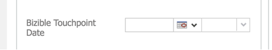

# Sincronización de datos históricos {#syncing-historical-data}

[!DNL Marketo Measure] es una solución que proporciona los datos más granulares y procesables. Sin embargo, entendemos que es posible que tenga datos existentes para los que le gustaría tener atribución. Es posible generar puntos de contacto para datos históricos, pero es importante tener en cuenta algunos factores antes de continuar con este proceso.

## Factores a considerar {#factors-to-consider}

**¿Los datos ya están organizados en campañas?**

a. Los datos deben organizarse en campañas para que se sincronicen con [!DNL Marketo Measure] para generar los puntos de contacto. Si actualmente no está organizado en Campañas, le recomendamos evaluar si merece la pena el tiempo y los recursos necesarios para segmentar los datos en las campañas adecuadas.

b. La fecha en la que se añadió el miembro a la campaña o se marcó como respondido se utilizará para la fecha de Touchpoint, por lo que esto también debe ser preciso. [!DNL Marketo Measure] ofrece soluciones tanto en SFDC como en MSD para actualizar las fechas, pero esto podría llevar mucho tiempo en función del volumen.

**¿Tiene la misma cantidad de datos organizados en campañas para todos los canales (búsqueda de pago, eventos, orgánicos, etc.)?**

Es importante tener una imagen equilibrada de la atribución para tener informes precisos y &quot;justos&quot;. Por ejemplo, si solo tiene datos para esfuerzos históricos de canal sin conexión, como Eventos, los datos estarán sesgados inherentemente sin datos en línea históricos para complementarlos.

**¿Qué nivel de granularidad espera?**

Básicamente, solo conoce el nombre del canal, subcanal y campaña.

**¿Cuáles son sus objetivos de creación de informes en el futuro?**

Estos datos van a estar limitados, por lo que es importante tener en cuenta cómo planea usarlos. Es posible que no tenga más sentido comparar los datos históricos con los datos futuros.

**¿Hasta dónde quieres llegar?**

[!DNL Marketo Measure] recomienda encarecidamente no pasar del año anterior.

Este es un tema que recomendamos encarecidamente que hable con su [!DNL Marketo Measure] contacto primero. Si ha tenido en cuenta lo anterior y desea continuar, consulte las instrucciones generales (separadas para [!DNL Salesforce] y [!DNL Microsoft Dynamics]) se muestran a continuación.

## Sincronización de campañas históricas en [!DNL Salesforce] {#syncing-historic-campaigns-in-salesforce}

**En línea:**

Para sincronizar datos en línea históricos, los datos deben estar organizados en campañas de Salesforce a las que luego se sincronizaría [!DNL Marketo Measure] mediante [!DNL Salesforce] Reglas de sincronización de campaña en [!DNL Marketo Measure] aplicación. Es importante asegurarse de que los puntos de contacto no se generen a partir de ninguna de estas campañas después de la fecha en que JavaScript se puso en marcha. El motivo es evitar puntos de contacto duplicados. Una vez que JavaScript está activo, los esfuerzos en línea se rastrean automáticamente, por lo que no queremos rastrearlos también mediante una campaña de SFDC. Para evitar este problema, asegúrese de añadir un sentido del tiempo a la regla. Tal vez algo como &quot;Fecha de creación del miembro de campaña&quot; sea menor que [Fecha de lanzamiento de JavaScript]&quot;.

El componente de asignación de canales para datos en línea históricos puede ser un poco complicado. Queremos que coincida con las reglas actuales del canal en línea (de la hoja de reglas en línea) lo más fielmente posible para generar informes limpios. A continuación se muestra un ejemplo de asignación de canal ideal.

>[!NOTE]
>
>Esta asignación de canal se realiza en la variable [!UICONTROL Canales sin conexión] de la sección [!DNL Marketo Measure] aplicación, ya que utilizamos campañas de SFDC.

| Tipo de campaña de Salesforce | Canal | Subcanal |
|---|---|---|
| Búsqueda de pago: AdWords | Búsqueda paga | AdWords |
| Búsqueda de pago: Bing | Búsqueda paga | Bing |
| Búsqueda de pago: Yahoo | Búsqueda paga | Yahoo |

Los datos en línea agregados de esta manera serán inherentemente menos granulares que los datos en línea [!DNL Marketo Measure] rastrea mediante JavaScript. Por ejemplo, los campos URL del formulario, Página de aterrizaje, Página de referencia, etc., no se rellenarán. Por lo tanto, se recomienda dividir las campañas en cada fuente si es posible. Como se ha visto en el ejemplo anterior, necesita tener varios tipos de campaña para cada fuente para tener granularidad en los informes.

Puede que no sea posible o razonable tener el número de tipos de campaña SFDC para admitir la asignación de canales granulares, por lo que puede recurrir únicamente a la asignación a nivel de canal e ignorar los subcanales. Si tampoco se conoce el nivel de canal, se puede configurar un canal proxy como &quot;Digital histórico&quot; para que al menos sepa que fue un contacto en línea.

Si necesita editar en masa la fecha del punto de contacto que se impulsará para estos esfuerzos en línea históricos, utilice el [!DNL Marketo Measure] personalizado &quot;[!UICONTROL Fecha de punto de contacto de actualización masiva]&quot; (está disponible como campo personalizado en el objeto de campaña en SFDC). Si la campaña tiene un periodo de tiempo corto, tal vez valdría la pena editar la fecha del punto de contacto de forma masiva día a día, mientras que puede tener sentido realizar actualizaciones masivas semanales si la campaña tiene un periodo de tiempo más largo. Si utiliza la funcionalidad Fecha de punto de contacto de actualización masiva, asegúrese de actualizar la regla de sincronización de campaña para utilizar la Fecha de punto de contacto del comprador en el campo de fecha. Tenga en cuenta que esto podría requerir ser creativo con las reglas de sincronización de Campaign si esto solo se aplica a una o dos campañas y no a todas.

**Sin conexión:**

Los datos históricos de los esfuerzos de marketing sin conexión (los que no se pueden rastrear mediante JavaScript) también deberán organizarse en campañas SFDC. Las campañas de SFDC son el camino [!DNL Marketo Measure] rastrea los esfuerzos sin conexión independientemente de si la actividad es &quot;histórica&quot; o &quot;actual/posterior&quot;[!DNL Marketo Measure] implementación&quot;, por lo que debe seguir la misma asignación de canal que se decidió en el curso de formación original de Configuración de canal sin conexión.

Si es necesario, utilice el botón &quot;Actualización masiva de la fecha del punto de contacto&quot; para editar de forma masiva la fecha del punto de contacto para los miembros de la campaña. Por ejemplo, si está creando campañas de SFDC después de que se produzca el evento, querrá realizar una edición masiva para la fecha correcta. Si utiliza la funcionalidad Fecha de punto de contacto de actualización masiva, asegúrese de actualizar la regla de sincronización de campaña para utilizar la Fecha de punto de contacto del comprador en el campo de fecha. Tenga en cuenta que esto podría requerir ser creativo con las reglas de sincronización de Campaign si esto solo se aplica a una o dos campañas y no a todas.

## Sincronización de campañas históricas en [!DNL Dynamics] {#syncing-historic-campaigns-in-dynamics}

[!DNL Marketo Measure] puede generar de forma retroactiva puntos de contacto para interacciones que se produjeron en el pasado, siempre y cuando estén organizados en campañas dentro de [!DNL Dynamics].

Esto suele implicar trabajo en CRM para tener en cuenta las fechas históricas. La gestión también será diferente para los esfuerzos en línea (rastreados por JS) y los esfuerzos sin conexión (no pueden rastrearse por JS).

Siga las instrucciones siguientes para organizar los datos históricos en [!DNL Dynamics] en un formato que se pueda sincronizar con [!DNL Marketo Measure].

**En línea:**

Los datos digitales históricos deben organizarse en [!DNL Dynamics] campañas para que se puedan rellenar. Idealmente, esta estructura ya está en su lugar.

Si los datos se alojan en otro lugar (por ejemplo, si siguen viviendo en la automatización de marketing), deberán insertarse en [!DNL Dynamics] y organizados en las campañas adecuadas. A continuación, deberá tener en cuenta la fecha de punto de contacto tal como desea que refleje la fecha del pasado, no la fecha en la que la insertó [!DNL Dynamics]. Para anular esta fecha, puedes utilizar el campo personalizado &quot;Fecha de punto de contacto del comprador&quot; para cambiar la fecha. Deberá agregar esto al formulario de lista de marketing.

Como resultado, puede establecer de forma masiva la fecha para todos los usuarios de la lista de marketing que se utilizará para la fecha de Touchpoint. Para tener fechas históricas más precisas, cree varias listas de marketing para la misma campaña, cada una con su propia fecha de punto de contacto. Si la campaña tiene un lapso de tiempo corto, tal vez valdría la pena crear una lista de marketing para cada día. Si la campaña tiene un periodo de tiempo más largo, puede ser recomendable crear una lista de marketing semanalmente.

Puede encontrar más información sobre la sincronización de listas de marketing aquí: [[!DNL Dynamics] Campañas y listas de marketing](/help/marketo-measure-and-dynamics/dynamics-reporting/dynamics-campaigns-and-marketing-lists.md)

>[!NOTE]
>
>Si, por cualquier motivo, tiene una actividad en línea de seguimiento de campañas activa después de la fecha de lanzamiento de JavaScript, asegúrese de establecer el &quot;[!UICONTROL Fecha de finalización de Touchpoint]&quot; hasta la fecha en que se activó el JS. Esto sirve para evitar tener puntos de contacto duplicados para la misma interacción.

Consideraciones: los datos en línea agregados de esta manera serán inherentemente menos granulares que los datos en línea [!DNL Marketo Measure] rastrea mediante JavaScript. Por ejemplo, los campos como: URL del formulario, Página de aterrizaje, Página de referente, etc., no se rellenarán. Por lo tanto, se recomienda dividir las campañas en cada fuente si es posible. A continuación se muestra un ejemplo de asignación ideal.

| Tipo de campaña de Dynamics | Canal | Subcanal |
|---|---|---|
| Búsqueda de pago: AdWords | Búsqueda paga | AdWords |
| Búsqueda de pago: Bing | Búsqueda paga | Bing |
| Búsqueda de pago: Yahoo | Búsqueda paga | Yahoo |

Si no tiene una forma de identificar una fuente o no merece la pena el tiempo y el esfuerzo, puede utilizar un tipo de campaña asignado a un canal denominado, por ejemplo, &quot;Digital heredado&quot; o &quot;Sitio web histórico&quot;.

**Sin conexión:**

Para tener puntos de contacto para los esfuerzos de marketing sin conexión del pasado, los datos deben organizarse en [!DNL Dynamics] campañas y sincronizadas con [!DNL Marketo Measure]. El proceso es el mismo que para los canales sin conexión actuales (sincronice la campaña a través de Listas de marketing o Respuestas de campaña). A continuación se muestra un ejemplo de asignación de canales.

| Tipo de campaña de Dynamics | Canal | Subcanal |
|---|---|---|
| Eventos - Conferencias patrocinadas | Eventos | Conferencias patrocinadas |
| Eventos: eventos de socios | Eventos | Eventos de socios |
| Eventos: eventos alojados | Eventos | Eventos alojados |
| Seminario web: seminario web para socios | Seminario web | Seminario web de partners |

Si estos datos aún no están organizados en Campañas con las fechas establecidas correctamente, puede utilizar el campo &quot;Fecha de punto de contacto del comprador&quot; para reflejar la fecha exacta de la actividad sin conexión en el pasado.

