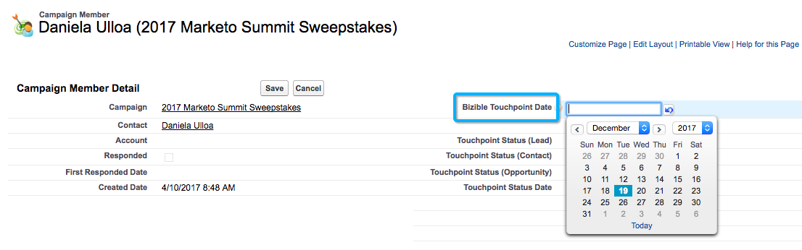

# Campañas y miembros de campañas {#campaigns-and-campaign-members}

Las campañas de [!DNL Salesforce] están pensadas para rastrear listas de posibles clientes y contactos asociados a un programa o una actividad de marketing. Esto ha sido, por lo general, seminarios web, inscripciones o visitas en ambos sitios, por ejemplo. Los especialistas en marketing pueden seleccionar si una campaña debe recibir crédito en un recorrido de touchpoint.

>[!NOTE]
>
>Este artículo trata sobre un proceso obsoleto. Recomendamos a los usuarios que utilicen el [proceso en la aplicación nuevo y mejorado](/help/channel-tracking-and-setup/offline-channels/custom-campaign-sync.md){target="_blank"}.

## Habilitar touchpoints {#enabling-touchpoints}

El paquete [!DNL Marketo Measure] [!DNL Salesforce] incluirá un campo denominado “Habilitar touchpoints del comprador” en el objeto de campaña. Una vez añadido el campo al diseño de página, aparece de forma similar a esto:

Las opciones disponibles en la lista desplegable son las siguientes:

* Incluir todos los miembros de la campaña: cada posible cliente o contacto añadido a la campaña recibirá un touchpoint asociado a esa campaña.
* Incluir solo los miembros de la campaña “Respondidos”: solo los posibles clientes o contactos que tengan el estado de miembro de campaña “Respondido” recibirán un touchpoint asociado a esa campaña.
* Excluir todos los miembros de la campaña: ninguno de los posibles clientes o contactos recibirá un touchpoint asociado a esa campaña.

Tenga en cuenta que los miembros de la campaña deben tener una dirección de correo electrónico asociada a su registro de [!DNL Marketo Measure] para crear un touchpoint. Sin una dirección de correo electrónico, [!DNL Marketo Measure] no se asigna ningún touchpoint al miembro de la campaña.

## Fechas de sincronización de campañas {#campaign-sync-dates}

Con la instalación del paquete, [!DNL Marketo Measure] también incluye dos campos de fecha en el objeto de campaña: fecha de inicio y de finalización de Touchpoint.

Estas fechas indican a [!DNL Marketo Measure] cuándo debe comenzar o detener la inclusión de los miembros de campaña de la campaña en el recorrido de Touchpoint. Puede establecer una fecha o ambas, o ninguna.

## Caso de uso para la fecha de inicio de Touchpoint {#use-case-for-touchpoint-start-date}

La fecha de inicio se puede utilizar en el caso de una campaña existente para rastrear posibles clientes y contactos, pero el usuario solo desea comenzar a medir una vez que se hayan establecido nuevos sistemas o procesos, por lo que decide establecer una fecha de inicio una vez que [!DNL Marketo Measure] empiece a rastrear a esos miembros de la campaña.

## Caso de uso para la fecha de finalización de Touchpoint {#use-case-for-touchpoint-end-date}

Si antes de usar [!DNL Marketo Measure], ha utilizado una plataforma de automatización de marketing que realiza un seguimiento de las interacciones digitales de los posibles clientes (es decir, los envíos de formularios) y, a continuación, ha cargado dichos posibles clientes en una campaña de [!DNL Saleforce], puede utilizar el campo Fecha de finalización de Touchpoint. Se establece la fecha de finalización de Touchpoint como la fecha de inicio con [!DNL Marketo Measure] y se activan los Buyer Touchpoints. Después, la interacción digital de cada uno de estos posibles clientes se crea como un Touchpoint. El motivo por el que configurará la fecha de finalización del punto de contacto como la fecha de inicio con [!DNL Marketo Measure] se debe a que, en adelante, rastrearemos estas interacciones digitales a través de JavaScript.

## Miembros de la campaña {#campaign-members}

Los miembros de la campaña están anidados en [!UICONTROL Campañas] y están relacionados con un posible cliente o contacto. Un posible cliente o un contacto solo se puede añadir una vez a una campaña, lo que puede resultar problemático según el caso de uso de la campaña. Cuando se sincroniza una campaña, el abono a la campaña se utiliza como actividad de marketing que se coloca en el recorrido de Touchpoint y se trata como un relleno de formulario.

## Estado de Buyer Touchpoint {#buyer-touchpoint-status}

Si está activado, [!DNL Marketo Measure] insertará un valor de estado en el miembro de la campaña en cuatro campos diferentes que se incluyen en el paquete instalado: estado de Touchpoint (posible cliente), estado de Touchpoint (contacto), estado de Touchpoint (oportunidad) y fecha de estado de Touchpoint. Esto ayuda a los clientes a auditar si se ha creado o no un Touchpoint como Buyer Touchpoint o Buyer Attribution Touchpoint, según el objeto con el que esté relacionado. La fecha de estado de Touchpoint es simplemente la última fecha en la que se actualizó el estado en el miembro de la campaña.

## Fecha de Buyer Touchpoint {#buyer-touchpoint-date}

Con la instalación del paquete, [!DNL Marketo Measure] también incluye un campo en el miembro de la campaña con la etiqueta “Fecha de Buyer Touchpoint”. Esto permite al usuario anular la fecha que [!DNL Marketo Measure] utilizaría para la fecha de Touchpoint en el registro de Touchpoint.

Esto podría ser necesario si se cargó una lista de días/semanas/meses después de que se produjera un evento. Existen maneras de actualizar todos los registros a la vez, que se explican a continuación.

Para saber si necesita utilizar o no la fecha de Buyer Touchpoint, así es como se determinan las fechas en [!DNL Marketo Measure] según el [!UICONTROL Tipo de sincronización] que se selecciona para la campaña.

Si [!UICONTROL tipo de sincronización] se establece en “Incluir todos los miembros de la campaña”, la prioridad de establecer la fecha de Touchpoint es de arriba abajo:

* Fecha de Buyer Touchpoint
* Fecha de creación del miembro de campaña

Si la variable [!UICONTROL Tipo de sincronización] se establece en “Incluir solo los miembros de campaña &#39;respondidos&#39;”, la prioridad de establecer la fecha del punto de contacto es de arriba abajo:

* Fecha de Buyer Touchpoint
* Primera fecha de respuesta
   * La primera fecha de respuesta se establece automáticamente en cuanto el estado se cambia a &quot;Respondido&quot; y es un campo [!DNL Salesforce] estándar que no se puede cambiar

* Fecha de creación del miembro de campaña

## Fecha de Touchpoint de actualización masiva {#bulk-update-touchpoint-date}

La fecha de Touchpoint de actualización masiva se incluye en el paquete [!DNL Marketo Measure] [!DNL Salesforce] instalado y el botón deberá añadirse al diseño de página.

Si es necesario actualizar un gran número de registros de miembros de la campaña, puede utilizar el botón [!UICONTROL Fecha de Touchpoint de actualización masiva] para la edición masiva.

Si hay casos de uso únicos que esta interfaz no cubre, también puede utilizar el [Cargador de datos](https://dataloader.io/){target="_blank"} para exportar los registros, realizar el cambio y volver a cargar los registros.

Comience por buscar los registros y filtrar aquellos para los que desea establecer una fecha de Buyer Touchpoint.

>[!CAUTION]
>
>Hay una búsqueda que no funciona y que se muestra en el ejemplo siguiente. La IU no admite la búsqueda de fechas de Buyer Touchpoint nulas (la siguiente búsqueda no funcionaría):

Si no necesita utilizar la búsqueda y tan solo aplica las fechas a cada registro del miembro de la campaña, utilice la casilla de verificación “[!UICONTROL Incluir todos los registros]” (véase la captura de pantalla siguiente), que comprobará todos los registros de todas las páginas.

Seleccione la fecha y la hora en el selector de calendario. Si desea seleccionar la fecha y la hora actuales, haga clic en la fecha y la hora que se muestran junto al selector de calendario.

Una vez que haya establecido la fecha y la hora, haga clic en **[!UICONTROL Actualizar registros seleccionados]** para aplicar los cambios.

## Costes de campaña {#campaign-costs}

Obtenga más información sobre los costes de campaña [en este artículo](/help/marketing-spend/spend-management/crm-campaign-costs.md){target="_blank"}.

## Eliminación de miembros de la campaña {#campaign-member-removal}

La forma en que [!DNL Marketo Measure] se mantiene al día de los registros eliminados en Salesforce, ya sean posibles clientes o cuentas u oportunidades eliminados es ver esos registros en la API y realizar un seguimiento de que una entrada se haya marcado como &quot;IsDeleted&quot;. Desafortunadamente con los miembros de la campaña, Salesforce introdujo una forma diferente de eliminar estos miembros de campaña de una campaña y, en realidad, solo están marcados como &quot;borrados&quot; en lugar de &quot;eliminados&quot;, por lo que el problema es que los Touchpoints seguían activos en Salesforce y estaban relacionados con los miembros de campaña eliminados.

Para evitar este problema, [!DNL Marketo Measure] creó un objeto Historial de [!DNL Marketo Measure] y un activador para rastrear cada vez que se borran miembros de la campaña y luego eliminar el Touchpoint correspondiente. **Necesitará el paquete de [!DNL Marketo Measure] Marketing Analytics V6.15 o superior** para utilizar esta función.

>[!CAUTION]
>
>Tenga en cuenta que este activador no rastrea ningún miembro de la campaña que se haya borrado en el pasado, por lo que solo funciona de cara al futuro. Si necesita quitar un gran número de Touchpoints de miembros de campañas anteriores, póngase en contacto con [Asistencia de Marketo](https://nation.marketo.com/t5/support/ct-p/Support){target="_blank"}.

>[!MORELIKETHIS]
>
>[[!DNL Marketo Measure] Tutorials: Campos de objetos de Campaign](https://experienceleague.adobe.com/en/docs/marketo-measure-learn/tutorials/onboarding/marketo-measure-salesforce/campaign-object-fields){target="_blank"}
>
>[[!DNL Marketo Measure] Tutorials: Asignación de canales sin conexión](https://experienceleague.adobe.com/en/docs/marketo-measure-learn/tutorials/onboarding/marketo-measure-salesforce/mapping-offline-channels){target="_blank"}
