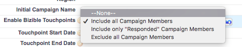

# Sincronización de campañas sin conexión {#syncing-offline-campaigns}

Puede resultar difícil rastrear con precisión las campañas sin conexión y comprender cómo se comparan con sus esfuerzos de marketing digital. [!DNL Marketo Measure] le permite rastrear y atribuir puntos de contacto a sus campañas sin conexión en [!DNL Salesforce], incluso en situaciones en las que no se crea una campaña de [!DNL Salesforce] hasta unas semanas después del evento.

>[!NOTE]
>
>Este artículo trata sobre un proceso obsoleto. Recomendamos a los usuarios que utilicen el [proceso en la aplicación nuevo y mejorado](/help/channel-tracking-and-setup/offline-channels/custom-campaign-sync.md){target="_blank"}.

## Antes de sincronizar {#before-you-sync}

A continuación se ofrecen algunas sugerencias para lograr un proceso de sincronización eficaz:

* Las campañas sin conexión hacen referencia a interacciones de marketing que no se producen en línea. Estos incluyen canales de marketing como eventos, seminarios web y ferias comerciales. Incluya solo campañas de marketing sin conexión.
* Si desea incluir campañas que rastrearon la actividad en línea antes de la fecha de instalación de [!DNL Marketo Measure], asegúrese de establecer la fecha de finalización del punto de contacto como la fecha en la que se implementó JavaScript en el sitio.
* Es útil mantener la aplicación [!DNL Marketo Measure] abierta en la página Canales sin conexión para que sea fácil identificar los distintos tipos de campaña, junto con el canal de marketing en el que se agrupan los puntos de contacto.

* ¡Comprueba todo antes de pulsar el botón &quot;[!UICONTROL Guardar]&quot;!

## Fecha de Touchpoint de actualización masiva {#bulk-update-touchpoint-date}

En [!DNL Salesforce], el campo Fecha de creación del objeto de miembro de campaña indica la fecha en la que se agregó el miembro de campaña a la campaña. Para que el proceso de sincronización transcurra sin problemas, asegúrese de que el campo de fecha de Buyer Touchpoint tenga la misma fecha que la del objeto de miembro de Salesforce Campaign. Este paso se realiza con el botón de actualización masiva de Touchpoint [!UICONTROL Botón de fecha],&quot; _antes_ de seleccionar la opción [!UICONTROL lista de selección] en el campo Habilitar puntos de contacto del comprador.

¿Por qué es esto importante? Imagine por un momento que su empresa patrocina un stand en una conferencia en enero. En la conferencia, 100 personas mostraron interés en su producto y proporcionaron su información de contacto para recibir actualizaciones por correo electrónico. Tres semanas después, finalmente creó una campaña en [!DNL Salesforce] para realizar un seguimiento del resultado de la conferencia.

La fecha de carga sería tres semanas después de la fecha de la conferencia. Para solucionar esta diferencia, se puede usar el botón [!UICONTROL Fecha de punto de contacto de actualización masiva] para establecer la fecha apropiada. El botón se muestra en la siguiente imagen.

En este caso, rellenaría la fecha de carga en tres semanas. Este paso debe realizarse antes de establecer el campo &quot;[!UICONTROL Habilitar puntos de contacto del comprador]&quot;.

En resumen, si usa el botón [!UICONTROL Actualización masiva de fecha de punto de contacto] y cambia la fecha de punto de contacto a la fecha del evento, [!DNL Marketo Measure] generará puntos de contacto para la fecha real del evento, no para la fecha de la carga.

También puede actualizar las fechas de todos los miembros de una campaña existente. Al hacerlo, asegúrese de que la fecha del punto de contacto sea la fecha de interacción del miembro. Haga clic en la actualización masiva de la fecha de Buyer Touchpoint, filtre la lista de miembros de la campaña según corresponda y, en la opción &quot;[!UICONTROL Seleccionar fecha]&quot; que se encuentra arriba de la lista de miembros de la campaña, agregue la misma fecha que la fecha en la que tuvo lugar el evento.

>[!CAUTION]
>
>Asegúrese de actualizar la fecha del punto de contacto _antes de_ para habilitar los puntos de contacto para todos los miembros de la campaña.

## Cómo crear una campaña y sincronizar los puntos de contacto del comprador {#how-to-create-a-campaign-and-sync-buyer-touchpoints}

Para crear una campaña en [!DNL Salesforce], vaya a la pestaña [!UICONTROL Campañas] y seleccione &#39;[!UICONTROL Nuevo]&#39; como se muestra en la siguiente imagen. Según la configuración de [!DNL Salesforce], es posible que deba agregar Campañas a la barra superior haciendo clic en el icono de signo más (+).

Al crear esta campaña, haz clic en el campo &quot;[!UICONTROL Habilitar puntos de contacto del comprador]&quot; y selecciona una de las siguientes opciones de la lista de selección:

* **Incluir todos los miembros de la campaña**
   * Esta opción permite que [!DNL Marketo Measure] atribuya un punto de contacto a cada miembro de la campaña.

* **Incluir miembros de la campaña &quot;Respondidos&quot;.**
   * Esta opción aplica puntos de contacto a los miembros de la campaña que tienen el estado Respondido.

* **Excluir todos los miembros de la campaña.**
   * Esta opción no atribuye puntos de contacto a ningún miembro de la campaña y actúa como indicador de que la campaña se ha excluido deliberadamente de [!DNL Marketo Measure]. Si alguna vez sincronizas una campaña con puntos de contacto del comprador en caso de accidente, puedes cambiar el estado a &quot;Excluir todos los miembros de la campaña&quot; y se eliminarán los puntos de contacto.

Una vez que se elija una de estas selecciones, [!DNL Marketo Measure] asignará a cada miembro de la campaña un punto de contacto, si corresponde. El posible cliente o contacto que se agrega a la campaña _debe_ tener una dirección de correo electrónico asociada a su registro para que [!DNL Marketo Measure] cree un punto de contacto. Sin una dirección de correo electrónico, [!DNL Marketo Measure] no se asigna ningún touchpoint al miembro de la campaña.

>[!MORELIKETHIS]
>
>[[!DNL Marketo Measure] Tutoriales: Asignación de canales sin conexión](https://experienceleague.adobe.com/es/docs/marketo-measure-learn/tutorials/onboarding/marketo-measure-salesforce/mapping-offline-channels){target="_blank"}
>
>[[!DNL Marketo Measure] Tutoriales: Campos de objetos de Campaign](https://experienceleague.adobe.com/es/docs/marketo-measure-learn/tutorials/onboarding/marketo-measure-salesforce/campaign-object-fields){target="_blank"}
