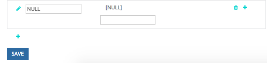

# Configuración de canales personalizados sin conexión {#offline-custom-channel-setup}

## Introducción {#getting-started}

Comparado con cómo [!DNL Marketo Measure] Si gestiona las reglas del canal en línea, verá que las reglas del canal sin conexión no requieren el uso de una hoja de cálculo. Sin embargo, aún hay una hoja en el plan de implementación, ya que puede resultar útil para pensar en la forma en que desea organizar los canales sin conexión.

La hoja de cálculo tiene tres columnas:

**[!UICONTROL Salesforce] Tipo de campaña** - añadir tipos de campaña identificados en [!DNL Salesforce] aquí

* Por ejemplo, podría ser un correo electrónico, un seminario web, una conferencia o cualquier valor que haya creado para este campo al que desee atribuir puntos de contacto.

**[!UICONTROL Canal]** - añada sus distintos canales de marketing aquí

**[!UICONTROL Subcanal]** - añada aquí los subcanales correspondientes

## Lógica de canal sin conexión {#offline-channel-logic}

[!DNL Marketo Measure] la lógica del canal sin conexión viene determinada por el objeto Campaign, específicamente por la variable [!DNL Salesforce] Tipo de campaña. Cada esfuerzo sin conexión debe tener un [!DNL Salesforce] Tipo de campaña, como cena o feria comercial, porque [!DNL Marketo Measure] se basa en este campo para comprender a qué canal y subcanal asignar.

Los tipos de campaña de SFDC aparecerán en la pestaña del canal sin conexión, en [!DNL Salesforce] Tipo de campaña. Tenga en cuenta que [!DNL Marketo Measure] solo puede importar tipos de campaña de SFDC para campañas que tengan puntos de contacto de comprador asociados a ellos.

Aquí es donde puede crear la asignación de canal/subcanal en la [!DNL Marketo Measure] aplicación. Esto probablemente implique la creación de nuevos canales y subcanales en la [!DNL Marketo Measure] La aplicación de, que se realiza en la sección Crear canales de la aplicación, se muestra en la siguiente imagen. Es necesario crear nuevos canales y subcanales para [!DNL Marketo Measure] para saber dónde insertar los puntos de contacto. Puede decidir cómo desea que se asignen los tipos de campaña.

## Ejemplo de asignación de canal {#channel-mapping-example}

Por ejemplo, imagine que asiste a dos [!DNL Salesforce] conferencias al año. Sin embargo, cada conferencia es muy diferente y tiene un público objetivo único. Desea saber cuál de los dos aporta más valor. En su [!DNL Salesforce] , puede asignar al evento de enero el tipo de campaña &quot;Conferencia&quot; y nombrar su canal &quot;[!DNL Salesforce],&quot; y su subcanal &quot;Conferencia de enero&quot;.

Ahora desea hacer lo mismo para la conferencia de junio. Como también es una conferencia, se le puede dar el mismo Tipo de campaña, en este caso, &quot;Conferencia&quot;. El canal es el mismo, [!DNL Salesforce], y el subcanal para esta segunda conferencia es &quot;Conferencia de Junio&quot;. Esto tiene sentido desde una perspectiva organizacional. Sin embargo, es muy confuso para la [!DNL Marketo Measure] para leer y aplicar estas reglas, ya que ambas campañas tienen el mismo tipo de campaña. [!DNL Marketo Measure] el script no puede asignar datos de un tipo a dos subcanales diferentes. Esto significa que debería crear un nuevo Tipo de campaña para cada subcanal, pero los subcanales pueden tener el mismo canal.

A continuación se muestra un ejemplo de lógica que [!DNL Marketo Measure] no sería capaz de leer:

En el escenario anterior, se desea crear un tipo de campaña único porque no se puede asignar el mismo tipo de campaña a dos subcanales diferentes. En su lugar, le recomendamos configurar tipos únicos como los siguientes:

Cualquier tipo de campaña existente debe incluirse en el mapa de canal y se debe agregar &quot;NULL&quot; como canal.

Tómese tiempo para entrar en [!DNL Salesforce] para determinar el número y la naturaleza de los tipos de registro existentes, que desea incluir, y si necesita crear campañas adicionales basadas en la información anterior. Una vez que haya rellenado toda la información necesaria, estará listo para cargar.

Más información sobre [sincronización sin conexión [!DNL Salesforce] Campañas con [!DNL Marketo Measure]](/help/channel-tracking-and-setup/offline-channels/syncing-offline-campaigns.md).

## Gestión de campañas de SFDC para esfuerzos de marketing en línea {#handling-sfdc-campaigns-for-online-marketing-efforts}

Es común que los equipos de marketing creen [!DNL Salesforce] campañas para rastrear varios esfuerzos de marketing digital. No hay problema con esta práctica; sin embargo, es importante tratar estas campañas de forma diferente a las verdaderas campañas sin conexión, como el correo directo o las conferencias, por ejemplo. Las campañas relacionadas con eventos digitales (las interacciones que se producen en el sitio web) no deben sincronizarse con [!DNL Marketo Measure]. La sincronización de estas campañas resultaría en la duplicación de puntos de contacto porque la variable [!DNL Marketo Measure] JavaScript ya está realizando un seguimiento de los esfuerzos en línea.

Otra sugerencia para administrar campañas para actividades en línea es asignar el [!DNL Salesforce] Tipo de campaña en NULL. Para ello, cree primero un canal en [!DNL Marketo Measure] aplicación titulada NULL como se muestra en la siguiente imagen. Esto se encuentra en [!DNL Marketo Measure] aplicación en **Crear canales** sección. Esto resulta útil en caso de que una campaña que no debería sincronizarse se sincronice accidentalmente. Es fácil encontrar la campaña y corregir el estado de sincronización mirando todo lo agrupado en NULL.

## Introducción de las reglas de canal sin conexión en la aplicación {#entering-your-offline-channel-rules-to-the-app}

Una vez que haya editado y actualizado la hoja de cálculo con sus reglas personalizadas, el siguiente paso es volver a crear esta asignación de canal en la [!DNL Marketo Measure] aplicación: en realidad, no se carga una hoja de cálculo para canales sin conexión. En su lugar, debe introducir la información en los cuadros de la lista de selección tal como se muestra en la imagen siguiente. Se encuentra haciendo clic en **[!UICONTROL Canales sin conexión]** en el **[!UICONTROL Canales]** sección.

>[!TIP]
>
>Desea determinar _cuando_ a [!DNL Salesforce] El tipo de campaña se arrastra hacia abajo en [!DNL Marketo Measure] ¿Asignación de canales? Simplemente vaya a **[!UICONTROL Configurar]** > **[!UICONTROL Campañas]** > **[!UICONTROL Campos]** > **[!UICONTROL Tipo]**. A continuación, puede ver qué valores se encuentran en la lista de selección y cuáles están inactivos. Los inactivos no aparecerán como un tipo seleccionable en nuestro &quot;[!UICONTROL Canales sin conexión]&quot; sección. Tenga en cuenta que este proceso puede tardar entre unos minutos y 48 horas.

Clic **[!UICONTROL Guardar]** cuando haya terminado y [!DNL Marketo Measure] cargará los cambios y volverá a procesar los datos.

>[!MORELIKETHIS]
>
>* [[!DNL Marketo Measure] Universidad: Asignación de canales sin conexión](https://universityonline.marketo.com/courses/bizible-fundamentals-channel-management/#/page/5c630eca34d9f0367662b77f)
>
>* [[!DNL Marketo Measure] Universidad: Sincronización de campañas sin conexión](https://universityonline.marketo.com/courses/bizible-fundamentals-channel-management/#/page/5c63286e34d9f0367662b78b)
>
>* [Integración de programas de Marketo Engage](/help/marketo-measure-and-marketo/marketo-measure-integrations-with-marketo/marketo-engage-programs-integration.md#channel-mapping)
