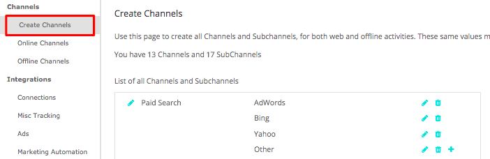

# Configuración de canal personalizado sin conexión {#offline-custom-channel-setup}

## Introducción {#getting-started}

Comparado con cómo [!DNL Marketo Measure] gestiona las reglas de canal en línea; observará que las reglas de canal sin conexión no requieren el uso de una hoja de cálculo. Sin embargo, todavía hay una hoja en el plan de implementación porque puede resultar útil para pensar a través de la forma en que desea organizar los canales sin conexión.

La hoja de cálculo tiene tres columnas:

**[!UICONTROL Salesforce] Tipo de campaña** - añadir tipos de campaña identificados en [!DNL Salesforce] here

* Por ejemplo, podría ser un correo electrónico, un seminario web, una conferencia o cualquier valor que haya creado para este campo al que desee atribuir Touchpoints.

**[!UICONTROL Canal]** : agregue los distintos canales de marketing aquí

**[!UICONTROL Subcanal]** - agregue los subcanales correspondientes aquí

## Lógica de canal sin conexión {#offline-channel-logic}

[!DNL Marketo Measure] la lógica del canal sin conexión está determinada por el objeto Campaign, específicamente el [!DNL Salesforce] Tipo de campaña. Cada esfuerzo sin conexión debe tener un [!DNL Salesforce] Tipo de campaña, como cena o presentación comercial, porque [!DNL Marketo Measure] depende de este campo para comprender a qué canal y subcanal se deben asignar.

Los tipos de campaña de SFDC aparecerán en la pestaña Canal sin conexión , en la lista [!DNL Salesforce] Tipo de campaña. Tenga en cuenta que [!DNL Marketo Measure] solo puede importar tipos de campaña de SFDC para campañas que tengan asociados puntos de contacto de Comprador.

Aquí es donde puede crear la asignación Canal/Subcanal en el [!DNL Marketo Measure] aplicación. Esto implicará probablemente la creación de nuevos canales y subcanales en la variable [!DNL Marketo Measure] , que se realiza en la sección Crear canales de la aplicación (se muestra en la imagen siguiente). Es necesario crear nuevos canales y subcanales para [!DNL Marketo Measure] para saber dónde insertar los puntos de contacto. Puede decidir cómo desea que se asignen los tipos de campaña.

## Ejemplo de asignación de canales {#channel-mapping-example}

Por ejemplo, imagine que asiste a dos [!DNL Salesforce] conferencias al año. Sin embargo, cada conferencia es muy diferente y tiene un público objetivo único. Desea saber cuál de los dos aporta más valor. En [!DNL Salesforce] entorno, puede asignar al evento de enero el tipo de campaña &quot;Conferencia&quot;, asigne al canal el nombre &quot;[!DNL Salesforce],&quot; y su subcanal &quot;Conferencia de enero&quot;.

Ahora quieren hacer lo mismo para la conferencia de junio. Como se trata de una conferencia también, se le puede dar el mismo tipo de campaña, en este caso, &quot;conferencia&quot;. El canal es el mismo, [!DNL Salesforce]y el subcanal para esta segunda conferencia es &quot;Conferencia de junio&quot;. Esto tiene sentido desde una perspectiva organizativa. Sin embargo, resulta muy confuso para la [!DNL Marketo Measure] para leer y aplicar estas reglas, ya que ambas campañas tienen el mismo tipo de campaña. [!DNL Marketo Measure] la secuencia de comandos no puede asignar datos de un tipo a dos subcanales diferentes. Esto significa que tendría que crear un nuevo tipo de campaña para cada subcanal, pero los subcanales pueden tener el mismo canal.

A continuación se muestra un ejemplo de lógica que [!DNL Marketo Measure] no podría leer:

En la situación anterior, deseará crear un tipo de campaña único porque no puede asignar el mismo tipo de campaña a dos subcanales diferentes. En su lugar, desea configurar tipos únicos como los siguientes:

Todos los tipos de campaña existentes deben incluirse en el mapa de canales y &quot;NULL&quot; debe agregarse como canal.

Tómese tiempo para entrar [!DNL Salesforce] para determinar el número y la naturaleza de los tipos de registro existentes, que desea incluir, y si necesita crear campañas adicionales basadas en la información anterior. Una vez que haya rellenado toda la información necesaria, estará listo para cargar.

Más información sobre [sincronización sin conexión [!DNL Salesforce] Campañas con [!DNL Marketo Measure]](/help/channel-tracking-and-setup/offline-channels/syncing-offline-campaigns.md).

## Gestión de campañas SFDC para esfuerzos de marketing en línea {#handling-sfdc-campaigns-for-online-marketing-efforts}

Es habitual que los equipos de marketing creen [!DNL Salesforce] campañas para realizar el seguimiento de varias campañas de marketing digital. Esta práctica no plantea ningún problema; sin embargo, es importante tratar estas campañas de forma diferente a las campañas sin conexión reales, como el correo postal o las conferencias, por ejemplo. Las campañas relacionadas con eventos digitales (interacciones que se producen en el sitio web) no deben sincronizarse con [!DNL Marketo Measure]. La sincronización de estas campañas resultaría en una duplicación de Touchpoints porque la variable [!DNL Marketo Measure] JavaScript ya está realizando un seguimiento de los esfuerzos en línea.

Otra sugerencia para administrar campañas para actividades en línea es asignar la variable [!DNL Salesforce] Tipo de campaña a NULL. Para ello, cree primero un canal en la [!DNL Marketo Measure] aplicación titulada NULL como se muestra en la siguiente imagen. Esto se encuentra en la variable [!DNL Marketo Measure] en la sección **Crear canales** para obtener más información. Esto será útil en caso de que una campaña que no se deba sincronizar se sincronice accidentalmente. Es fácil encontrar la campaña y corregir el estado de sincronización mirando todo agrupado en NULL.

## Introducción de reglas de canal sin conexión en la aplicación {#entering-your-offline-channel-rules-to-the-app}

Una vez que haya editado y actualizado la hoja de cálculo con las reglas personalizadas, el siguiente paso es volver a crear esta asignación de canal en la [!DNL Marketo Measure] aplicación: no se carga realmente una hoja de cálculo para canales sin conexión. En su lugar, debe introducir la información en los cuadros de lista de selección como se muestra en la imagen siguiente. Esto se encuentra haciendo clic en **[!UICONTROL Canales sin conexión]** en el **[!UICONTROL Canales]** para obtener más información.

>[!TIP]
>
>Desea determinar _when_ a [!DNL Salesforce] El tipo de campaña se introduce en [!DNL Marketo Measure] asignación de canales? Simplemente vaya a **[!UICONTROL Configuración]** > **[!UICONTROL Campañas]** > **[!UICONTROL Campos]** > **[!UICONTROL Tipo]**. A continuación, puede ver qué valores están en la lista de selección y cuáles están inactivos. Los inactivos no aparecerán como un tipo seleccionable en nuestro &quot;[!UICONTROL Canales sin conexión]&quot;. Tenga en cuenta que este proceso puede tardar desde unos minutos hasta 48 horas.

Haga clic en **[!UICONTROL Guardar]** cuando haya terminado y [!DNL Marketo Measure] cargará los cambios y reprocesará los datos.

>[!MORELIKETHIS]
>
>* [[!DNL Marketo Measure] Universidad: Asignación de canales sin conexión](https://universityonline.marketo.com/courses/bizible-fundamentals-channel-management/#/page/5c630eca34d9f0367662b77f)
>
>* [[!DNL Marketo Measure] Universidad: Sincronización de campañas sin conexión](https://universityonline.marketo.com/courses/bizible-fundamentals-channel-management/#/page/5c63286e34d9f0367662b78b)
>
>* [Integración de programas de Marketo Engage](/help/marketo-measure-and-marketo/marketo-measure-integrations-with-marketo/marketo-engage-programs-integration.md#channel-mapping)

