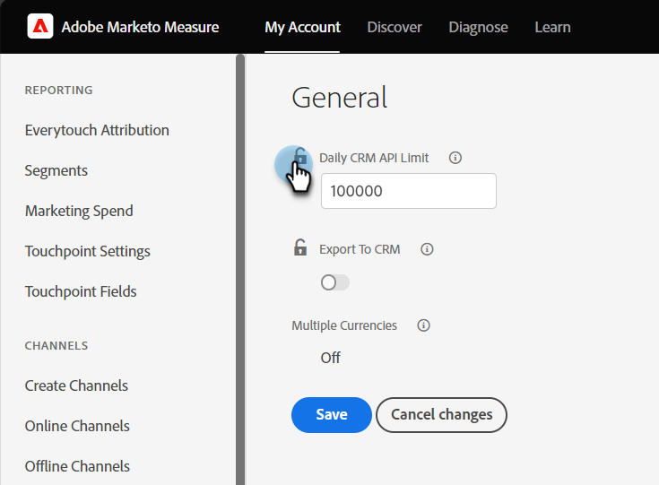

# Conectar Marketo Measure a Salesforce {#connect-marketo-measure-to-salesforce}

Este artículo proporciona información general sobre cómo conectar su [!DNL Salesforce] a su cuenta de [!DNL Marketo Measure] cuenta.

## Conectando [!DNL Marketo Measure] con [!DNL Salesforce] {#connecting-marketo-measure-with-salesforce}

1. Utilizar un explorador de incógnito para iniciar sesión en [!DNL Marketo Measure].

1. En la barra de menús de la parte superior de la pantalla, vaya a **[!UICONTROL Mi cuenta]** y haga clic en **[!UICONTROL Configuración]** opción.

1. En la columna de opciones de configuración de la izquierda, haga clic en **[!UICONTROL Conexiones]** situado bajo el [!UICONTROL Integraciones] sección.

   

1. En la sección CRM de Conexiones, haga clic en **[!UICONTROL Configurar nueva conexión CRM]**.

   

1. Aparecerá una ventana emergente en la que se le pedirá que seleccione una conexión CRM. Haga clic en **[!UICONTROL Connect]** junto al botón [!DNL Salesforce] logotipo.

   

1. Aparecerá una última ventana emergente en la que se le pedirá su [!DNL Salesforce] credenciales, zona protegida o producción. Introduzca su información y haga clic en **[!UICONTROL Autorizar]** para conectar la cuenta a [!DNL Marketo Measure].

>[!NOTE]
>
>[!DNL Marketo Measure] solo se puede conectar a uno [!DNL Salesforce] instancia a instancia.
>
>* A [!DNL Marketo Measure] La instancia se puede conectar a una instancia de zona protegida de SFDC para probar la integración antes de cambiar la conexión a la instancia de producción de SFDC.
>* Si realiza la prueba primero con una zona protegida de SFDC, le recomendamos encarecidamente que realice la prueba con una que sea una réplica exacta de la instancia de producción de SFDC en términos de campos en los objetos de posible cliente, contacto, cuenta, oportunidad, campaña y caso. Si tiene déclencheur APEX activos en producción que se activan al actualizar los objetos de posible cliente, contacto, cuenta, oportunidad, campaña y caso, debe intentar tenerlos activos en su zona protegida.
>* Una vez que haya terminado con las pruebas, actualizará su [!DNL Marketo Measure] cuenta para apuntar a su producción [!DNL Salesforce] (en lugar de espacio aislado) [!DNL Salesforce]). Debido a la forma en que se creó la integración, una vez [!DNL Marketo Measure] La cuenta está conectada a Producción [!DNL Salesforce], no puede ir &quot;hacia atrás&quot; y conectarse a una zona protegida [!DNL Salesforce] org.

## Uso de créditos de API {#api-credits-usage}

Marketo Measure emplea una tarea de integración de CRM para interactuar con Salesforce de un cliente a través de un usuario integrado. Todos los intercambios de datos a través de este usuario utilizan créditos de API de Salesforce. Tiene la capacidad de asignar una cuota de crédito a un usuario de integración, lo que sirve para regular llamadas de API excesivas. Esta cuota o límite se restablece cada 24 horas.

Puede acceder a este límite en Marketo Measure mediante: **Mi cuenta** > **Configuración** > **CRM** > **General** > **Límite diario de API de CRM** y puede configurarlo para sus inquilinos.

### Configuración de un límite para créditos de API {#setting-a-limit-for-api-credits}

1. Vaya a **Mi cuenta** > **Configuración**.

1. En CRM, haga clic en **General**. Verá el... **Límite diario de API de CRM** opción.

1. Haga clic en el icono Bloquear para editarlo.

   

1. Introduzca un límite deseado igual o superior a 100 000. Clic **Guardar** cuando termine.

   

>[!NOTE]
>
>Para aumentar los créditos de API de Salesforce disponibles para su solución conectada, póngase en contacto con su administrador de Salesforce y consulte [este documento de Salesforce](https://developer.salesforce.com/docs/atlas.en-us.salesforce_app_limits_cheatsheet.meta/salesforce_app_limits_cheatsheet/salesforce_app_limits_platform_api.htm){target="_blank"}.

>[!MORELIKETHIS]
>
>[Notificaciones de error](/help/configuration-and-setup/getting-started-with-marketo-measure/error-notifications.md){target="_blank"}
