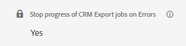

# Gestión de errores para exportaciones de CRM

La función Pausa al exportar errores permite controlar si los trabajos de exportación de CRM deben pausarse cuando se encuentra un error de nivel de registro.

La configuración se encuentra en **Mi cuenta** > **Configuración** > **CRM** > **General**.

>[!NOTE]
>
>Esta función solo está visible si tiene habilitada la función &quot;Exportar a CRM&quot;.

Cuando esta función está habilitada, el trabajo de exportación deja de progresar y permanece en el registro donde se produjo el error hasta que se resuelva el problema. Estos errores suelen deberse a la falta de permisos, a reglas de validación personalizadas aplicadas incorrectamente o a problemas en flujos de trabajo/activadores. El trabajo seguirá ejecutándose según lo programado y volverá a intentar exportar automáticamente el registro fallido hasta que se realice correctamente.

Si decide desactivar esta función, aparecerá una ventana emergente de advertencia que le informará de que esto puede provocar incoherencias en los datos. Será su responsabilidad abordar cualquier problema que pueda surgir de estas inconsistencias.

En ambos casos, independientemente de si la característica está activada o desactivada, todos los errores de nivel de registro encontrados se registran en la tabla `ExportErrors` y el trabajo `CRMExport_ExportError` intentará automáticamente volver a exportar estos registros diariamente. Esto elimina la necesidad de una solicitud de soporte para iniciar una reexportación, ya que se producirá automáticamente sin ninguna intervención del desarrollador.

¿Por qué es necesario el comportamiento de detención del trabajo dada la funcionalidad de `ExportErrors`? Al detener los trabajos de exportación de CRM normales en un registro específico, la resolución de problemas se vuelve mucho más fácil. Permite ejecutar trabajos localmente e impedir la creación de un número potencialmente elevado de ExportErrors, que deberían recuperarse y procesarse durante la reexportación.

Esta función se puede activar o desactivar según el comportamiento que prefiera. Por ejemplo, si encuentra un código de error especialmente difícil y prefiere aceptar temporalmente datos &quot;incompletos&quot;, puede desactivar la función. Una vez resuelto el problema, puede volver a activar la función para garantizar que las futuras exportaciones sean completas y precisas.
