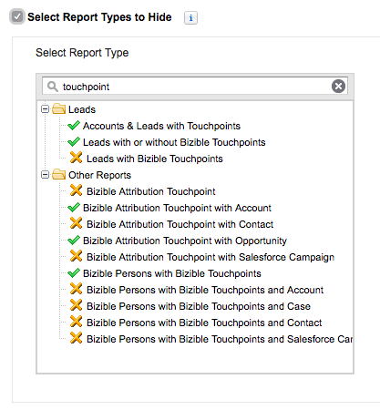

# Ocultar tipos de informes innecesarios {#hiding-unnecessary-report-types}

Una vez finalizada la instalación y comenzado a usar los informes, su organización no usará todos los informes que se incluyen en el paquete [!DNL Marketo Measure]. Por lo tanto, es útil ocultar los tipos de informes que no esté utilizando para eliminar cualquier confusión y permitir una apariencia más limpia. Puede ocultar cualquier informe que desee, pero los informes identificados en la siguiente imagen suelen estar ocultos.

1. Vaya a la pestaña **[!UICONTROL Informes]**.

1. Haga clic en el botón **[!UICONTROL Crear nuevo informe]** en la parte superior de la pantalla.

1. Escriba la palabra &quot;Touchpoint&quot; para rellenar los informes.

1. Seleccione la casilla de verificación **[!UICONTROL Seleccionar tipos de informes para ocultar]** en la parte superior izquierda.

1. Haga clic en los informes marcados a continuación con una X naranja para que la lista de informes tenga el mismo aspecto que la imagen siguiente.

   

>[!MORELIKETHIS]
>
>[Salesforce - Ocultar tipos de informe sin usar](https://help.salesforce.com/articleView?id=release-notes.rn_analytics_hide_report_types.htm&type=5&language=en_us)
