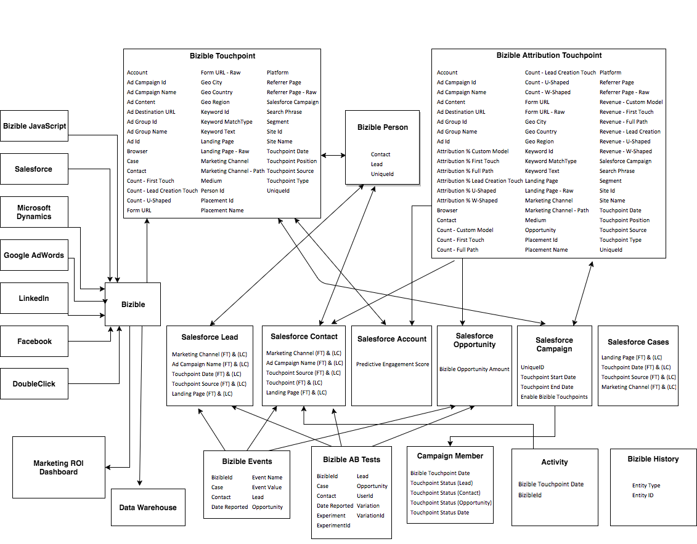

# [!DNL Marketo Measure] Taxonomía de objetos y campos {#marketo-measure-object-and-field-taxonomy}

A continuación se muestra un diagrama de flujo que representa cómo [!DNL Marketo Measure] Los objetos personalizados están relacionados con [!DNL Salesforce] Objetos estándar.

Para la imagen de tamaño completo, [haga clic aquí](assets/bizible-object-and-field-taxonomy-graph-full.png).

Definiciones del [!DNL Marketo Measure] campos que residen en cada objeto [se puede encontrar aquí](/help/introduction-to-marketo-measure/overview-resources/glossary-of-marketo-measure-fields.md).

## Preguntas frecuentes {#faq}

**¿Cuál es la lógica de las flechas?**

Cada flecha describe la relación entre un objeto y el otro. Por ejemplo, verá que la variable [!DNL Marketo Measure] Persona rellena los campos en el estándar [!DNL Salesforce] Objeto de posible cliente. Si está apuntando hacia él, significa que está rellenando el extremo receptor de la flecha.

**¿Qué es el [!DNL Marketo Measure] ¿Persona?**

Es un [!DNL Marketo Measure] Objeto en [!DNL Salesforce] que vincula puntos de contacto del comprador con posibles clientes y contactos.

**¿Qué es el [!DNL Bizible].JS?**

Es nuestro JavaScript personalizado que utilizamos para rastrear la información web que una persona tiene en un sitio específico.

**¿Qué es el panel de retorno de la inversión de marketing?**

Es un tablero de canales de marketing personalizado que se encuentra en el [!DNL Marketo Measure] aplicación. Se puede acceder a ella yendo a su [!DNL Marketo Measure] en [!DNL Salesforce].
