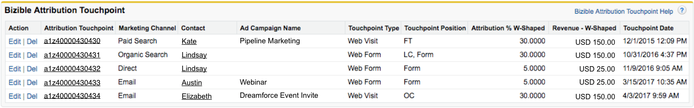
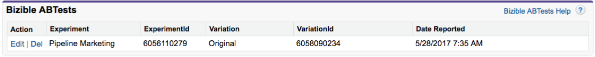

# Objetos de Salesforce de [!DNL Marketo Measure]  {#marketo-measure-salesforce-objects}

>[!NOTE]
>
>Puede que vea instrucciones que especifican &quot;[!DNL Marketo Measure]&quot; en nuestra documentación, pero seguirá viendo &quot;Bizible&quot; en su CRM. Estamos trabajando para que se actualice y el cambio de marca se reflejará pronto en su CRM.

Cuando [!DNL Marketo Measure] está instalado en [!DNL Salesforce] (SFDC), se añadirán varios objetos de [!DNL Marketo Measure] personalizados. Este artículo proporciona una explicación de varios de estos objetos de [!DNL Marketo Measure] personalizados. Algunos objetos que [!DNL Marketo Measure] añade a [!DNL Salesforce] son:

* [Buyer Touchpoint](#touchpoint)
* [Buyer Attribution Touchpoint](#attribution)
* [[!DNL Marketo Measure] Persona](#person)
* [[!DNL Marketo Measure] Pruebas A/B](#ab)
* [[!DNL Marketo Measure] Eventos](#events)

Los Touchpoints capturados por las cosas que desea rastrear escribirán en los objetos personalizados creados por la instalación del paquete de [!DNL Bizible Salesforce].

[!DNL Marketo Measure] Los objetos están relacionados con objetos estándares de [!DNL Salesforce] específicos. Esto le permite informar sobre los objetos de [!DNL Marketo Measure] y [!DNL Salesforce] juntos. La tabla siguiente muestra a qué objeto de [!DNL Salesforce] corresponde el objeto de [!DNL Marketo Measure].

## Buyer Touchpoint {#buyer-touchpoint}

El Objeto [!UICONTROL Buyer Touchpoint] (BT) cuenta la historia de marketing de un individuo. Almacena todos los datos relacionados con los Touchpoints de marketing generados por los posibles clientes y contactos. El BT le muestra información como el canal de marketing del que procedía el Touchpoint o la campaña de publicidad que llevó a ese posible cliente/contacto concreto a su sitio web.

El objeto BT es visible en las páginas de posibles clientes y contactos como **Lista relacionada** (véase la imagen siguiente).

La lista relacionada de BT muestra todos los Touchpoints que pertenecen al posible cliente o contacto. Dentro de la lista están los campos de [!DNL Marketo Measure] personalizados que proporcionan más detalles sobre cada Touchpoint. Al hacer clic en el número de ID del Buyer Touchpoint, accederá a la página Detalles del Buyer Touchpoint, que proporciona todavía más detalles sobre el Touchpoint, como la primera página web que visitó el posible cliente/contacto durante esa sesión web (**página de aterrizaje**).

## Buyer Attribution Touchpoint {#buyer-attribution-touchpoint}

El Objeto [!UICONTROL Buyer Attribution Touchpoint] cuenta la historia de las interacciones de marketing de sus contactos relacionadas con una oportunidad. Muestra los datos de *atribución* relacionados con los Touchpoints de marketing. Este objeto le permite ver cuánto crédito de ingresos se atribuye a cada Touchpoint de marketing. El tipo de modelo de atribución que utiliza determinará el porcentaje de ingresos atribuidos a los Touchpoints.

Los Buyer Attribution Touchpoints (BAT) solo se crean una vez que se crea una Oportunidad relacionada con contactos que tienen datos de Buyer Touchpoint (BT). Los BAT no se crean sin una oportunidad. Una vez creada la Oportunidad, el objeto BAT utilizará el campo [!DNL Salesforce] *Importe* en la Oportunidad para comprender cuántos ingresos hay que atribuir a los Touchpoints.

Debe crearse un **flujo de trabajo** si utiliza un [campo de importe personalizado](/help/advanced-marketo-measure-features/custom-revenue-amount/using-a-custom-revenue-amount-field.md) para mostrar los ingresos del Objeto Oportunidad. [!DNL Marketo Measure] no puede leer la información que aparece en los campos de importe personalizados y, por lo tanto, no puede rellenar los datos de atribución de ingresos en los Touchpoints. Este flujo de trabajo utilizará el Campo **[!DNL Marketo Measure]Importe de oportunidad**, uno de los campos personalizados de [!DNL Marketo Measure], para asignar el valor de ingresos del campo personalizado Importe al campo Importe de oportunidad.

El objeto BAT es visible en el Objeto [!UICONTROL Oportunidad], [!UICONTROL Contacto]y [!UICONTROL Cuenta] como lista relacionada. Esta lista muestra todos los Touchpoints con los datos de atribución que pertenecen a una Oportunidad. Al pulsar el ID de Buyer Attribution Touchpoint, se le dirigirá a la página Detalle del Buyer Attribution Touchpoint. Aquí podrá ver datos de atribución más específicos e información sobre la procedencia del Touchpoint (similar a lo que se proporciona desde el Objeto Buyer Touchpoint).

## [!DNL Marketo Measure] Persona {#marketo-measure-person}

El Objeto Persona de [!DNL Marketo Measure] relaciona los objetos Posible cliente y Contacto. De forma predeterminada, Salesforce no proporciona la opción de crear informes utilizando el objeto Posible cliente y Contacto en el mismo informe. Al referirse al Objeto Posible cliente y Contacto, la Persona de [!DNL Marketo Measure] le permite crear informes sobre ambos Objetos dentro del mismo informe. Esto resulta especialmente útil cuando un posible cliente se ha convertido en un contacto. En un Registro de persona de [!DNL Marketo Measure] verá una búsqueda del registro de Contacto o Posible cliente correspondiente, una lista relacionada de los Touchpoints vinculados a la persona y el ID de Persona (que siempre es la dirección de correo electrónico del Contacto o Posible cliente). Dado que la Persona de [!DNL Marketo Measure] se relaciona con el objeto Posible cliente y Contacto, nunca habrá un registro de Persona de [!DNL Marketo Measure] vinculado a un Buyer Attribution Touchpoint. A continuación se muestra un ejemplo de un registro de Persona de [!DNL Marketo Measure] en Salesforce:

## [!DNL Marketo Measure] Prueba A/B {#marketo-measure-a-b-test}

Si está ejecutando pruebas A/B mediante [!DNL Optimizely] o VWO (Visual Web Optimizer), puede conectar esas cuentas a su cuenta de [!DNL Marketo Measure] para ver datos de prueba A/B en Salesforce. El objeto Prueba A/B de [!DNL Marketo Measure] esencialmente le permite tomar datos de prueba A/B de Optimizely/VWO y vincularlos a posibles clientes y contactos.

El objeto Prueba A/B de [!DNL Marketo Measure] se muestra como una lista relacionada en las páginas [!UICONTROL Posibles clientes], [!UICONTROL Contactos] y [!UICONTROL Oportunidad]. La lista muestra todos los experimentos y variaciones que está ejecutando a través de Optimizely o VWO, y le permite ver los experimentos/variaciones en relación con posibles clientes y contactos específicos.

## [!DNL Marketo Measure] Eventos {#marketo-measure-events}

El objeto Eventos de [!DNL Marketo Measure] le permite realizar un seguimiento de eventos específicos que se producen en el sitio web. Para realizar un seguimiento de eventos específicos que se producen en el sitio web, se debe añadir código personalizado a las páginas, además del Javascript de [!DNL Marketo Measure]. La información capturada se mostrará dentro de la lista relacionada de objetos de [!DNL Marketo Measure], que se puede encontrar en las páginas [!UICONTROL Posibles clientes], [!UICONTROL Contactos] y [!UICONTROL Oportunidad]. El objeto Evento de [!DNL Marketo Measure] *no está* vinculado a los datos de atribución. El propósito de este objeto es ver si las personas están realizando acciones específicas en el sitio web.

## [!DNL Marketo Measure] Campos {#marketo-measure-fields}

Los datos capturados por el Javascript de [!DNL Marketo Measure] se insertarán en los campos de [!DNL Marketo Measure] dentro de nuestros objetos de [!DNL Marketo Measure]. Algunos campos solo están presentes en determinados objetos. Para ver un glosario de todos los campos de [!DNL Marketo Measure], [haga clic aquí](/help/introduction-to-marketo-measure/overview-resources/glossary-of-marketo-measure-fields.md). Para visualizar el objeto de [!DNL Marketo Measure] con el que se relaciona cada campo de [!DNL Marketo Measure], [haga clic aquí](/help/configuration-and-setup/marketo-measure-and-salesforce/marketo-measure-object-and-field-taxonomy.md).

## Informes y paneles de [!DNL Marketo Measure] {#marketo-measure-reports-and-dashboards}

Los Informes y paneles de [!DNL Marketo Measure] que se añaden a su [!DNL Salesforce] le ofrecen funcionalidades de creación de informes y visualización de datos listas para usar. Estos son informes básicos de [!DNL Marketo Measure] que le permiten organizar, analizar y comprender rápidamente los datos de Touchpoint.
