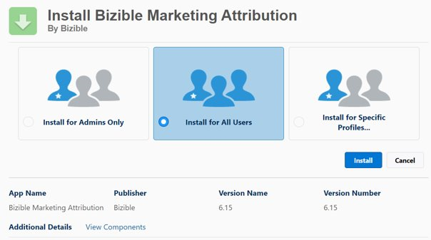

# [!DNL Marketo Measure] Instalación y configuración del paquete de Salesforce {#marketo-measure-salesforce-package-installation-and-set-up}

Antes de instalar el [!DNL Marketo Measure] [!DNL Salesforce] paquete base, debe determinar si lo va a instalar primero en un [!DNL Salesforce] entorno limitado antes de pasar a la instancia de producción de Salesforce.

>[!NOTE]
>
>Una vez que [!DNL Marketo Measure] la cuenta está conectada a un [!DNL Salesforce] instancia de producción, no puede moverse hacia atrás y conectarse a un simulador para pruebas. Además, un [!DNL Marketo Measure] la cuenta solo puede conectarse a una [!DNL Salesforce] instancia de producción.

La variable [!DNL Marketo Measure] El paquete base contiene:

* 7 Personalizado [!DNL Marketo Measure] Objetos
* Personalizado [!DNL Marketo Measure] Campos
* 25 [!DNL Stock] Informes

[!DNL Marketo Measure] es capaz de leer standard [!DNL Salesforce] Sin embargo, Objetos, Campos y Registros [!DNL Marketo Measure] nunca se actualizarán ni insertarán datos en ellos. Todos los datos recopilados por la [!DNL Marketo Measure] El JavaScript se mostrará en la variable [!DNL Marketo Measure] Objetos y campos personalizados.

Siga los pasos a continuación para instalar el [!DNL Marketo Measure Salesforce] paquete base.

1. Con un navegador de incógnito, vaya a la [Appexchange de Salesforce](https://appexchange.salesforce.com/appxListingDetail?listingId=a0N3000000B3KLuEAN){target="_blank"} e inicie sesión.

1. Instale en el [!DNL Marketo Measure] paquete en entorno limitado o producción.

1. Iniciar sesión en [!DNL Salesforce] como administrador.

1. Select **[!UICONTROL Instalar] para todos los usuarios**.

   

1. Una vez finalizada la instalación, puede verla.

   

Una vez finalizada la instalación, puede actualizar su [[!DNL Salesforce] diseños de página](/help/configuration-and-setup/marketo-measure-and-salesforce/page-layout-instructions.md){target="_blank"} con la variable [!DNL Marketo Measure] si lo desea.

>[!NOTE]
>
>Obtenga información sobre [!DNL Marketo Measure] Conjuntos de permisos creados y [cómo se utilizarán](/help/configuration-and-setup/marketo-measure-and-salesforce/marketo-measure-permission-sets.md){target="_blank"}.

## Instalar [!DNL Marketo Measure] Paquete de tablero {#install-marketo-measure-dashboard-package}

La variable [!UICONTROL Panel] El paquete de extensión contiene tres paneles creados previamente. Se recomienda instalar [!UICONTROL en] Producción para todos los usuarios.

1. Instale el paquete desde el [[!DNL Salesforce] Appexchange](https://login.salesforce.com/packaging/installPackage.apexp?p0=04t610000001jI6){target="_blank"}.

1. Select **[!UICONTROL Instalar para todos los usuarios]**.

   

## Creación de [!DNL Marketo Measure] Perfil y usuario {#creating-a-marketo-measure-profile-and-user}

[!DNL Marketo Measure] envía y recibe datos a través de una [!DNL Salesforce] dentro del [!DNL Marketo Measure] aplicación.

Para insertar datos de puntos de contacto en el [!DNL Salesforce] , el usuario conectado debe tener acceso a [!DNL Marketo Measure] objetos personalizados (p. ej., Touchpoint de Comprador y Touchpoint de Atribución de Comprador), así como [!DNL Salesforce] objetos como Posibles clientes y Contactos.

Cree un [!DNL Marketo Measure] para garantizar que no se producirá ningún error de validación al enviar datos a Salesforce.

Paso 1: Cree un [!DNL Marketo Measure] perfil

1. Asigne los siguientes permisos:

* &quot;[!DNL Marketo Measure] Conjunto de permisos de administrador&quot;
   * El conjunto de permisos administrados permite a un administrador de SFDC crear, leer, escribir y eliminar registros de [!DNL Marketo Measure] objetos.
* &quot;Ver y editar conjunto de permisos de posibles clientes convertidos&quot;
   * Esto permite que [!DNL Marketo Measure] para decorar posibles clientes después de convertirlos en contactos. Si este conjunto de permisos no está habilitado, puede haber lagunas de seguimiento de datos significativas.

>[!NOTE]
>
>Este perfil puede ser un clon de un perfil de administrador del sistema.

Paso 2: Cree una [!DNL Marketo Measure] para que pueda realizar un seguimiento del impacto de [!DNL Marketo Measure] en su [!DNL Salesforce] instancia

1. Asigne el nuevo [!DNL Marketo Measure] Perfil a ese usuario.

1. Habilite &quot;Usuario de marketing&quot; como permiso a nivel de usuario.

* La variable [!UICONTROL Usuario de marketing] permite al usuario crear campañas y utilizar el Asistente para importación de campañas. Si no se selecciona esta opción, el usuario solo puede ver las campañas y la configuración avanzada de la campaña, editar el historial de campañas para un único posible cliente o contacto y ejecutar informes de campaña. [!DNL Marketo Measure] necesita poder leer y escribir en el objeto de campaña.

Paso 3: Excluir este perfil de todos los déclencheur, flujos de trabajo y procesos

Paso 4: Inicie sesión en su [!DNL Marketo Measure] Cuenta y vuelva a autorizar la variable [!DNL Salesforce] conexión con el nuevo usuario

1. Vaya a apps.bizible.com e inicie sesión con la nueva producción de usuario [!DNL Salesforce] credenciales.

1. Select **[!UICONTROL Configuración]** dentro de la variable **[!UICONTROL Mi cuenta]** lista desplegable.

1. Select **[!UICONTROL Conexiones]** dentro de la variable **[!UICONTROL Integraciones]** agrupación.

1. Haga clic en el icono Clave a la derecha del conectado actual [!DNL Salesforce] conexión y seleccione **Volver a autorizar con producción**. Inicie sesión de nuevo con las nuevas credenciales de usuario (si se le solicita).
