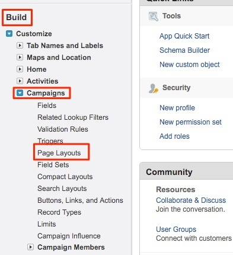

# Instrucciones de diseño de página {#page-layout-instructions}

>[!NOTE]
>
>Puede ver instrucciones que especifican &quot;[!DNL Marketo Measure]&quot; en nuestra documentación, pero aún así ver &quot;Bizible&quot; en su CRM. Estamos trabajando para que esto se actualice y el cambio de marca se reflejará pronto en su CRM.

Para ver fácilmente [!DNL Marketo Measure] , se recomienda actualizar los diseños de página para la variable [!UICONTROL Cuenta], [!UICONTROL Contacto], [!UICONTROL Posible cliente], [!UICONTROL Oportunidad]y [!UICONTROL Campaign] Objetos. Las instrucciones se desglosan para cada diseño de página de objeto que se muestra a continuación.

Para empezar, vaya primero a la [!DNL Salesforce] Configuración y busque la [!UICONTROL Personalizar] pestaña .

## Objeto de campaña {#campaign-object}

Se recomienda añadir la variable [!DNL Marketo Measure] a la campaña de SFDC solo para su simulador de pruebas. Los campos se pueden utilizar para probar la generación de puntos de contacto. En producción, se recomienda añadir solo la variable [!DNL Marketo Measure] Botón Actualización masiva de fecha de punto de contacto. No se recomienda añadir la variable [!DNL Marketo Measure] campos a producción ya que puede crear reglas de regla de sincronización de Campaign.

1. Dentro de la opción Generar , seleccione **[!UICONTROL Campañas]**.

1. Haga clic en **[!UICONTROL Diseños de página]**.

   

1. Haga clic en **[!UICONTROL Editar]** junto al diseño de página que desea actualizar.

   

1. Dentro de [!UICONTROL campos] seleccione la opción **[!UICONTROL Habilitar puntos de contacto del comprador]** y arrástrela donde desee en la página. A continuación, añada la variable **[!UICONTROL Fecha inicial de Touchpoint]** y **[!UICONTROL Fecha de finalización de Touchpoint]** campos.

   

1. A continuación, en la parte superior de la página, haga clic en la[!UICONTROL Botones]&quot; dentro del menú de búsqueda rápida.

1. Arrastre el **[!UICONTROL Fecha de punto de contacto de actualización masiva]** a la sección de botones personalizados.

   

1. Haga clic en **[!UICONTROL Guardar]**.

   >[!NOTE]
   >
   >Si utiliza varios tipos de registro de Campaign, los valores de la lista de selección para la variable **[!UICONTROL Habilitar puntos de contacto del comprador]** se debe actualizar el campo . Consulte [este artículo](/help/channel-tracking-and-setup/offline-channels/configurations-for-multiple-campaign-record-types.md) para obtener instrucciones.

## Leads {#leads}

1. Dentro de la opción Generar , seleccione **[!UICONTROL Posibles clientes]**.

1. Haga clic en **[!UICONTROL Diseños de página]**.

1. Haga clic en **[!UICONTROL Editar]** junto al diseño de página que desea actualizar. Tenga en cuenta que varios diseños de página pueden contener las secciones Puntos de contacto del comprador .

1. Haga clic en la opción de página de VisualForce a la izquierda en el menú de búsqueda rápida.

1. Cree una nueva sección y asígnele el nombre &quot;Puntos de contacto del comprador&quot;.

   >[!NOTE]
   >
   >Seleccione el formato &quot;una columna&quot; para cada una de estas secciones.

1. Arrastre el **[!UICONTROL Lista relacionada con los posibles clientes de medida de Marketo]** Página de VisualForce en la sección de diseño de página.

   

1. Haga clic en la llave inglesa dentro de la [!DNL VisualForce] y cambie la altura a 100 y habilite las barras de desplazamiento.

1. En el menú, seleccione la opción [!UICONTROL Aplicaciones de lienzo] y cree una nueva sección denominada &quot;Marketo Measure Insights&quot; (Perspectivas de medida de) debajo de Touchpoints [!DNL VisualForce] que acaba de crear.

   >[!NOTE]
   >
   >Seleccione el formato &quot;una columna&quot; para cada una de estas secciones.

1. Arrastre el [!DNL Marketo Measure Insights] Aplicación de lienzo en la sección recién creada. Haga clic en **Guardar**. A veces es necesario guardar primero el diseño de página antes de soltarlo en la aplicación de lienzo porque Salesforce no lo reconoce al instante. Por lo tanto, después de crear la nueva sección, guarde el diseño de página y vuelva a editarlo para arrastrar la aplicación de lienzo dentro de esa sección. Esto se aplica a todos los objetos.

   >[!NOTE]
   >
   >Para la variable [!DNL Marketo Measure Insights] Aplicación de lienzo para funcionar correctamente, [Los permisos de deben configurarse correctamente](/help/configuration-and-setup/marketo-measure-insights-canvas-app/marketo-measure-insights-configuration.md).

   >[!TIP]
   >
   >La mayoría de los clientes no utilizan los campos que terminan con (FT) o (LC) porque son campos heredados de antes del [!DNL Marketo Measure] Touchpoint existía como un objeto.

Si está aprovechando el [!DNL Marketo Measure] función ABM, [haga clic aquí para obtener instrucciones adicionales sobre el diseño de la página](/help/advanced-marketo-measure-features/account-based-marketing/account-based-marketing-overview.md).

## Contactos {#contacts}

1. Dentro de la opción Generar , seleccione **[!UICONTROL Contactos]**.

1. Haga clic en **[!UICONTROL Diseños de página]**.

1. Seleccione el diseño de página que desee editar.

   Vaya a la opción Listas relacionadas dentro del menú de búsqueda rápida y añada la **[!UICONTROL Puntos de contacto del comprador]** lista relacionada.

1. Haga clic en el icono de la llave inglesa y añada las columnas siguientes en este orden:

   * Punto de contacto del comprador
   * Canal de marketing
   * Fuente del Touchpoint
   * Nombre de campaña de publicidad
   * Posición del Touchpoint
   * Fecha de Touchpoint

1. Ordenar por: Fecha de punto de contacto, ascendente.

   

1. Expanda la opción Botones y anule la selección **[!UICONTROL Nuevo]**.

   

1. Vuelva a la [!UICONTROL Lista relacionada] en el menú y, a continuación, añada la opción **[!UICONTROL Punto de contacto de atribución del comprador]** lista relacionada.

1. Haga clic en el icono de la llave inglesa y añada las columnas siguientes en este orden:

   * Punto de contacto de atribución
   * Canal de marketing
   * Oportunidad
   * Nombre de campaña de publicidad
   * Tipo de Touchpoint
   * Posición del Touchpoint
   * Atribución % Forma-W (_o el modelo de atribución más robusto, como Ruta completa o Personalizado_)
   * Forma de W de ingresos (_o el modelo de atribución más robusto, como Ruta completa o Personalizado_)
   * Fecha de Touchpoint

1. Ordenar por punto de contacto [!UICONTROL Fecha] > [!UICONTROL Ascendente].

1. Expanda la sección Botones y anule la selección **[!UICONTROL Nuevo]**.

1. Haga clic en **[!UICONTROL Guardar]**.

## Oportunidades {#opportunities}

1. Dentro de la opción Generar , seleccione **[!UICONTROL Oportunidades]**.

1. Haga clic en **[!UICONTROL Diseños de página]**.

1. Seleccione el diseño de página que desee editar.

1. Agregue la variable **[!UICONTROL Punto de contacto de atribución del comprador]** Lista relacionada y haga clic en la llave inglesa para agregar las siguientes columnas para Oportunidades:

   * Punto de contacto de atribución
   * Canal de marketing
   * Contacto
   * Nombre de campaña de publicidad
   * Tipo de Touchpoint
   * Posición del Touchpoint
   * Atribución % Forma-W (_o el modelo de atribución más robusto, como Ruta completa o Personalizado_)
   * Forma de W de ingresos (_o el modelo de atribución más robusto, como Ruta completa o Personalizado_)
   * Fecha de Touchpoint

1. Ordenar por [!UICONTROL Fecha de Touchpoint] > [!UICONTROL Ascendente].

1. Anular selección **[!UICONTROL Nuevo]** dentro de la variable [!UICONTROL Botones] para obtener más información.

1. Haga clic en **[!UICONTROL Guardar]**.

## Cuentas {#accounts}

1. Dentro de la opción Generar , seleccione **[!UICONTROL Cuentas]**.

1. Haga clic en **[!UICONTROL Diseños de página]**.

1. Seleccione el diseño de página que desee editar.

1. Agregue la variable **[!UICONTROL Punto de contacto de atribución del comprador]** Lista relacionada y haga clic en la llave inglesa para añadir las siguientes columnas:

   * Punto de contacto de atribución
   * Canal de marketing
   * Oportunidad
   * Nombre de campaña de publicidad
   * Tipo de Touchpoint
   * Posición del Touchpoint
   * Atribución % Forma-W (_o el modelo de atribución más robusto, como Ruta completa o Personalizado_)
   * Forma de W de ingresos (_o el modelo de atribución más robusto, como Ruta completa o Personalizado_)
   * Fecha de Touchpoint

1. Ordene por Fecha de punto de contacto > Ascendente.

1. Anular selección **[!UICONTROL Nuevo]** dentro de la variable [!UICONTROL Botones] para obtener más información.

1. Haga clic en **[!UICONTROL Guardar]**.

Si está aprovechando el [!DNL Marketo Measure] función ABM,  [haga clic aquí para obtener instrucciones adicionales sobre el diseño de la página](/help/advanced-marketo-measure-features/account-based-marketing/account-based-marketing-overview.md).
