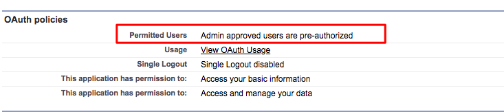

# Configuración de información de [!DNL Marketo Measure] {#marketo-measure-insights-configuration}

El [!DNL Marketo Measure] La aplicación de lienzo de Insights debe agregarse al diseño de página de posible cliente, pero requiere una configuración adicional en la sección Aplicaciones conectadas de su [!DNL Salesforce] Configurar. Siga estas instrucciones para asegurarse de que la aplicación de lienzo tenga los permisos adecuados.

1. Vaya a [!DNL Salesforce] Configure y haga clic en **[!UICONTROL Aplicaciones conectadas]** en el [!UICONTROL Administrar aplicaciones] pestaña.

1. Seleccione el [!DNL Marketo Measure Insights] de la lista que se rellena.

1. En el [!UICONTROL OAuth] En la sección de directivas, cambie la configuración Usuarios permitidos a &quot;Los usuarios aprobados por el administrador están preautorizados&quot;. Aparece una ventana emergente y hace clic en **[!UICONTROL OK]** y luego **[!UICONTROL Guardar]**.

   

1. Una vez guardada la página, puede hacer clic en **[!UICONTROL Administrar perfiles]** botón.

   

1. Seleccione todos los perfiles que deben tener acceso a [!DNL Marketo Measure] Perspectivas y clic **[!UICONTROL Guardar]**.
