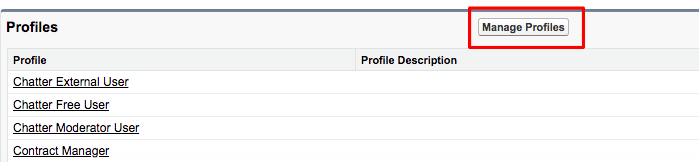

# Configuración de información de [!DNL Marketo Measure] {#marketo-measure-insights-configuration}

La aplicación de lienzo de perspectivas [!DNL Marketo Measure] debe agregarse al diseño de página de posible cliente, pero requiere una configuración adicional en la sección Aplicaciones conectadas de la configuración de [!DNL Salesforce]. Siga estas instrucciones para asegurarse de que la aplicación de lienzo tenga los permisos adecuados.

1. Vaya al programa de instalación de [!DNL Salesforce] y haga clic en **[!UICONTROL Aplicaciones conectadas]** en la ficha [!UICONTROL Administrar aplicaciones].

1. Seleccione [!DNL Marketo Measure Insights] de la lista que se rellena.

1. En la sección de directivas de [!UICONTROL OAuth], cambie la opción Usuarios permitidos a &quot;Los usuarios aprobados por el administrador están preautorizados&quot;. Aparece una ventana emergente, haz clic en **[!UICONTROL Aceptar]** y luego **[!UICONTROL Guardar]**.

   

1. Una vez guardada la página, puede hacer clic en el botón **[!UICONTROL Administrar perfiles]**.

   

1. Seleccione todos los perfiles que deberían tener acceso a [!DNL Marketo Measure] Insights y haga clic en **[!UICONTROL Guardar]**.
