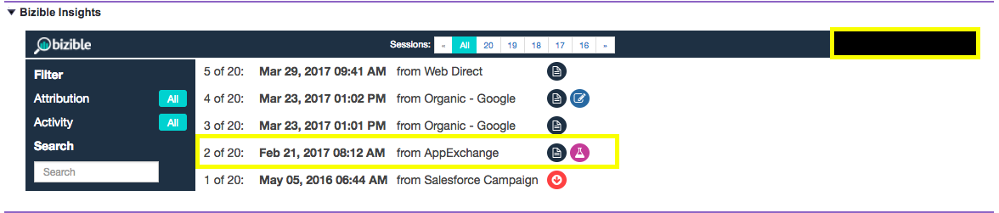

# [!DNL Marketo Measure] Información explicada {#marketo-measure-insights-explained}

Obtenga información sobre [!DNL Marketo Measure] Vista de perspectivas en [!DNL Salesforce], incluidos los diferentes iconos que representan y cómo utilizar la función. Esta función es muy útil para ver las 20 primeras sesiones de un posible cliente, contacto o cuenta.

Una vez que alguien es rastreado por la variable [!DNL Marketo Measure] javascript y rellena un formulario en su sitio web, la persona se convertirá en líder en su sistema y trasladaremos sus datos de marketing digital a su organización de Salesforce (SFDC). Cuando esto ocurra, verá los datos de punto de contacto rellenados en la variable [!DNL Marketo Measure] Lead Insights (una aplicación de lienzo) en los objetos Posibles clientes/Contacto/Oportunidad/Cuenta.

Primero, verá en la parte central de sus perspectivas, el número de sesiones que la persona ha tenido en su sitio web. Puede desplazarse por estas sesiones y navegar a voluntad.

Puede ver el resumen de todas sus sesiones si hace clic en &quot;Todo&quot; en la parte central-superior de sus perspectivas. Allí comprenderá las fechas de cada sesión, qué canal o fuente condujo a estas sesiones y un conjunto de iconos que especifican más información.

Lo primero que verá son los iconos de FT o LC. Representan la posición del punto de contacto de las sesiones enumeradas. Específicamente, FT significa Primer toque y LC significa Creación de Posibles Clientes. Puede tener varias sesiones, pero solo un punto de contacto puede ser FT o LC. Nunca encontrará varias FT o LC asociadas a una sola persona.

Los iconos que parecen papel indican que se ha producido una vista de página en la sesión. Es probable que cada sesión incluya este icono.

El icono que parece un vaso de precipitados indica que se ha producido un experimento de prueba A/B. Nos integramos con Optimizely y VWO en este momento. Con esta integración, podemos impulsar el experimento y la variación que el usuario vio en su sesión específica.

Si hace clic en cualquier sesión específica (puede hacerlo haciendo clic en la fecha real de la sesión o en la parte superior media de las sesiones agrupadas), podrá ver los detalles de la sesión. En cada sesión, puede ver todas las páginas específicas que el usuario vio ordenadas por fecha y hora.

A la derecha de cada sesión, puede ver más de los datos de marketing granulares que estamos presionando sobre el [!DNL Marketo Measure] en el SFDC. En este ejemplo, puede ver Grupo de publicidad, Contenido de publicidad, Campaña, Palabra clave, Medio. También puede desplazarse hacia abajo para ver más información sobre [!DNL Marketo Measure] datos que proporcionamos.

Por último, una vez que alguien tiene una infinidad de sesiones, puede usar algunos filtros dentro de [!UICONTROL Perspectivas] para buscar partes específicas de su participación en el sitio. Puede filtrar por [!UICONTROL Posición del punto de contacto] por ejemplo.

También puede buscar por Vistas de página, Pruebas A/B o Forms.
