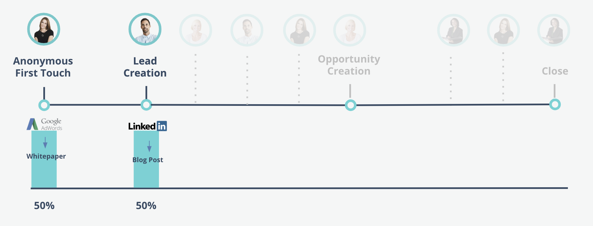

# Modelos de atribución de Marketo Measure {#marketo-measure-attribution-models}

Marketo Measure ofrece seis tipos de modelos de atribución:

* Primer contacto
* Creación de posibles clientes
* En forma de U
* En forma de W
* Ruta completa
* Modelo personalizado

Estos modelos varían en complejidad. El primer contacto y la creación de posibles clientes son nuestros sencillos modelos de un solo contacto. Los otros cuatro son nuestros modelos más complejos y multicontacto. La estructura de los modelos de atribución de Marketo Measure refleja los cuatro puntos de contacto principales que se producen en el recorrido del cliente:

* Primer contacto (FT)
* Creación de posibles clientes (LC)
* Creación de oportunidades (OC)
* Acuerdo ganado cerrado (CW)

En **modelos de un solo contacto**, el crédito de atribución solo se atribuye a un punto de contacto de hito; de ahí el nombre “un solo contacto”.
En **modelos multicontacto**, la mayor parte del crédito de atribución se asigna a dos o más puntos de contacto de hito. El crédito restante se atribuye a los puntos de contacto que se producen entre los puntos de contacto de hito.

Las siguientes secciones tratan sobre cada modelo de atribución y cómo se asigna el crédito de atribución.

## Modelos de un solo contacto {#single-touch-models}

**Modelo de primer contacto**

El modelo de primer contacto solo se centra en la primera interacción que un posible cliente tiene con su organización. Este modelo atribuye el 100 % del crédito de atribución a la primera vez que el posible cliente conoció su empresa, el primer contacto (FT).

Supongamos que Kate visita www.adobe.com por primera vez a través de un anuncio de AdWords y ve un documento técnico. El canal AdWords recibirá el 100 % del crédito de atribución de esa oportunidad.

**Modelo de creación de posibles clientes**

El modelo de creación de posibles clientes atribuye el 100 % del crédito de atribución al punto de contacto LC, cuando un cliente potencial proporciona su información de contacto y se convierte en un posible cliente.

Continuando con el ejemplo anterior, después de la primera visita de Kate a www.adobe.com a través de AdWords, Austin visita el sitio web a través de una publicación de LinkedIn. Austin rellena un formulario y se convierte en un posible cliente. En este modelo, LinkedIn recibirá el 100 % del crédito de atribución.

## Modelos multicontacto {#multi-touch-models}

Los modelos multicontacto se utilizan para ciclos de ventas más largos y complicados. Estos modelos son especialmente útiles si varias personas de una cuenta o empresa participan en el recorrido del comprador.

**Modelo en forma de U**

El modelo en forma de U se centra en los puntos de contacto FT y LC. En este modelo, los puntos de contacto FT y LC reciben cada uno el 50 % del crédito de ingresos.

La primera visita de Kate a www.adobe.com a través de un anuncio de AdWords recibirá el 50 % del crédito de atribución. El 50 % restante se atribuirá a la publicación de LinkedIn que llevó a Austin a rellenar un formulario y convertirse en un posible cliente.

**Modelo en forma de W**

En el modelo en forma de W, se incluyen tres de los puntos de contacto de hito. En este modelo, los puntos de contacto FT, LC y OC se atribuyen cada uno el 30 % del crédito de atribución. El 10 % restante se atribuye proporcionalmente a cualquier punto de contacto intermedio que se produzca entre los tres puntos de contacto de hito.

Kate y Austin mencionan Marketo Measure a su compañera Hillary. Ella encuentra un fragmento de contenido a través de una búsqueda en Google y rellena un formulario. Más tarde, Austin recibe un correo electrónico para un registro a un seminario web y rellena el formulario de registro en el sitio web. Kate tiene una conversación con un representante de ventas sobre el producto Marketo Measure.

Hillary recibe un correo electrónico con un vínculo a la página de precios y visita la página. A continuación, se crea una oportunidad para su cuenta. La visita web de Hillary a la página de precios recibe el crédito por la creación de oportunidades porque fue la interacción de marketing más cercana a la fecha de creación de oportunidades. A cada uno de los puntos de contacto de hito se le asigna el 30 % del crédito de atribución y a los puntos de contacto intermedios se les atribuye el 10 % restante.

**Modelo de ruta completa**

El modelo de ruta completa incluye los cuatro puntos de contacto de hito. FT, LC, OC y CW reciben cada uno un 22,5 % del crédito de ingresos, y el 10 % restante se distribuye equitativamente entre los contactos intermedios.

Después de la creación de la oportunidad, Kate, Austin y Hillary deciden presentar Marketo Measure a su CMO Elizabeth. Elizabeth asiste a una conferencia donde Marketo Measure organiza un evento. Kate ve una publicación de LinkedIn acerca de un caso práctico y rellena un formulario para descargar el contenido. Elizabeth asiste a una cena de ventas organizada por Marketo Measure. Después de la cena, decide comprar Marketo Measure y se convierte en cliente. En este escenario, a la cena de ventas se le atribuye el 22,5 % del crédito de ingresos del acuerdo cerrado. Los puntos de contacto FT, LC y OC también reciben el 22,5 % del crédito. A los puntos de contacto intermedios se les asigna equitativamente el 10 % restante del crédito de ingresos.

**Modelo de atribución personalizado**

Marketo Measure también ofrece un modelo de atribución personalizado que permite a los usuarios elegir qué puntos de contacto o fases personalizadas desean incluir en su modelo. Además, los usuarios pueden controlar el porcentaje de crédito de atribución atribuido a estos puntos de contacto y fases.
