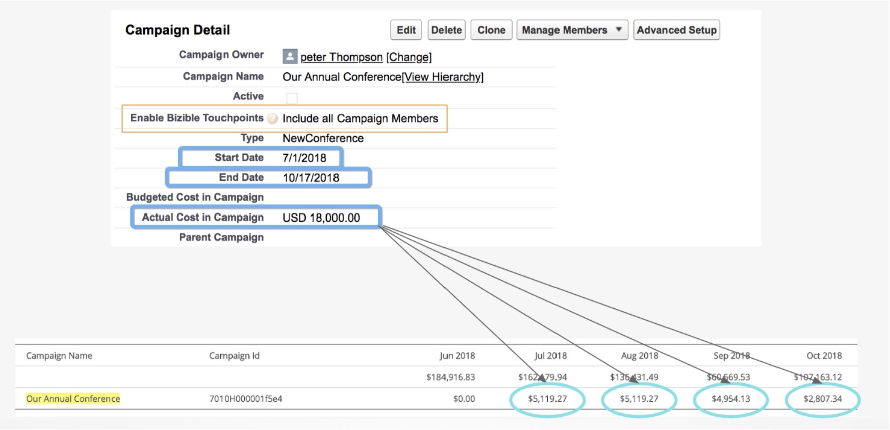

# Costes de campañas de CRM {#crm-campaign-costs}

Más [!DNL Marketo Measure] Los clientes de utilizan campañas CRM para rastrear actividades de marketing sin conexión. Los especialistas en marketing que utilicen estas campañas también monitorizarán los costes dentro de CRM, por lo que esta función les facilita las cosas al permitir lo siguiente [!DNL Marketo Measure] para leer esos costes y aplicarlos al gasto de marketing notificado en [!DNL Marketo Measure]. Hasta la fecha, los clientes han tenido que introducir manualmente los costes de cada campaña al mes, pero con la información necesaria proporcionada a nosotros, [!DNL Marketo Measure] puede automatizar este proceso para que los especialistas en marketing puedan dedicar más tiempo a analizar su gasto y el ROI.

## Disponibilidad {#availability}

Esta función está disponible para todos los [!DNL Salesforce] y clientes de Dynamics.

## Cómo funciona {#how-it-works}

[!DNL Marketo Measure] busca primero las campañas que se han &quot;habilitado&quot; para los puntos de contacto, por lo que se ha creado una regla de sincronización de campañas que coincida o el valor de Habilitar los puntos de contacto del comprador es &quot;Incluir todos los miembros de la campaña&quot; o &quot;Incluir los miembros de la campaña &quot;Respondidos&quot;&quot;. Además, [!DNL Marketo Measure] Necesita importar los valores correctos y saber cómo distribuir los costes, por lo que es necesario que los siguientes campos contengan un valor:

**[!DNL Salesforce]**: ActualCost, StartDate, EndDate

**[!DNL Microsoft Dynamics]**: totalactualcost, actualstart, real end

Si a alguno de los 3 campos le falta un valor, [!DNL Marketo Measure] no importará los costes. Puede corregir esto actualizando el registro de campaña en CRM. También es importante tener en cuenta que no importaremos los costes si se establece explícitamente en 0 $ porque [!DNL Salesforce] trata en blanco y 0 $ como lo mismo.

Para que [!DNL Marketo Measure] para determinar la distribución de una campaña por meses, se utilizan las fechas de inicio y finalización de la campaña y la cantidad se distribuye uniformemente por día.

En este ejemplo, tenemos una campaña que dura 109 días, así que con un costo total de 18 000 dólares, el gasto por día llega a ~ 165,14 dólares.

En función del número de días por mes, obtenemos estos totales mensuales, como puede ver en la tabla:

Jul de 2018: (18.000 $/109) x 31 = 5.119,27 $

Ago 2018: (18.000 $/109) x 31 = 5.119,27 $

Sep 2018: (18.000/109 $) x 30 = 4.954,13 $

Oct 2018: (18 000/109 USD) x 17 = 2 807,34 USD

## Gasto notificado histórico {#historical-reported-spend}

¡No te preocupes! Si ha introducido gasto para campañas que hemos rastreado en el pasado y que se asignaron a una campaña de CRM, no anularemos ninguno de los costes introducidos. Si se modifica la misma campaña en CRM, se seguirá ignorando y dando prioridad a los cambios realizados anteriormente en la carga CSV.

Si prefiere que sigamos adelante con el coste de la campaña de CRM, lo que puede hacer es cambiar el valor del CSV a 0 $, lo que anula la entrada. A continuación, la próxima vez que ejecutemos nuestros trabajos para importar los costes, analizaremos los registros que se hayan editado anteriormente y los extraeremos.

## Campañas sin puntos de contacto {#campaigns-with-no-touchpoints}

Muchos especialistas en marketing eligen informar sobre el gasto en marketing en campañas CRM que no generaron puntos de contacto o que, a sabiendas, no tienen miembros de campaña para los fines del seguimiento del gasto. Siempre que se rellenen los 3 campos (fecha de inicio, fecha de finalización, coste) y la campaña esté habilitada para puntos de contacto, [!DNL Marketo Measure] seguirá tirando de ese coste independientemente de si hay puntos de contacto asociados a él o no.

Esto podría resultar útil para rastrear el gasto en costes de marketing excesivos o herramientas para resumirlo en los cálculos de ROI.

## Sincronización del programa Marketo {#marketo-program-sync}

Si introduce programas de Marketo en CRM como campañas, debe asegurarse de que ha configurado la asignación de Fecha de inicio, Fecha de finalización y Coste de período en los campos de CRM necesarios. Dado que no hay ninguna asignación para el campo Habilitar puntos de contacto del comprador, aún debe habilitar estas campañas para que sepamos cuáles son los costes.

## Edición de los Costes {#editing-the-costs}

Una vez importada una campaña desde CRM, se tratará de manera similar a un proveedor de anuncios de API y no aparecerá en el CSV para realizar cambios de costes.

Cualquier cambio en el coste o la distribución debe realizarse en CRM para que podamos señalar un único punto de verdad.

## Preguntas frecuentes {#faq}

**He hecho un cambio en mi campaña: ¿cuándo debo esperar ver los cambios en la tabla de gastos de marketing o en mis informes?**

3 a 4 horas

**Tengo la fecha de inicio, la fecha de finalización y el coste rellenados, pero ¿por qué mis costes siguen sin aparecer en? [!DNL Marketo Measure]?**

Compruebe que tiene el valor de Habilitar el punto de contacto del comprador establecido en &quot;Incluir todos los miembros de la campaña&quot; o al menos en &quot;Incluir miembros de la campaña &quot;Respondidos&quot;&quot;, o que ha creado una regla de sincronización de campañas personalizada que incluye esta campaña. Si ha confirmado esto y aún no ve la campaña, póngase en contacto con [Asistencia de Marketo](https://nation.marketo.com/t5/support/ct-p/Support){target="_blank"} para que podamos comprobar que sus campañas se están importando correctamente.

**Necesito cambiar la distribución de mi campaña para poder pesarla más en ciertos meses. ¿Cómo lo hago?**

La distribución de los costes se basa exclusivamente en una distribución uniforme desde la fecha de inicio hasta la fecha de finalización. Desafortunadamente, no podemos cambiarlo para que sus costos tengan una ponderación diferente aparte de las fechas establecidas. Puede controlar esto ajustando las fechas de inicio y finalización de la campaña, ya que cada día del mes importa.

**Tengo los costes configurados en mi campaña principal. ¿Cómo se asignan los costes de la campaña principal a las campañas secundarias?**

En realidad, la forma en que se recuperarán los costes será directamente desde una sola campaña, independientemente de cualquier relación con los padres o los hijos. Se recomienda que el coste se cargue en las Campañas para niños, junto con las fechas de la campaña, y que luego se use la Campaña principal como campaña general en la que la Campaña principal no se habilitaría para puntos de contacto.

**¿Cómo puedo cambiar el coste de un mes en? [!DNL Marketo Measure]?**

Como dependemos del CRM como única fuente fiable, todos los cambios deben realizarse en el CRM. Una vez importada la campaña por [!DNL Marketo Measure], los valores de Campaign no se pueden editar en [!DNL Marketo Measure] o en el archivo CSV.

**¿En qué escenario aparecería una campaña en la tabla Gasto en marketing y, a continuación, dejaría de aparecer?**

Seguiremos exigiendo que los tres campos clave tengan un valor: Fecha de inicio, Fecha de finalización y Coste. Nuestro comportamiento predeterminado es que solo importamos campañas con un valor mayor que 0 $. Lo ideal sería importar campañas donde haya un $0 explícito y no importar las que se queden en blanco, pero la API de Salesforce las importa como $0 independientemente del valor. Además, si el valor de Habilitar el punto de contacto del comprador cambia de &quot;Incluir todo&quot; o &quot;Incluir &quot;Respondido&quot; a &quot;Excluir todo&quot;, se eliminan la campaña y el coste de la tabla Gastos de marketing.

**¿Qué coste tendría prioridad si ya se ha descargado una fila del CRM y he introducido otra fila en el CSV con el mismo ID de campaña?**

Aunque es posible que pueda cargar correctamente el archivo, [!DNL Marketo Measure] no usará esa fila porque ya tenemos un ID de campaña con el mismo valor que se extrajo automáticamente de la integración.

**¿Cómo sugeriría que le suministremos los costes de nuestras Campañas digitales que configuramos en CRM?**

Porque nuestro [!DNL Marketo Measure] javascript ya está realizando un seguimiento de la actividad web desde su sitio. Le recomendamos que no sincronice ninguna campaña que realice un seguimiento de los miembros de la campaña desde formularios web u otras actividades del sitio, ya que contará dos veces los toques. Por ello, es posible que quiera seguir utilizando la opción de carga de CSV en Gastos de marketing para realizar un seguimiento de los costes digitales/en línea si aún no estamos integrados con esa plataforma (por ejemplo, Twitter o Adroll).
