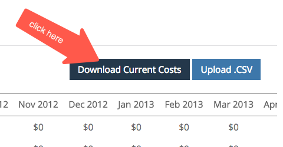

# Costes de canales de marketing {#marketing-channel-costs}

Una de las ventajas más importantes de usar [!DNL Marketo Measure] es la capacidad de conectar los esfuerzos de marketing directamente con el impacto en los ingresos, con la granularidad que se desee. Es posible ver el retorno de la inversión en el nivel de punto de contacto. Para aprovechar este beneficio, los costos de canal deben cargarse en la aplicación [!DNL Marketo Measure]. Los informes de retorno de la inversión se crean automáticamente y están disponibles en **Panel de retorno de la inversión de marketing** en [experience.adobe.com/marketo-measure](https://experience.adobe.com/marketo-measure){target="_blank"}.

[Haga clic aquí para ir directamente a las instrucciones.](/help/marketing-spend/spend-management/marketing-channel-costs.md#uploading-marketing-costs)

La función [!DNL Marketo Measure] de gasto en marketing permite a los clientes cargar su gasto en todos los canales, subcanales y campañas. Cuantos más datos agreguen los clientes, más informes de ROI aparecerán en el Tablero de atribución de ingresos.

Los costes que se registran e importan desde conexiones de publicidad directa se recuperan automáticamente en el nivel más granular y no es necesario cargarlos. Esto incluye nuestras integraciones actuales con Google AdWords, Bing Ads, Doubleclick y Facebook.

[Haga clic aquí para ir directamente a las preguntas frecuentes.](/help/marketing-spend/spend-management/marketing-channel-costs.md#faq)

## Definiciones {#definitions}

**Gasto por campaña**

En el nivel más granular, los clientes pueden introducir el gasto por campañas individuales, agrupadas dentro de su canal respectivo. Para campañas CRM, [!DNL Marketo Measure] ha extraído el ID de campaña en una columna independiente que le ayuda a asignar el gasto de campaña sin conexión de su CRM a esta tabla. Añadir el gasto en este nivel permite a los clientes ver el ROI de la campaña y optimizar el rendimiento por campaña.

El total de todas las campañas no necesita sumar valores introducidos en el subcanal o canal, pero no puede ser más que cualquier valor introducido en el subcanal o canal. Si la suma es menor que el valor introducido en el subcanal o canal, [!DNL Marketo Measure] agregará automáticamente una fila para &quot;Otro&quot; para cubrir la diferencia y rellenar los huecos.

**Gasto por subcanal**

En un nivel superior, los clientes pueden introducir los gastos por subcanal, agrupados debajo de su canal. Añadir el gasto en este nivel permite a los clientes ver el ROI del subcanal y optimizar el rendimiento por subcanal.

El total de todos los subcanales no necesita sumar valores introducidos en el canal, pero no puede ser más que cualquier valor introducido en el canal. Si la suma es menor que el valor introducido en el canal, [!DNL Marketo Measure] agregará automáticamente una fila para &quot;Otro&quot; para cubrir la diferencia y rellenar los huecos.

**Gasto por canal**

En el nivel más alto, los clientes pueden introducir los gastos por canal. Añadir el gasto a este nivel permite a los clientes ver el retorno de la inversión del canal y optimizar el rendimiento por canal.

**Selector de fecha**

El intervalo de fechas predeterminado comenzará desde la fecha de inicio con [!DNL Marketo Measure] hasta el mes actual. Para asegurarse de que los costos siguen siendo correctos, no puede especificar los costos de los meses futuros, pero puede especificar los costos de los meses anteriores a su asociación con [!DNL Marketo Measure].

**Filtro**

Para reducir los resultados en la tabla Gasto en marketing, seleccione un canal en la parte superior para filtrar otros canales. Esto resulta útil cuando tiene un equipo centrado en un canal singular.

**Buscar**

Utilice el cuadro Buscar para buscar texto coincidente de canales, subcanales o campañas.

**Descargar costos actuales**

El CSV descargado extrae los resultados de la pantalla actual, lo que significa que cualquier fecha, filtro o búsqueda que se aplique se descargará tal cual.

**Cargar CSV**

Independientemente de la vista que se encuentre en el explorador, si es una vista filtrada o la vista predeterminada con todas las fechas y canales, puede cargar cualquier CSV.

El error más común es el formato de las columnas de fecha, que ocurre si se cambia el formato de fecha y podría ocurrir intencionalmente si se mueve entre hojas de Excel o Google. Tenga en cuenta que la fecha debe ser MM-AA, de modo que 12-sep y no 12-sep, o 12-mayo y no 05-12.

## Antes de empezar {#before-you-begin}

[!DNL Marketo Measure] viene con 13 canales predeterminados que se pueden usar o expandir. Además, se pueden crear hasta 40 canales en línea y sin conexión para adaptarse a su estructura de marketing única. Partiendo de esto, se pueden crear un total de 200 subcanales para admitir también estos canales en línea y sin conexión.

[!DNL Marketo Measure] descargará automáticamente los costos de canal de mercadotecnia de las plataformas con las que tenga una integración de API, como Bing Ads y Google AdWords. Los costos de las plataformas que no están integradas con [!DNL Marketo Measure] deben cargarse manualmente. Los canales de marketing deben configurarse antes de cargar los datos de costes.

## Carga de costes de marketing {#uploading-marketing-costs}

Una vez configurados o actualizados los canales y las reglas de marketing, pueden cargarse los costes asociados. Para realizar esto, siga los pasos a continuación:

**Paso 1: Vaya a la página Gasto en mercadotecnia en la aplicación [!DNL Marketo Measure].**

Vaya al menú **[!UICONTROL Mi cuenta]**, haga clic en **[!UICONTROL Configuración]** y luego vaya a la opción **[!UICONTROL Gasto en marketing]** en la barra lateral izquierda debajo de la sección **[!UICONTROL Informes]**.

**Paso 2: Descargue el CSV de costos actuales**

Vaya a la derecha de la pantalla y haga clic en **[!UICONTROL Descargar costos actuales].** Esta opción le permite descargar una hoja de cálculo en formato CSV.

**Paso 3: Abrir el archivo CSV y realizar cambios**

Puede importar el archivo y abrirlo utilizando Google Sheets, Apple Numbers, Microsoft Excel o el software que prefiera. [!DNL Marketo Measure] recomienda usar hojas de Google.

Después de importar la hoja, realice los cambios que desee, como agregar costos a los canales y subcanales o actualizar la información existente.

Compruebe las reglas lógicas de la hoja. Cada fila debe contener un canal y uno de sus subcanales separados por un punto (.) al final. Es importante utilizar este formato de forma coherente.

Por ejemplo, para indicar que Facebook es el subcanal y social es el canal, la regla debe escribirse de la siguiente manera: &quot;Social.Facebook&quot;. Del mismo modo, para rastrear un evento sin conexión, la sintaxis del canal debe ser: &quot;Events.Big Conference&quot;. En la siguiente imagen se muestran ejemplos:

_Notas adicionales_:

No modifique las fechas de la hoja de cálculo, ya que esto puede causar problemas al cargar el documento.

No deje ningún campo en blanco. Incluso si no hay ningún valor en dólares que agregar, escriba 0 $ como la cantidad en dólares.

No es necesario introducir ni actualizar los costes de Bing Ads y Google AdWords, ya que [!DNL Marketo Measure] extrae automáticamente estos datos de su conexión API con estas plataformas.

**Paso 4: guardar archivo en formato CSV**

Si está trabajando en Hojas de cálculo de Google, asegúrese de descargar primero el archivo. No excluya ni elimine ningún dato mensual, ya que esto causa dificultades al intentar cargar el archivo CSV a [!DNL Marketo Measure] más adelante.

**Paso 5: cargar el archivo CSV**

Vaya a la sección **[!UICONTROL Cost]** de la aplicación [!DNL Marketo Measure] y haga clic en **[!UICONTROL Upload.CSV]**. El sistema se actualizará y reflejará la nueva información.

## Preguntas frecuentes {#faq}

**Por qué los números aparecen en el archivo CSV**

Si no se introduce ningún valor en un nivel superior como Canal o Subcanal, [!DNL Marketo Measure] sumará automáticamente los niveles secundarios, que se presentarán una vez que se cargue el archivo. Además, si la suma de los elementos secundarios es menor que el valor introducido para el elemento principal, [!DNL Marketo Measure] agrega una fila &quot;Otro&quot; para mostrar la diferencia en el total.

**¿Cómo se determinan las campañas en la lista que estoy viendo?**

Por el momento, nuestros resultados enumeran las campañas que hemos visto que reciben crédito por un punto de contacto. Si había actividad de una campaña, se muestra esa campaña en función de la fecha de punto de contacto en la que se produjo.

**Hay demasiadas filas y columnas para filtrar. ¿Puedo consolidar la vista?**

Con la capacidad de cambiar el intervalo de fechas, filtrar el canal o buscar valores, puede consolidar los resultados de la tabla para adaptarlos mejor a sus necesidades.

**¿Por qué no puedo cargar un archivo?**

Tenemos diferentes conjuntos de permisos dentro de la aplicación [!DNL Marketo Measure]. Para cargar un archivo, debe ser un &quot;Administrador de cuentas&quot;. Para evitarlo, solicite acceso a su administrador de cuentas o haga que el administrador de cuentas cargue el archivo en su nombre. Encontrará una lista de usuarios y sus funciones en **[!UICONTROL Mi cuenta]** > **[!UICONTROL Configuración]** > **[!UICONTROL Ver o agregar usuarios de la cuenta]**.
