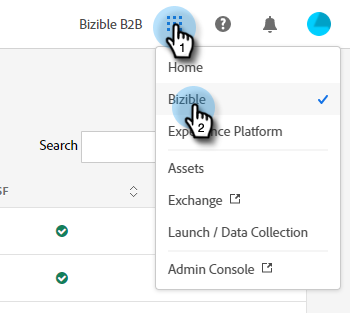

# Información general sobre la interfaz Adobe Experience Cloud {#experience-cloud-interface-overview}

La interfaz de Adobe Experience Cloud alinea la apariencia de las aplicaciones y servicios de Adobe Experience Cloud. Pero, es más que solo un nuevo diseño. Es una aplicación de una sola página que ofrece la experiencia del usuario en una sola instancia.

## Flujo de usuario {#user-flow}

Si ya ha iniciado sesión en un producto de Adobe Experience Cloud, haga clic en el icono de menú y seleccione **[!DNL Marketo Measure]**.

>[!NOTE]
>
>El menú desplegable puede tener un aspecto diferente en función de los productos de Adobe Experience Cloud a los que esté suscrito.

Si usted es _no_ ya ha iniciado sesión en un producto de Adobe Experience Cloud, inicie sesión directamente en [!DNL Marketo Measure] aquí: [https://experience.adobe.com/marketo-measure](https://experience.adobe.com/marketo-measure).

## Nuevas funciones {#new-features}

Además de la apariencia actualizada, notará las siguientes funciones:

**Administración de dominios**

[Administre su [!DNL Marketo Measure] dominios](/help/marketo-measure-and-adobe/domain-management.md) sin asistencia de [!DNL Marketo Measure].

**Centro de ayuda integrado**

Busque artículos de asistencia, envíe tickets, proporcione comentarios, todo desde el [!DNL Marketo Measure] aplicación.

**Conmutador de aplicaciones**

Aquellos con acceso a múltiples productos de Adobe podrán alternar fácilmente entre ellos.

**Notificaciones y anuncios**

Vea e interactúe con notificaciones específicas de productos y anuncios de productos de Adobe general directamente en la aplicación.

**Configuración de Adobe**

Haga clic en el icono de perfil para cambiar el idioma u otras preferencias de todo el Adobe. También puede hacer lo siguiente [!DNL Marketo Measure]Cambios específicos de haciendo clic en **Mis configuraciones**.

## Preguntas frecuentes {#faq}

**¿Qué les sucede a mis marcadores?**

Se redirigirán los marcadores. Por ejemplo, si tuviera que navegar a https://apps.marketo-measure.com/Discover/391, se le redirigiría a https://experience.adobe.com/marketo-measure/Discover/391 después de completar la autenticación.

**No puedo iniciar sesión en [!DNL Marketo Measure] a través de la interfaz de Experience Cloud. ¿Cuál podría ser el problema?**

Si puede iniciar sesión en Adobe Experience Cloud pero ve una página como la siguiente, el problema podría estar en la [!DNL Marketo Measure] lado:

Si recibe el error anterior, [Contactar con Soporte](https://nation.marketo.com/t5/support/ct-p/Support) para obtener asistencia.
