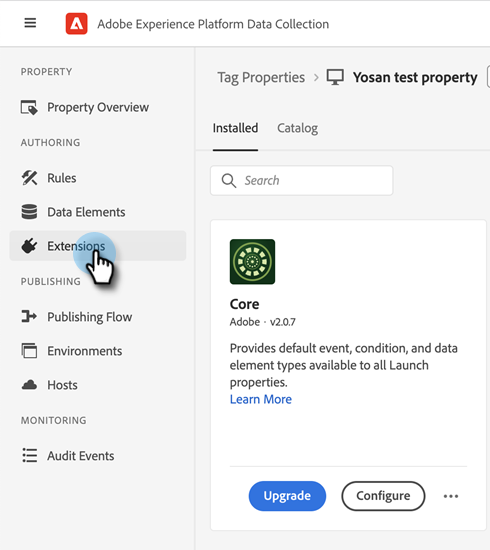
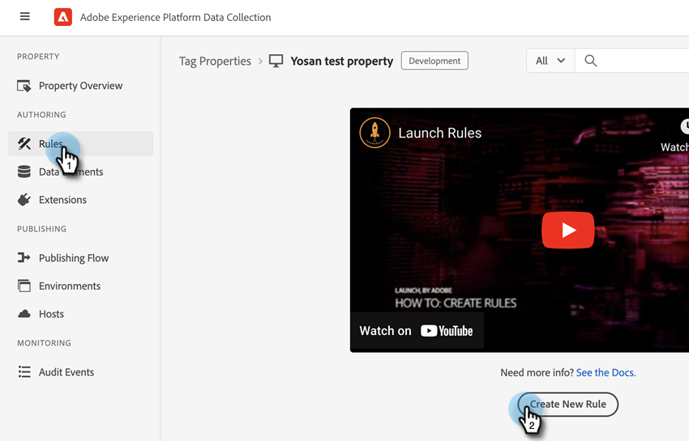
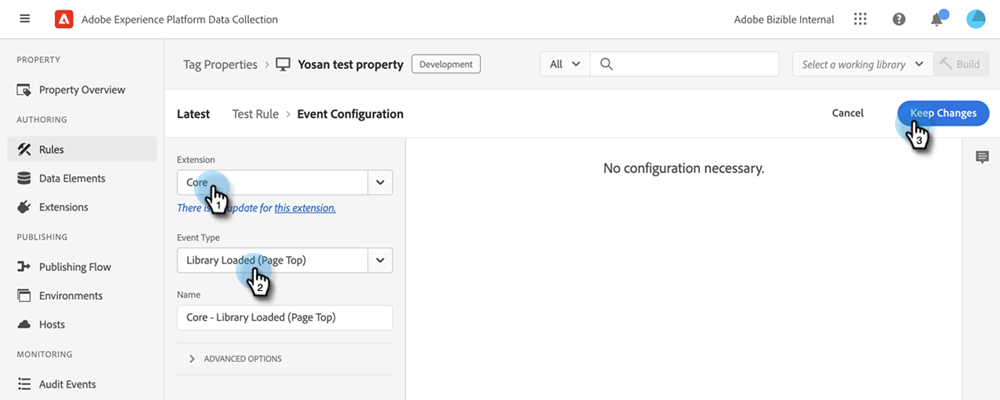

# Integraciones de [!DNL Marketo Measure] con Adobe Launch {#marketo-measure-integrations-with-adobe-launch}

La extensión de Adobe Launch está diseñada para [!DNL Marketo Measure] usuarios que ya utilizan Adobe Launch en su sitio web. La extensión sirve como solución de administración de etiquetas que puede utilizar para configurar y cargar dinámicamente scripts en sus páginas en función de determinados eventos y condiciones.

Cuando se instala y configura en Adobe Launch, la variable [!DNL Marketo Measure] La extensión de carga el script bizible.js en las páginas donde el script de Launch de Adobe esté presente. Esto permite a los especialistas en marketing añadir bizible.js a través de la configuración de Launch del Adobe, en lugar de modificar explícitamente la página web para añadir la etiqueta de script bizible.js.

## Configuración de la extensión de Launch de Adobe {#configure-the-adobe-launch-extension}

>[!PREREQUISITES]
>
>Consulte los siguientes vínculos para obtener más información sobre Adobe Launch y sus extensiones:
>
>* [[!DNL Marketo Measure] Extensión](https://experienceleague.adobe.com/docs/experience-platform/destinations/catalog/email/bizible.html#catalog){target="_blank"}
>* [Información general sobre Adobe Launch](https://experienceleague.adobe.com/docs/platform-learn/implement-in-websites/overview.html){target="_blank"}
>* [Información general sobre la extensión Adobe Launch](https://experienceleague.adobe.com/docs/experience-platform/tags/extension-dev/overview.html){target="_blank"}

1. Cree una propiedad siguiendo los pasos [en este artículo](https://experienceleague.adobe.com/docs/platform-learn/implement-in-websites/configure-tags/create-a-property.html#go-to-the-data-collection-interface){target="_blank"}.

1. Haga clic en la propiedad que ha creado.

   

1. Clic **[!UICONTROL Extensiones]**.

   

1. Haga clic en **[!UICONTROL Catálogo]** y busque &quot;.[!UICONTROL Bizible].&quot;

   

1. En el [!UICONTROL Bizible Analytics] mosaico, haga clic en **[!UICONTROL Instalar]**.

   

1. En el campo Bizible AccountId, escriba la dirección URL del sitio web (por ejemplo, `adobe.com`).

   

   >[!NOTE]
   >
   >Este campo no es el &quot;ID de cuenta&quot; en la tabla Business_Prod.Business. Todas las actividades web desde la URL determinada (por ejemplo, `adobe.com`) se asignan al [!DNL Marketo Measure] inquilino.

1. Haga clic en **[!UICONTROL Guardar]**.

   

1. Clic **[!UICONTROL Reglas]**, luego seleccione **[!UICONTROL Crear nueva regla]**.

   

1. Haga clic en **[!UICONTROL Añadir]** botón debajo de [!UICONTROL Eventos].

   

1. En la lista desplegable Extensión, seleccione **[!UICONTROL Núcleo]**. A continuación, en la lista desplegable Tipo de evento, seleccione **[!UICONTROL Library Loaded (Page Top)]**. Si no le asigna un nombre al evento, se aplica uno predeterminado. Clic **[!UICONTROL Conservar cambios]** cuando termine.

   

1. Haga clic en **[!UICONTROL Añadir]** en Acciones.

   

1. En la lista desplegable Extensión, seleccione **[!UICONTROL Bizible Analytics]**. A continuación, en la lista desplegable Tipo de acción, seleccione **[!UICONTROL Inicializar]**. Si no asigna un nombre a la acción, se aplica uno predeterminado. Clic **[!UICONTROL Conservar cambios]** cuando termine.

   

1. Haga clic en **[!UICONTROL Guardar]**.

   
