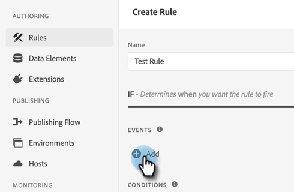

# Integraciones de [!DNL Marketo Measure] con Adobe Launch {#marketo-measure-integrations-with-adobe-launch}

La extensión de Adobe Launch está diseñada para los usuarios de [!DNL Marketo Measure] existentes que ya usan Adobe Launch en su sitio web. La extensión sirve como solución de administración de etiquetas que puede utilizar para configurar y cargar dinámicamente scripts en sus páginas en función de determinados eventos y condiciones.

Cuando se instala y configura en Adobe Launch, la extensión [!DNL Marketo Measure] carga el script bizible.js en las páginas donde el script de Adobe Launch esté presente. Esto permite a los especialistas en marketing añadir bizible.js a través de la configuración de Launch del Adobe, en lugar de modificar explícitamente la página web para añadir la etiqueta de script bizible.js.

## Configuración de la extensión de Launch de Adobe {#configure-the-adobe-launch-extension}

>[!PREREQUISITES]
>
>Consulte los siguientes vínculos para obtener más información sobre Adobe Launch y sus extensiones:
>
>* [[!DNL Marketo Measure] Extensión](https://experienceleague.adobe.com/docs/experience-platform/destinations/catalog/email/bizible.html#catalog){target="_blank"}
>* [Información general sobre el lanzamiento en Adobe](https://experienceleague.adobe.com/docs/platform-learn/implement-in-websites/overview.html){target="_blank"}
>* [Información general sobre la extensión de Adobe Launch](https://experienceleague.adobe.com/docs/experience-platform/tags/extension-dev/overview.html){target="_blank"}

1. Cree una propiedad siguiendo los pasos [de este artículo](https://experienceleague.adobe.com/docs/platform-learn/implement-in-websites/configure-tags/create-a-property.html#go-to-the-data-collection-interface){target="_blank"}.

1. Haga clic en la propiedad que ha creado.

   

1. Haga clic en **[!UICONTROL Extensiones]**.

   

1. Haz clic en la pestaña **[!UICONTROL Catálogo]** y busca &quot;[!UICONTROL Bizible]&quot;.

   

1. En el mosaico de [!UICONTROL Bizible Analytics], haga clic en **[!UICONTROL Instalar]**.

   

1. En el campo Bizible AccountId, escriba la dirección URL del sitio web (por ejemplo, `adobe.com`).

   

1. Haga clic en **[!UICONTROL Guardar]**.

   

1. Haga clic en **[!UICONTROL Reglas]** y luego seleccione **[!UICONTROL Crear nueva regla]**.

   

1. Haga clic en el botón **[!UICONTROL Agregar]** en [!UICONTROL Eventos].

   

1. En la lista desplegable Extensión, seleccione **[!UICONTROL Principal]**. A continuación, en la lista desplegable Tipo de evento, seleccione **[!UICONTROL Biblioteca cargada (Principio de página)]**. Si no le asigna un nombre al evento, se aplica uno predeterminado. Haga clic en **[!UICONTROL Conservar cambios]** cuando haya terminado.

   

1. Haga clic en el botón **[!UICONTROL Agregar]** en Acciones.

   

1. En el menú desplegable Extensión, seleccione **[!UICONTROL Bizible Analytics]**. A continuación, en la lista desplegable Tipo de acción, seleccione **[!UICONTROL Inicializar]**. Si no asigna un nombre a la acción, se aplica uno predeterminado. Haga clic en **[!UICONTROL Conservar cambios]** cuando haya terminado.

   

1. Haga clic en **[!UICONTROL Guardar]**.

   

