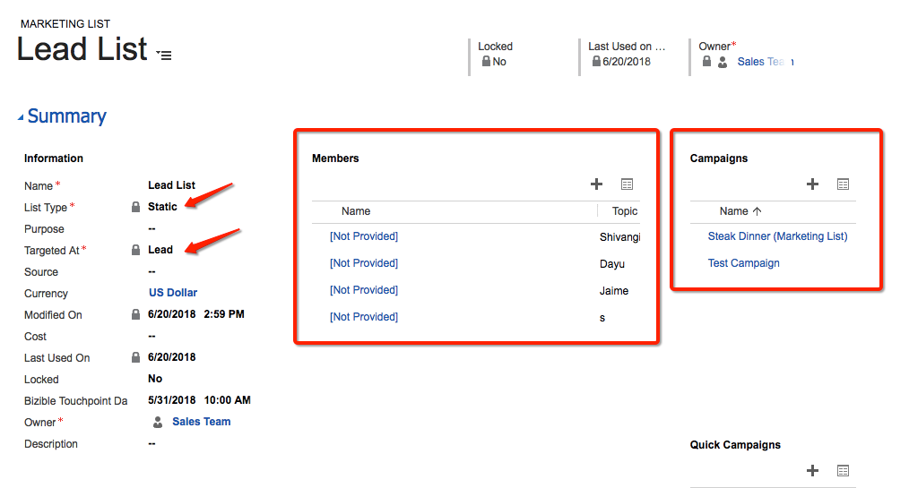
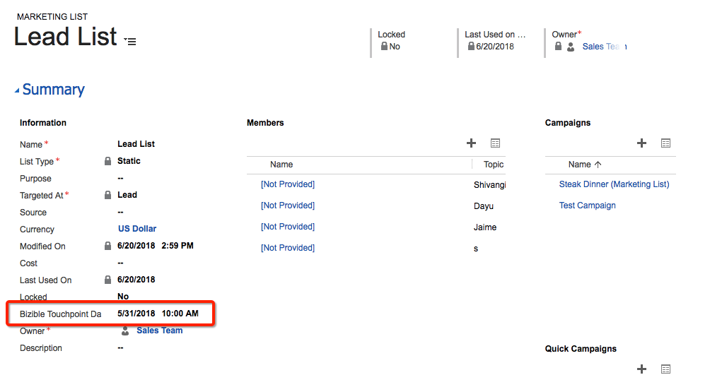

# Listas de marketing y campañas de Dynamics {#dynamics-campaigns-and-marketing-lists}

>[!NOTE]
>
>Puede ver instrucciones que especifican &quot;[!DNL Marketo Measure]&quot; en nuestra documentación, pero sigue viendo &quot;Bizible&quot; en su CRM. Estamos trabajando para que se actualice y el cambio de marca se reflejará pronto en su CRM.

## Campañas {#campaigns}

Las campañas de Dynamics son buenas para rastrear actividades de marketing sin conexión e incluirlas en el recorrido omnicanal. Las campañas deben estar relacionadas con posibles clientes o contactos y pueden acumularse en la campaña a través de respuestas de campaña o listas de marketing.

## Respuestas de campaña {#campaign-responses}

Cuando se agregan posibles clientes o contactos directamente a una campaña, se introducen como un registro de respuesta de campaña.

## Habilitar puntos de contacto {#enable-touchpoints}

Para incluir estos registros en el recorrido de punto de contacto, existen algunas opciones para los tipos de respuestas de campaña que se deben sincronizar. En el registro de campaña, debe haber un campo personalizado de la solución instalada etiquetado como, &quot;[!UICONTROL Activar puntos de contacto del comprador].&quot; Si no lo ve, el campo debe añadirse mediante el Editor de formularios.

Puede seleccionar incluir todos los registros que tengan una respuesta de campaña en la campaña, o solo aquellos con una respuesta de &quot;Interesado&quot; o, de forma predeterminada, no puede incluir las respuestas de campaña. Puede dejar el campo en blanco o elegir excluirlo explícitamente.

[!DNL Marketo Measure] no admite valores de respuesta personalizados.

Estos son los valores de respuesta de stock para la respuesta de campaña:

En función de su selección, estos registros ahora pueden optar a puntos de contacto en el recorrido de posible cliente, contacto u oportunidad. Si cumple los requisitos, aparecerá un punto de contacto de &quot;Dynamics Campaign&quot; en el recorrido.

Una razón por la que una respuesta de campaña podría no mostrarse es porque ya se ha registrado una actividad de primer contacto o contacto de creación de posible cliente para el posible cliente/contacto y la función &quot;PostLC&quot; está deshabilitada o ha alcanzado su número máximo de puntos de contacto.

## Fecha de Touchpoint {#touchpoint-date}

La fecha de punto de contacto de una campaña suele ser la fecha en la que se añadió la respuesta de campaña a la campaña. Se puede sobrescribir si se rellena el campo personalizado de la solución instalada con la etiqueta &quot;Fecha del punto de contacto del comprador&quot;. Si no lo ve, el campo debe añadirse mediante el Editor de formularios.

Un ejemplo común de uso de este campo es para eventos en los que se añade una lista de análisis de distintivos de un evento al CRM días después de que se produzca el evento, de modo que el usuario pueda volver a cambiar la Fecha del punto de contacto del comprador a cuando se produjo el evento.

## Listas de marketing {#marketing-lists}

Las listas de marketing son otra forma de incluir posibles clientes o contactos en un recorrido de marketing. Las listas de marketing son únicas para un grupo de posibles clientes o contactos, lo que significa que el usuario debe seleccionar si su lista es un conjunto de posibles clientes o un conjunto de contactos.

[!DNL Marketo Measure] solo admite listas de marketing estáticas. No se admiten listas de marketing dinámicas porque el procesamiento requiere que comprobemos la fecha de modificación de un registro, pero como una lista dinámica cambia con frecuencia, no hay ninguna fecha de modificación para [!DNL Marketo Measure] para comprobarlo. Esto requeriría una descarga constante del conjunto de datos completo a lo largo del día.

La captura de pantalla anterior es una lista de marketing para posibles clientes. Las listas de marketing están asociadas a campañas y pueden asociarse a varias campañas. A menos que solo cree una lista de marketing para una campaña, [!DNL Marketo Measure] no recomienda que los clientes utilicen Listas de marketing para rastrear sus Campañas. Es poco probable que la misma lista exacta de posibles clientes/contactos sea apta para puntos de contacto en varias campañas.

## Habilitar puntos de contacto {#enable-touchpoints-1}

Para habilitar una lista de marketing para puntos de contacto, existe una configuración independiente en el registro de campaña denominada &quot;[!UICONTROL Sincronizar listas de marketing],&quot; que es un conmutador simple de sí/no. Si no lo ve, el campo debe añadirse mediante el Editor de formularios. En el registro de campaña puede ver qué listas de marketing están relacionadas con la campaña para saber cuántas listas está habilitando.

## Fecha de Touchpoint {#touchpoint-date-1}

La fecha de punto de contacto de una lista de marketing suele ser la fecha de creación del ListMember, por lo que la fecha en la que se agregó el posible cliente o contacto a la lista de marketing. Se puede sobrescribir si se rellena el campo personalizado de la solución instalada con la etiqueta &quot;Fecha del punto de contacto del comprador&quot;. Si no lo ve, el campo debe añadirse mediante el Editor de formularios.

## Asignación de canales {#channel-mapping}

Las campañas de Dynamics se agrupan en los canales de marketing personalizados mediante el campo Tipo de campaña. Se pueden cambiar en el menú Personalizaciones de Dynamics.

Los valores del menú Tipo de campaña se extraen en la variable [!DNL Marketo Measure] Aplicación. **[!UICONTROL Mi cuenta]** > **[!UICONTROL Configuración]** > **[!UICONTROL Canales sin conexión]**.

Para cada tipo de campaña, se puede asignar a una combinación de canal y subcanal para que cada punto de contacto que se derive de la campaña tenga los canales y subcanales asignados correctamente.

## Fecha de sincronización de campaña {#campaign-sync-date}

Esto no está disponible para los clientes de Dynamics

## Preguntas frecuentes {#faq}

**¿Se pueden habilitar puntos de contacto en las listas de marketing o solo en las campañas de Dynamics?**

Puede habilitar una lista de marketing, pero debe estar relacionada con una campaña, ya que la opción para sincronizar una lista de marketing reside en la campaña.

**¿Podemos usar las respuestas de campaña y las listas de marketing en una campaña?**

Sí.
