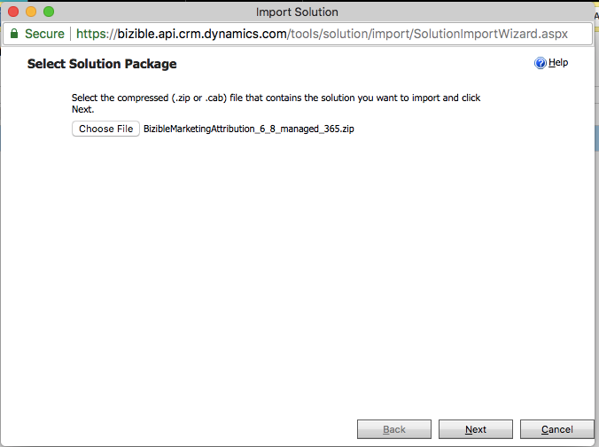
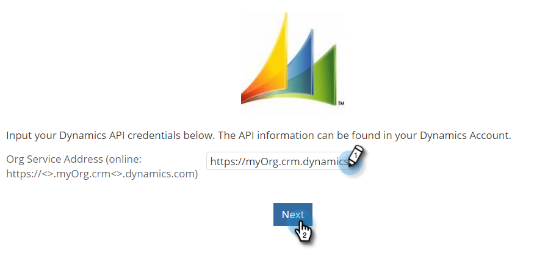

# [!DNL Microsoft Dynamics] Guía de instalación de CRM {#microsoft-dynamics-crm-installation-guide}

>[!NOTE]
>
>Puede ver instrucciones que especifican &quot;[!DNL Marketo Measure]&quot; en la documentación, pero sigue viendo &quot;Bizible&quot; en su CRM. Estamos trabajando para que se actualice y el cambio de marca se reflejará pronto en su CRM.

## Versiones compatibles {#supported-versions}

[!DNL Marketo Measure] admite lo siguiente [!DNL Microsoft Dynamics CRM] versiones:

* [!DNL Microsoft Dynamics 2016] (En línea y locales)
* [!DNL Microsoft Dynamics 365] (En línea y locales)

Para la conexión y autenticación, [!DNL Marketo Measure] admite las siguientes versiones de Servicios federados de Active Directory (ADFS):

* ADFS 4.0 - [!DNL Windows Server 2016]
* ADFS 5.0 - [!DNL Windows Server 2019]

## Instalación de la solución administrada {#install-the-managed-solution}

[Descargar e instalar](assets/marketo-measure-dynamics-extension.zip) el archivo zip en Dynamics CRM.

**[!UICONTROL Configuración]** > **[!UICONTROL Personalizaciones]** > **[!UICONTROL Soluciones]** > **[!UICONTROL Importar]** (botón) > **[!UICONTROL Elegir archivo]**.

>[!NOTE]
>
>Las dos capturas de pantalla siguientes pueden diferir ligeramente de las suyas, ya que se tomaron durante la actualización de una solución.

## Creación de un [!DNL Marketo Measure] Usuario {#creating-a-marketo-measure-user}

Se recomienda crear un usuario de Marketo Measure específico como &quot;usuario de la aplicación&quot; en Dynamics para que podamos exportar e importar datos a través de para evitar problemas con otros usuarios de CRM. Tome nota del nombre de usuario y la contraseña, así como de la dirección URL del punto de conexión, ya que se utilizarán al crear el [!DNL Marketo Measure] cuenta.

## Funciones de seguridad {#security-roles}

Si su organización utiliza funciones de seguridad de Dynamics, asegúrese de que el usuario conectado o el dedicado [!DNL Marketo Measure] El usuario tiene suficientes permisos de lectura y escritura para las entidades requeridas.

Las funciones de seguridad se encuentran aquí: **[!UICONTROL Configuración]** > **[!UICONTROL Seguridad]** > **[!UICONTROL Funciones de seguridad]**.

Para [!DNL Marketo Measure] entidades personalizadas, necesitaremos permisos completos en todas nuestras entidades.

>[!NOTE]
>
>Los usuarios que vayan a cerrar oportunidades también necesitarán los permisos completos.

Para las entidades estándar de Dynamics, consulte la [!DNL Marketo Measure] Documento de esquema de Dynamics. En un nivel alto, [!DNL Marketo Measure] solo necesita leer ciertas entidades para recopilar los datos adecuados y escribir en campos personalizados que se instalarán con la solución administrada. No crearemos nuevos registros estándar ni actualizaremos ningún campo estándar.

## Incluir puntos de contacto en los diseños de página: {#include-touchpoints-on-page-layouts}

1. Para cada entidad, vaya al Editor de formularios. Puede encontrar esto en **[!UICONTROL Configuración]** > **[!UICONTROL Personalizaciones]** > **[!UICONTROL Personalizar el sistema]** > `[Entity]` > **[!UICONTROL Forms]**. O puede encontrarlo en la configuración mientras está viendo un registro.

   * Entidades para configurar: Cuenta, Oportunidad, Contacto, Posible cliente y Campaña.

   * Para configurar campañas, debe activar la opción &quot;Sincronización de campañas&quot; en **[!UICONTROL CRM]** > **[!UICONTROL Campañas]**.

   

1. Diseños de página: en primer lugar, añada &quot;[!UICONTROL Una columna]&quot; en la sección en la que desea que se activen los puntos de contacto. Dentro de esa nueva columna, necesitaremos una subcuadrícula agregada a cada formulario dentro de las entidades Cuenta, Oportunidad, Contacto y Posible cliente.

   

   

1. Seleccione el objeto (puntos de contacto de atribución del comprador o puntos de contacto del comprador) que se debe representar en la subcuadrícula, que depende de la relación de objeto. Si lo desea, puede cambiar las columnas que desea mostrar haciendo clic en el botón Editar. La solución administrada ha establecido un diseño predeterminado.

   Subcuadrícula de puntos de contacto de atribución de comprador: cuentas, oportunidades y contactos\
   Subcuadrícula Touchpoint del comprador - Posibles clientes y contactos

   

1. Una vez que haya terminado de actualizar el formulario, publique y guarde los cambios.

## Consideraciones relacionadas con los esquemas {#schema-related-considerations}

**Ingresos**

[!DNL Marketo Measure] apunta al campo Ingresos reales estándar de forma predeterminada. Si no utiliza esto, explique cómo informa de los ingresos a su ingeniero de soluciones o administrador de éxito, ya que se necesitará un flujo de trabajo personalizado.

**Cerrar fecha**

[!DNL Marketo Measure] apunta al campo Fecha de cierre real de forma predeterminada. Si no utiliza esto o también utiliza el campo Fecha de cierre estimada, explique el proceso al ingeniero de soluciones o al administrador de éxito. Puede que sea necesario un flujo de trabajo personalizado para tener en cuenta ambos campos.

## Configuración de las conexiones y los proveedores de datos {#configuring-your-connections-and-data-providers}

Después de iniciar sesión en el [!DNL Marketo Measure] y se hayan configurado como usuario en Adobe Admin Console, el siguiente paso es configurar las distintas conexiones de datos.

**CRM como proveedor de datos**

1. En su [!DNL Marketo Measure] , haga clic en **[!UICONTROL Mi cuenta]** y seleccione. **[!UICONTROL Configuración]**.

   

1. En [!UICONTROL Integraciones] en la navegación izquierda, haga clic en **[!UICONTROL Conexiones]**.

   

1. Haga clic en **[!UICONTROL Configurar nueva conexión CRM]** botón.

   

1. Junto a [!UICONTROL Microsoft Dynamics CRM], haga clic en **[!UICONTROL Connect]** botón.

   

1. Seleccionar [!UICONTROL Credenciales] o [!UICONTROL OAuth].

   

   >[!NOTE]
   >
   >Para obtener más información sobre OAuth, visite [este artículo](/help/marketo-measure-and-dynamics/getting-started-with-marketo-measure-and-dynamics/oauth-with-azure-active-directory-for-dynamics-crm.md). Si tiene alguna pregunta sobre el proceso, póngase en contacto con su [!DNL Marketo Measure] Representante de cuentas.

1. En este ejemplo, se han elegido las credenciales. Introduzca sus credenciales de y haga clic en **[!UICONTROL Siguiente]**.

Después de conectarse, verá los detalles de la conexión de Dynamics en la lista Conexiones de CRM/MAP.

**Agregar conexiones de cuenta**

Para conectar sus cuentas de publicidad con [!DNL Marketo Measure], comience visitando la [!UICONTROL Conexiones] dentro de la [!DNL Marketo Measure] aplicación.

1. Siga los pasos 1 y 2 de lo anterior _CRM como proveedor de datos_ sección.

1. Haga clic en **[!UICONTROL Configurar nueva conexión CRM]** botón.

   

1. Seleccione la plataforma que desee.

   

**[!DNL Marketo Measure]Javascript**

Para que [!DNL Marketo Measure] para realizar un seguimiento de las actividades web, hay que configurar varios pasos.

1. Haga clic en **[!UICONTROL Mi cuenta]** y seleccione. **[!UICONTROL Configuración de cuenta]**.

   

1. Introduzca su número de teléfono. En Sitio web, introduzca el dominio raíz principal que se utilizará para [!DNL Marketo Measure] seguimiento en el sitio web. Clic **[!UICONTROL Guardar]** cuando termine.

   

   >[!NOTE]
   >
   >Para agregar varios dominios raíz, póngase en contacto con su [!DNL Marketo Measure] Representante de cuentas.

1. El [[!DNL Marketo Measure] JavaScript](/help/marketo-measure-tracking/setting-up-tracking/adding-marketo-measure-script.md) a continuación, debe colocarse en todo el sitio y las páginas de aterrizaje. Se recomienda codificar la secuencia de comandos dentro del encabezado de las páginas de aterrizaje o añadirla a través de un sistema Tag Management como [Google Tag Manager](/help/marketo-measure-tracking/setting-up-tracking/adding-marketo-measure-script-via-google-tag-manager.md).

   >[!NOTE]
   >
   >De forma predeterminada, [!DNL Marketo Measure] exporta 200 registros por crédito de API cada vez que un trabajo envía datos a su CRM. Para la mayoría de los clientes, esto proporciona el equilibrio óptimo entre los créditos de API consumidos por [!DNL Marketo Measure] y los requisitos de recursos de CPU en CRM. Sin embargo, para los clientes con configuraciones de CRM complejas, como flujos de trabajo y activadores, un tamaño de lote más pequeño podría ser útil para mejorar el rendimiento de CRM. Con este fin, [!DNL Marketo Measure] permite a los clientes configurar el tamaño del lote de exportación de CRM. Esta configuración está disponible en la página Configuración > CRM > General en [!DNL Marketo Measure] la aplicación web y los clientes pueden elegir entre tamaños de lote de 200 (predeterminado), 100, 50 o 25.
   >
   >Al modificar esta configuración, tenga en cuenta que los tamaños de lote más pequeños consumirán más créditos de API de su CRM. Es aconsejable reducir el tamaño del lote solo si está experimentando un tiempo de espera de CPU o una carga de CPU alta en su CRM.

   >[!NOTE]
   >
   >Cuando deshabilita la exportación de datos de Marketo Measure a Dynamics, no se eliminan los datos existentes. Para obtener ayuda con la eliminación de datos existentes, póngase en contacto con el Soporte técnico de Dynamics.

   >[!MORELIKETHIS]
   >
   >[Notificaciones de error](/help/configuration-and-setup/getting-started-with-marketo-measure/error-notifications.md){target="_blank"}
