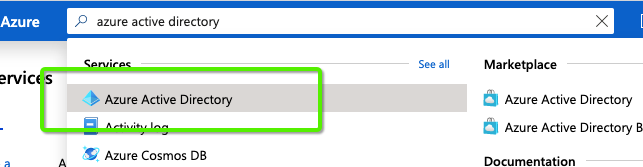
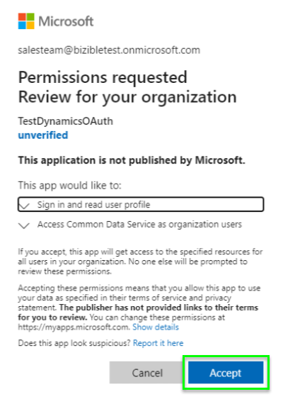
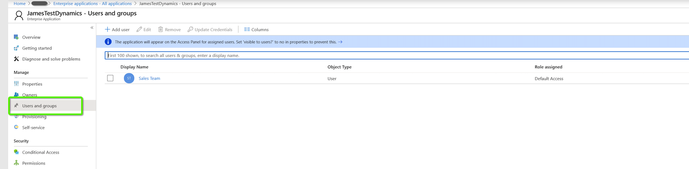

# OAuth con [!DNL Azure Active Directory] para Dynamics CRM {#oauth-with-azure-active-directory-for-dynamics-crm}

## Quién se ve afectado {#who-s-affected}

Esta configuración es para nuevos [!DNL Marketo Measure] clientes que utilizan Dynamics CRM con una [!DNL Azure Active Directory] (AAD) o para clientes que deseen migrar de su nombre de usuario y contraseña heredados a [!DNL Azure Active Directory] con OAuth.

>[!NOTE]
>
>Para ambos casos, AAD está configurado aquí para facilitar la conexión de la instancia de Dynamics en [!DNL Marketo Measure] como proveedor de datos.

## Configurar nueva aplicación {#set-up-new-application}

1. Inicie sesión en su [Azure Portal](https://portal.azure.com/#home).

1. Seleccione el inquilino de Azure AD haciendo clic en su cuenta en la esquina superior derecha de la página, luego en la opción de navegación Cambiar directorio y, a continuación, seleccione el inquilino adecuado. Omita este paso si solo tiene un inquilino de Azure AD en su cuenta o si ya ha seleccionado el inquilino de Azure AD adecuado.

   

1. Buscar &quot;[!DNL Azure Active Directory]&quot; en la barra de búsqueda y haga clic en el nombre para abrir.

   

1. Clic **[!UICONTROL Registros de aplicaciones]** en el menú de la izquierda.

   

1. Clic **[!UICONTROL Nuevo registro]** en la parte superior.

   

1. Siga las indicaciones y cree una aplicación. No importa si se trata de una aplicación web o de una aplicación cliente pública (móvil y de escritorio), pero si desea ver ejemplos específicos de aplicaciones web o de aplicaciones cliente públicas, consulte la [quickstarts](https://learn.microsoft.com/en-us/azure/active-directory/develop/v2-overview).\
   a. Nombre es el nombre de la aplicación y describe la aplicación a los usuarios finales.\
   b. En Tipos de cuenta admitidos, seleccione Cuentas en cualquier directorio organizativo y cuentas personales de Microsoft.\
   c. Proporcione el URI de redireccionamiento. En las aplicaciones web, esta es la dirección URL base de la aplicación en la que los usuarios pueden iniciar sesión. Por ejemplo, `http://localhost:12345`. Para clientes públicos (móviles y de escritorio), Azure AD lo utiliza para devolver respuestas de token. Introduzca un valor específico para la aplicación. Por ejemplo, `http://MyFirstAADApp`.

1. Una vez completado el registro, Azure AD asigna a su aplicación un identificador de cliente único (el ID de aplicación). Necesita este valor en la siguiente sección, así que cópielo desde la página de la aplicación.

1. Para encontrar la aplicación en el portal de Azure, haga clic en **[!UICONTROL Registros de aplicaciones]**, luego haga clic en **[!UICONTROL Todas las aplicaciones]**. Abra la aplicación recién creada

1. Clic **[!UICONTROL Autenticación]** en el menú de la izquierda.

   

1. Añada el [!DNL Marketo Measure] URL de redireccionamiento: `https://apps.bizible.com/OAuth2` y `https://apps.bizible.com/OAuth2?identityOnly=true` a la lista de URL de redireccionamiento.

   

1. Vaya a la pestaña Permisos de API y asegúrese de que los permisos correctos están asignados a la aplicación.

   

1. Desde aquí, introduzca &quot;[!UICONTROL empresa]&quot; en el cuadro de búsqueda y haga clic **[!UICONTROL Aplicaciones empresariales]**.

   

1. De nuevo, busque y abra la nueva aplicación en la lista de aplicaciones.

1. En la pestaña Permisos, haga clic en **[!UICONTROL Conceder consentimiento de administrador para (nombre de instancia)]**.

   

1. Clic **[!UICONTROL Aceptar]**.

   

1. Desde el &quot;[!UICONTROL Usuarios y grupos]&quot;, asegúrese de que los &quot;Usuarios y grupos&quot; válidos estén asignados a la aplicación.

   

## Creación de un usuario de aplicación {#creating-an-application-user}

Una vez finalizado el registro de la aplicación, se puede crear un usuario de la aplicación.

1. Vaya al entorno de Common Data Service (`https://[org].crm.dynamics.com`).

1. Vaya a **[!UICONTROL Configuración]** > **[!UICONTROL Seguridad]** > **[!UICONTROL Usuarios]**.

1. Elegir **[!UICONTROL Usuarios de aplicación]** en el filtro de vista.

1. Seleccionar **[!UICONTROL + Nuevo]**.

1. En el formulario Usuario de aplicación, introduzca la información necesaria.

   >[!NOTE]
   >
   >* La información del nombre de usuario no debe coincidir con un usuario que exista en la [!DNL Azure Active Directory].
   >
   >* En el campo ID de aplicación, introduzca el ID de aplicación de la aplicación que registró anteriormente en Azure AD.

1. Si la configuración es correcta, después de seleccionar **[!UICONTROL Guardar]**, el **[!UICONTROL URI de ID de aplicación]** y **[!UICONTROL ID de objeto de Azure AD]** Los campos de se rellenarán automáticamente con los valores correctos.

1. Antes de salir del formulario de usuario, seleccione **[!UICONTROL Administrar funciones]** y asigne una función de seguridad a este usuario de la aplicación para que el usuario de la aplicación pueda acceder a los datos de organización deseados.

## Conexión de la instancia de Dynamics mediante OAuth {#connecting-your-dynamics-instance-via-oAuth}

1. Al configurar la conexión de Dynamics por primera vez, siga los pasos del 1 al 5 de la sección &quot;CRM como proveedor de datos&quot; en [este artículo](/help/marketo-measure-and-dynamics/getting-started-with-marketo-measure-and-dynamics/microsoft-dynamics-crm-installation-guide.md).

1. Cuando se le soliciten credenciales de OAuth, rellene los campos ID de cliente, Secreto de cliente y URI de ID de aplicación que se configuraron en la sección anterior.

a. El ID de cliente es el ID del paso #7 de la sección anterior. Si no lo ha anotado, el ID de aplicación se muestra en la Configuración del registro de la aplicación.

b. Secreto de cliente es el secreto de aplicación creado en Azure Portal para su aplicación en Certificados y secretos.

c. El URI del ID de aplicación es la dirección URL de la API web de destino (recurso protegido). Para encontrar la URL del ID de la aplicación, en Azure Portal, haga clic en [!DNL Azure Active Directory], haga clic en Registros de aplicaciones, abra la página Configuración de la aplicación y, a continuación, haga clic en Propiedades. También puede ser un recurso externo como `https://graph.microsoft.com`. Normalmente, es la dirección URL de la instancia de Dynamics.

1. Después de hacer clic en **[!UICONTROL Enviar]**, se le pedirá que inicie sesión con [!DNL Azure Active Directory]. Cuando la autenticación se realiza correctamente, su cuenta de Dynamics está conectada como proveedor de datos en [!DNL Marketo Measure].

## Volver a autenticar su cuenta de Dynamics {#re-authenticating-your-dynamics-account}

1. Cuando esté en la [!DNL Marketo Measure] aplicación, vaya a **[!UICONTROL Mis configuraciones]** > **[!UICONTROL Configuración]** > **[!UICONTROL Conexiones]**.

1. Haga clic en el icono de clave en la sección CRM junto a la conexión de Dynamics.

1. Cuando se hace clic en la tecla, aparece una ventana emergente y se le solicita que introduzca el ID de cliente, el secreto de cliente y el URI de ID de aplicación, de forma similar al flujo de suscripción.

   

1. Después de hacer clic en **[!UICONTROL Enviar]**, se le pedirá que inicie sesión con [!DNL Azure Active Directory]. Cuando la autenticación se realiza correctamente, la cuenta de Dynamics se vuelve a autorizar en [!DNL Marketo Measure].
