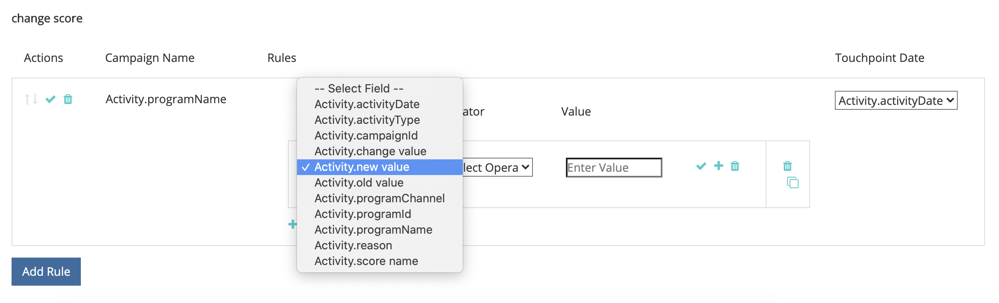

# [!DNL Marketo Engage] Integración de actividades {#marketo-engage-activities-integration}

Como parte del [!DNL Marketo Measure] y [!DNL Marketo Engage] Al integrarse, este esfuerzo por incorporar actividades de Marketo juega un papel enorme. A través de Actividades de Marketo, el sistema rastrea eventos como Hacer clic en correo electrónico, Cambiar puntuación o Cambiar estado en progresión: estos tipos de actividades se pueden reducir y definir para seleccionar un subconjunto apto para los puntos de contacto. Una vez creados los puntos de contacto de estas actividades, se rastrean en el recorrido de participación y se miden junto con otros canales de marketing, como la búsqueda de pago o el marketing de socio.

## Requisitos {#requirements}

* Instancia de Production Marketo
* Producción [!DNL Salesforce] o [!DNL Microsoft Dynamics] instancia
* Cualquier pago [!DNL Marketo Measure] suscripción
* Sincronización de personas de Marketo habilitada ([!DNL Marketo Measure] Configuración)
* Programas Marketo habilitados ([!DNL Marketo Measure] Configuración)
* Actividades de Marketo habilitadas ([!DNL Marketo Measure] Configuración)

## Instalación {#setup}

1. Para empezar a configurar actividades de Marketo, vaya a **Mi cuenta** > **Configuración** > **Actividades**.

   

   

   Lo primero que debe hacer es seleccionar la lista de tipos de actividades en los que planea crear reglas. No se requiere un número elevado de tipos de actividades, pero también recomendamos que no sobrecargue los puntos de contacto y diluya la importancia de los hitos significativos. Dicho esto, es posible que no necesite más de 5 tipos de actividades para rastrear las participaciones relevantes.

1. Haga clic en el menú desplegable debajo de [!UICONTROL Seleccionar tipos de actividades] para empezar a elegir los distintos tipos.

   

1. Una vez seleccionadas todas las actividades que necesita, también las verá rellenadas en su [!UICONTROL Lista de actividades seleccionadas] así como en [!UICONTROL Definir reglas].

   

1. Para cada tipo de actividad, debe definir una o más reglas que determinen qué registros cumplen los requisitos para los puntos de contacto. Para nuestro ejemplo, añadiremos una regla para el tipo de actividad &quot;Cambiar puntuación&quot; para que el sistema cree un punto de contacto cuando una persona de Marketo alcance una puntuación de 90 o buena.

1. En primer lugar, según el tipo de actividad, es posible que tenga que configurar una [!DNL Marketo Measure] Nombre de campaña que se puede utilizar más adelante para la asignación de canales. [!DNL Marketo Measure] Los nombres de campaña se pueden reutilizar en varias reglas. Esto ayuda a tener nombres más amplios que se pueden utilizar en una sola regla de canal. No todos los tipos de actividades contienen un programa de Marketo, por lo que es necesario especificar un nombre como primer paso.

   A continuación se muestra un ejemplo del aspecto que tendría ese paso adicional:

   

1. En nuestro ejemplo &quot;Cambiar puntuación&quot;, no es necesario introducir un Nombre de campaña, ya que podemos extraer esa información del Programa de Marketo. Ahora puede crear la expresión de regla. Siguiendo con el ejemplo, queremos seleccionar el campo &quot;[!UICONTROL Nuevo valor]&quot; con un operador de &quot;[!UICONTROL es bueno que]&quot; con un valor de 90.

   Puede ampliar las reglas y agregar filtros o criterios adicionales agregando instrucciones &quot;and&quot; u &quot;or&quot; para reducir los resultados.

   

   

1. Por último, elija lo que debemos utilizar como fecha de punto de contacto. Todos los campos de fecha y hora disponibles aparecerán aquí desde Marketo. A menos que tenga campos de fecha personalizados, verá &quot;[!UICONTROL Fecha de actividad].&quot;

   

1. Asegúrese de hacer clic en **[!UICONTROL Guardar como borrador]** en el camino para que no pierdas tus cambios.

   

1. Vaya a **[!UICONTROL Asignación de atributos]** pestaña.

   

1. Para cada tipo de actividad seleccionado, tiene la opción de asignar atributos de Marketo adicionales a los campos de Touchpoint para poder ver y crear informes de esos valores en [!DNL Marketo Measure Discover] o en el CRM.

   Muchos de los campos se han asignado automáticamente y no se pueden cambiar para que sean coherentes con el resto de las integraciones. Consulte la sección Asignaciones de campos a continuación para encontrar esos valores. Para algunos tipos de actividad, Marketo incluye atributos para una página de aterrizaje, una página de referencia o un explorador que se puede asignar de forma opcional a un campo de Touchpoint. En el ejemplo siguiente, hemos hecho algunas sugerencias adicionales que se pueden eliminar.

1. Selecciona el campo Punto de contacto del comprador de la columna izquierda a la que deseas asignar el artículo. A continuación, seleccione el atributo de Marketo que desee rellenar en el campo Punto de contacto del comprador. Recuerde que estas son asignaciones opcionales y adicionales, además de las que [!DNL Marketo Measure] ya ha establecido.

   Campos asignables:

   * Ciudad
   * País
   * Región
   * Página de aterrizaje
   * Página del referenciador
   * Página de formulario
   * Fecha de formulario
   * Plataforma
   * Explorador

   >[!NOTE]
   >
   >Los campos de publicidad como Contenido de publicidad o Palabra clave no están disponibles en esta lista, ya que se reservan para las integraciones de nuestra plataforma de publicidad.

## Tipos de actividades {#activity-types}

Algunos tipos de actividades nos proporcionan el ID de programa y el nombre del programa, por lo que es fácil asignarlos al ID de campaña y al nombre de campaña en el punto de contacto del comprador. Para otros, no hay ninguna asociación de programa, por lo que parte de la definición de reglas requiere la creación de una [!DNL Marketo Measure] Nombre de campaña. A continuación se muestran listas de cada categoría:

**Tipos de actividades con ID de programa**

Enviar correo electrónico (6)\
Correo electrónico enviado (7)\
Correo electrónico rechazado (8)\
Correo electrónico de cancelación de suscripción (9)\
Abrir correo electrónico (10)\
Haga clic en Correo electrónico (11)\
Cambiar valor de datos (13)\
Puntuación de cambio (22)\
Añadir a la lista (24)\
Cambiar estado en progresión (104)\
Añadir a Nutrir (113)\
Cambio de la cadencia de la nutrición (115)

>[!NOTE]
>
>De los tipos de actividades para los que se espera un ID de programa, si se detecta una actividad sin un programa, [!DNL Marketo Measure] no lo aceptará como punto de contacto apto, ya que no podemos tener valores de campaña nulos.

**Tipos de actividades sin ID de programa**

Haga clic en Vínculo (3)\
Nuevo posible cliente (12)\
Cable de sincronización a SFDC (19)\
Convertir posible cliente (21)\
Cambiar propietario (23)\
Eliminar de la lista (25)\
Actividad de SFDC (26)\
Correo electrónico rechazado (27)\
Eliminar posible cliente de SFDC (29)\
Combinar posibles clientes (32)\
Agregar a oportunidad (34)\
Quitar de oportunidad (35)\
Oportunidad de actualización (36)\
Eliminar posible cliente (37)\
Enviar alerta (38)\
Enviar correo electrónico de ventas (39)\
Abrir correo electrónico de ventas (40)\
Haga clic en Correo electrónico de ventas (41)\
Añadir a la campaña de SFDC (42)\
Eliminación de la campaña de SFDC (43)\
Cambiar estado en la campaña de SFDC (44)\
Correo electrónico de recepción de ventas (45)\
Campaña de solicitud (47)\
Correo electrónico de ventas devuelto (48)\
Cambiar etapa de ingresos (101)\
Cambiar etapa de ingresos manualmente (102)\
Cambiar segmento (108)\
Llamar a Webhook (110)\
Enviar Reenviar a un amigo Correo electrónico (111)\
Correo electrónico enviado a un amigo (112)\
Cambio de la pista de nutrición (114)\
Insertar posible cliente en Marketo (145)\
Sincronizar posible cliente con Microsoft (300)\
Compartir contenido (400) Documento interactuado con (158) Documento interactuado con (159) Cita de diálogo programada (160) Objetivo de diálogo alcanzado (161) Actividad personalizada (xxx)

## Asignación de canales {#channel-mapping}

Para cualquiera de las reglas de un tipo de actividad con un ID de programa, el canal de programa de Marketo se determina a partir del programa. Utilizamos el canal de programa para asignarlo a sus canales sin conexión personalizados, por lo que deberá asegurarse de que sus canales estén configurados correctamente [como se indica aquí](/help/marketo-measure-and-marketo/marketo-measure-integrations-with-marketo/marketo-engage-programs-integration.md#channel-mapping).

Y para cualquiera de las reglas de un tipo de actividad sin un ID de programa, el primer paso fue crear un nombre de campaña. Utilice este Nombre de campaña para configurar sus canales en línea personalizados [presentado aquí](/help/channel-tracking-and-setup/online-channels/online-custom-channel-setup.md).

Si los canales de las actividades de Marketo no están correctamente configurados, es probable que los nuevos puntos de contacto entren en el canal &quot;Otro&quot;.

## Costos de programa {#program-costs}

Mediante la importación de datos de los programas de Marketo, los costes se descargan automáticamente de los costes del periodo y el coste notificado en Marketo se distribuye a lo largo del mes asignado. Por ejemplo, si se informa de 1000 $ para enero de 2021, los 1000 $ se dividen en 31 días. Los costes se encuentran en [!DNL Marketo Measure Discover].

## Asignación de cookies {#cookie-mapping}

Como resultado de la [!DNL Marketo Measure] integración con Marketo, la [!DNL Marketo Measure] El ID de cookie ahora también está asignado y sincronizado con el [!DNL Marketo Munchkin Id]. Esto ayuda a cerrar la brecha para atribuir el primer contacto anónimo a una sesión web en lugar de atribuir los toques FTP y LC a una actividad de Marketo. Imagine este escenario:

Mark hace clic en un anuncio de Facebook y llega a wayneenterprises.com donde se le cookie con [!DNL Marketo Measure] Id 123 y [!DNL Marketo Munchkin Id] 456. No se rellena ningún formulario.

El equipo de marketing de empresas de Wayne envía una notificación por correo electrónico a posibles clientes específicos, uno de los cuales es `mark@email.com`.

`mark@email.com` recibe el correo electrónico, hace clic en y aterriza en `wayneenterprises.com`. Esto se convierte en `mark@email.com's` segunda visita a `wayneenterprise.com` con los mismos ID de cookie, pero no se rellenó el formulario, por lo que [!DNL Marketo Measure]Sin embargo, siguen siendo un visitante anónimo.

El equipo de marketing de empresas Wayne crea una regla de actividad de Marketo para generar puntos de contacto para un tipo de actividad de &quot;clic en correo electrónico&quot;.

La implementación de hoy crearía un único punto de contacto FT y LC para `mark@email.com` de la actividad de Marketo desde el tipo de actividad &quot;Haga clic en correo electrónico&quot;.

Con esta mejora de la asignación de cookies, el FTP regresaría y se acreditaría al anuncio de Facebook y la LC se acreditaría al correo electrónico.

>[!NOTE]
>
>Con el comportamiento de asignación de cookies, puede encontrar algunos puntos de contacto LC que provienen de una visita web. Es posible que un posible cliente apareciera en Marketo sin ninguna actividad asociada, y [!DNL Marketo Measure] descargó ese posible cliente, comparó las cookies asociadas y, a continuación, lo rastreó hasta la sesión web más reciente, incluso si no había ninguna actividad de formulario que creara el posible cliente.

## Preguntas frecuentes {#faq}

**¿Cómo sé si crear una regla de Programas de Marketo o una regla de Actividades de Marketo?**

El [!DNL Marketo Engage] La integración de programas es una forma sencilla de generar puntos de contacto en función de si una persona es o no miembro de un programa. Si está interesado en definir una regla basada en el momento en que una persona cambia a un estado de programa determinado, la variable [!DNL Marketo Engage] La integración de actividades será la configuración que desee, específicamente el tipo de actividad &quot;Cambiar estado en progresión&quot; para que la fecha de punto de contacto se pueda asignar a la fecha de actividad generada por el sistema.

**¿Por qué se trunca el nombre de mi tipo de punto de contacto?**

El campo Tipo de punto de contacto se creó en la variable [!DNL Marketo Measure] paquete con 16 caracteres. Lamentablemente, cambiar el límite de caracteres del campo requeriría dejar obsoleto el campo existente y crear uno nuevo. El valor del Tipo de punto de contacto es el Tipo de actividad, que también se establece en el campo Medio.

**¿Por qué mi tipo de actividad personalizada no aparece en la lista de actividades disponibles?**

Solo se muestran los tipos de actividad personalizados &quot;Aprobado&quot; y no Borrador ni Aprobado con Borrador.

**¿Cómo puedo determinar para qué tipos de actividades deseo generar un punto de contacto?**

Aunque no hay límite en el número de tipos de actividades que puede crear, generalmente recomendamos no más de 5 tipos de actividades. Se tarda tiempo en determinar qué actividades de marketing son lo suficientemente relevantes como para formar parte del recorrido de puntos de contacto. Por ejemplo, puede que &quot;Cancelar la suscripción al correo electrónico&quot; no sea un punto de contacto significativo para rastrear, pero &quot;Hacer clic en el correo electrónico&quot; con filtros adicionales podría ser uno bueno. Esto varía según cada organización y cada equipo, por lo que le sugerimos que trabaje con sus equipos para generar ideas sobre el mejor enfoque aquí.

**¿Por qué está desactivado mi nombre de explorador?**

El [!DNL Marketo Measure] El nombre del explorador tiene un límite estricto de 20 caracteres, aunque el valor de agente de usuario que obtenemos de Marketo tiende a ser una cadena más larga.

BrowserInfo.Name\
BrowserInfo.Version\
PlatformInfo.Name\
PlatformInfo.Version
