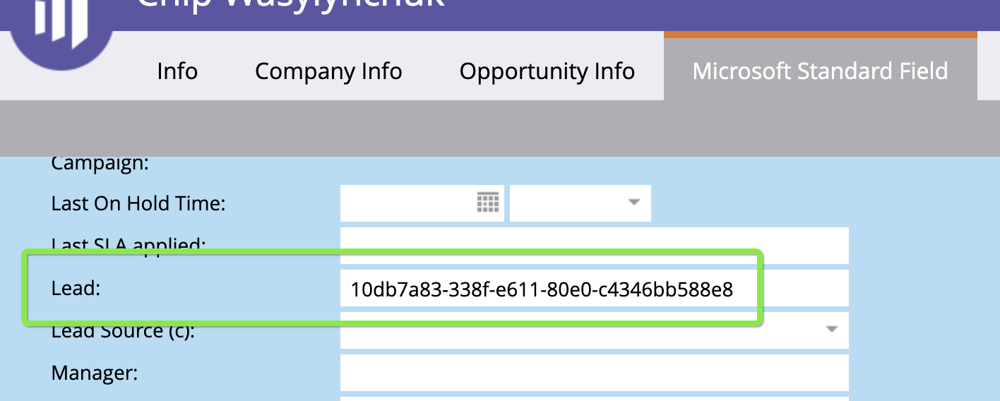

# [!DNL Marketo Engage] Integración de personas {#marketo-engage-people-integration}

La integración de personas de Marketo permite [!DNL Marketo Measure] para empezar a descargar personas de Marketo y comenzar a vincular sus sesiones rastreadas al usuario y asignar puntos de contacto a sus participaciones. Históricamente, [!DNL Marketo Measure] solo pudo asignar puntos de contacto a una persona desde CRM, por lo que esto ayuda a los especialistas en marketing a medir sus esfuerzos de marketing antes que esperar una fase o un déclencheur para sincronizarlo con CRM.

## Requisitos {#requirements}

* Instancia de Production Marketo
* Producción [!DNL Salesforce] o [!DNL Microsoft Dynamics] instancia
* Cualquier pago [!DNL Marketo Measure] suscripción
* SOLR activado (póngase en contacto con [Asistencia de Marketo](https://nation.marketo.com/t5/Support/ct-p/Support) para tener esto habilitado)

## Cómo funciona {#how-it-works}

Como cliente actual, [!DNL Marketo Measure] ya está descargando personas de su CRM. El proceso estándar es que [!DNL Marketo Measure] descarga people y asigna la dirección de correo electrónico a una sesión web de la que hemos realizado un seguimiento a través de bizible.js.

Con la introducción de descargar Marketo people, [!DNL Marketo Measure] ahora puede asignar sesiones web a un grupo más grande de individuos, los que no se han sincronizado con CRM. Normalmente vemos esto debido a procesos internos que esperan hasta que las personas alcanzan un determinado estado antes de ser insertadas en el CRM.

Cuándo [!DNL Marketo Measure] asigna correctamente la persona de Marketo a una sesión web y nuestro procesamiento generará cualquier punto de contacto relevante para ella que, en última instancia, se puede registrar en [!DNL Marketo Measure Discover]. Si esa persona de Marketo se inserta en el CRM, [!DNL Marketo Measure] gestionará el escenario duplicado y recrearemos el punto de contacto para la persona de CRM y marcaremos el conjunto inicial como &quot;duplicado&quot;.

Para que podamos detectar estos duplicados, asegúrese de que su [!DNL Marketo-Salesforce] o [!DNL Marketo-Dynamics] La sincronización está rellenando los ID de contacto y posible cliente en la persona de Marketo. Si el ID se sincroniza correctamente, debería poder ver el CRM Id en el registro de persona, de esta manera:

Los clientes tienen la opción de informar de todo el conjunto de personas de Marketo y personas de CRM dentro de [!DNL Marketo Measure] Descubrir. Si solo le interesa informar sobre personas de CRM, le recomendamos que cree un Segmento para filtrarlos.

## [!DNL Marketo Measure Discover] {#marketo-measure-discover}

Al informar sobre posibles clientes (personas) en [!DNL Marketo Measure Discover], verá el total de sus posibles clientes de Marketo y CRM. Para informar solo sobre las personas de Marketo o solo sobre los posibles clientes de CRM, debe crear una Categoría de segmento para el origen y, a continuación, crear Reglas de segmento para Marketo y CRM mediante el campo &quot;Sistema de origen&quot; para definir la regla. Una vez creados los segmentos, verá la categoría Fuente disponible para filtrar por el [!DNL Marketo Measure Discover] paneles.

## Asignaciones de campos {#field-mappings}

<table> 
 <colgroup> 
  <col> 
  <col> 
 </colgroup> 
 <tbody> 
  <tr> 
   <th>
<strong>biz_leads</strong>
</th> 
   <th>
<strong>Marketo</strong>
</th> 
  </tr> 
  <tr> 
   <td>
ID
</td> 
   <td>
Identificación
</td> 
  </tr> 
  <tr> 
   <td>
MODIFIED_DATE
</td> 
   <td>
updatedAt<strong>*</strong>
</td> 
  </tr> 
  <tr> 
   <td>
CREATED_DATE
</td> 
   <td>
createdAt
</td> 
  </tr> 
  <tr> 
   <td>
EMAIL
</td> 
   <td>
email
</td> 
  </tr> 
  <tr> 
   <td>
WEB_SITE
</td> 
   <td>
sitio web
</td> 
  </tr> 
  <tr> 
   <td>
COMPANY
</td> 
   <td>
compañía
</td> 
  </tr> 
  <tr> 
   <td>
IS_CONVERTED
</td> 
   <td>
n/a
</td> 
  </tr> 
  <tr> 
   <td>
ACCOUNT_ID
</td> 
   <td>
ID de cuenta (L2A)
</td> 
  </tr> 
  <tr> 
   <td>
BIZIBLE_STAGE
</td> 
   <td>
Estado
</td> 
  </tr> 
  <tr> 
   <td>
IS_DELETED
</td> 
   <td>
true/false
</td> 
  </tr> 
 </tbody> 
</table>

* Hay un problema de comportamiento conocido en el que los campos de la entidad Compañía de Marketo no afectan al valor de actualización de fecha de la persona, por lo que si se actualizan los campos relevantes como Sitio web o Compañía, [!DNL Marketo Measure] no sabrá que esos valores están modificados porque el valor updatedAt fecha/hora no está actualizado. Esto afecta a la función ABM, donde no tendríamos datos nuevos para resolver la cuenta del posible cliente. No hay una solución en este momento, pero hay planes para abordar esto en el futuro.

## Preguntas frecuentes {#faq}

**¿Por qué difieren mis recuentos de posibles clientes entre mi CRM y [!DNL Marketo Measure Discover]?**

Debido a que esta integración nos permite crear puntos de contacto para posibles clientes que hemos importado directamente desde Marketo, puede haber posibles clientes que no se hayan sincronizado con CRM. Por lo tanto, el recuento dentro de Discover podría ser mayor que el de CRM, ya que los puntos de contacto solo se insertan para los posibles clientes de CRM.

**¿Cómo reemplaza esto mis datos?**

Esta integración combina realmente los conjuntos de datos dentro de su [!DNL Marketo Measure] por lo que no se reemplazará nada. Lo que esperaríamos de sus posibles clientes actuales de CRM es que cuando descarguemos los posibles clientes correspondientes a dos años de Marketo, simplemente actualicemos ese registro de posibles clientes para mostrar que también hubo una coincidencia con un posible cliente de Marketo. Que todo sucede en el back-end y se espera que los puntos de contacto sigan siendo los mismos. También esperamos ver más puntos de contacto debido a los posibles clientes de Marketo. Si somos capaces de encontrar sesiones web que coincidan con esas personas de Marketo, empezaremos a ver los puntos de contacto contabilizados en [!DNL Marketo Measure].

**¿Puedo hacer que mis recursos solo se descarguen de Marketo y se interrumpa la conexión CRM?**

En este momento, no. Tendremos esta opción en el futuro, pero necesitamos desarrollar otras fases de esta integración de Marketo para poder conectar los programas, oportunidades y ofertas de Marketo a [!DNL Marketo Measure].

**¿Importas a TODA mi gente de Marketo?**

Por el momento, lo más pronto que importaremos personas es a partir del 1/1/2018 para que tengamos un mínimo de 2 años de datos, que es el mismo comportamiento que aplicamos desde las descargas de CRM. Implementaremos un comportamiento mejorado para descargar una ventana móvil de 2 años una vez que se haya establecido la conexión de Marketo.

Tampoco filtramos por ningún tipo de persona, por lo que todas las personas dentro de la ventana de dos años se importarán y serán elegibles para puntos de contacto.

**¿Qué es SOLR y por qué necesito tenerlo habilitado para usar esta función?**

Habilitar SOLR para su instancia de Marketo es un paso trivial que abre espacio de hardware en Marketo para que su suscripción pueda utilizar el [!DNL Marketo Measure] integración. Sin SOLR habilitado, no tenemos acceso a ciertas llamadas que de otra manera nos permitirían descargar a las personas adecuadas de su instancia de Marketo.
