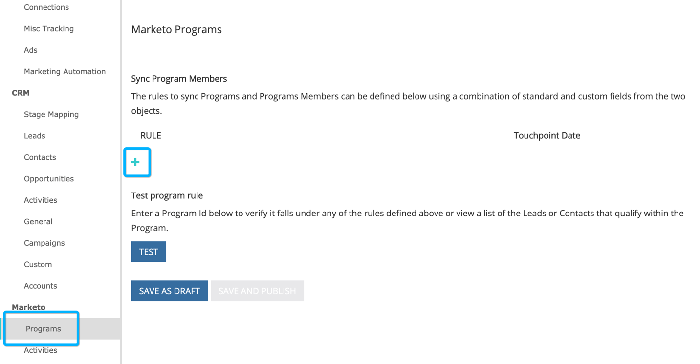

# Integración de programas de [!DNL Marketo Engage] {#marketo-engage-programs-integration}

A través de la integración de [!DNL Marketo Measure] con los programas de [!DNL Marketo Engage], nuestros clientes pueden empezar a crear puntos de contacto para el seguimiento de atribución desde las suscripciones a programas de Marketo. Esta capacidad permite a los especialistas en marketing iniciar el seguimiento de las suscripciones a programas desde programas de correo electrónico o participación que de otra manera no serían vistos por el javascript [!DNL Marketo Measure] y deberían medirse dentro del recorrido de atribución.

## Disponibilidad {#availability}

Todos los niveles.

## Requisitos {#requirements}

* Instancia de Production Marketo
* Instancia de Production Salesforce o Microsoft Dynamics
* Cualquier suscripción pagada de [!DNL Marketo Measure]
* Sincronización de personas de Marketo habilitada (configuración de [!DNL Marketo Measure])
* Programas de Marketo habilitados (configuración de [!DNL Marketo Measure])

## Instalación {#setup}

**Reglas**

1. Para comenzar a configurar reglas en los programas de Marketo, vaya a **[!UICONTROL Mi cuenta]** > **[!UICONTROL Configuración]** > **[!UICONTROL Programas]**. Haga clic en el icono **+** para comenzar a crear la primera regla.

   

   

1. Si lo desea, puede definir un nombre para la regla si resulta útil realizar un seguimiento de la misma. En primer lugar, debe seleccionar el campo para definir la regla en la lista de campos Program y Program Membership. Continúe creando la regla seleccionando el operador y el valor esperado que desea comprobar.

   

1. Añada otra instrucción dentro del mismo cuadro para configurar un criterio &quot;y&quot; en la regla o haga clic en el icono + fuera del cuadro para configurar una instrucción &quot;o&quot;.

   

1. Elija qué fecha o campo de fecha/hora debe utilizarse para asignar a la fecha del punto de contacto. Para ver la lista de valores disponibles en Marketo, escriba un corchete angular `{` y se mostrarán los campos disponibles.

   

   >[!NOTE]
   >
   >Si la regla desea capturar la fecha de la actividad o la fecha en la que un miembro del programa alcanzó un estado determinado, necesitará utilizar la integración de actividades de [!DNL Marketo Engage] y configurar una regla para el tipo de actividad &quot;Cambiar estado en progreso&quot;.

   

La regla completada debería tener un aspecto similar al siguiente:

## Prueba {#test}

Después de crear algunas reglas, es posible que desee probarlas para comprobar que la instrucción coincide con los programas.

1. Para ejecutar una prueba, haga clic en el botón **[!UICONTROL PRUEBA]** como se muestra a continuación.

   

1. Aparecerá un modal donde puede introducir el ID de programa desde Marketo.

   

   Una vez que ingrese el identificador y haga clic en el botón [!UICONTROL Test], nuestro motor de reglas revisará cada regla y determinará si el programa se ajusta o no a alguna de las reglas. En el ejemplo siguiente, puede ver que el programa 1002, denominado [!DNL Marketo Measure] Ebook, tiene 5 miembros de programa y es elegible debido a la regla que se muestra.

   Las reglas se ejecutan en un tamaño de muestra de 5000 miembros. Si su programa contiene más de 5000 miembros, es posible que no verifiquemos la compatibilidad de todos los miembros. Esta herramienta simplemente sirve como una forma de comprobar si las reglas se construyen correctamente.

   

   Puede hacer clic en el recuento de miembros para ver una lista de los ID de personas de Marketo que cumplen los requisitos dentro del programa.

   

## Asignación de canales {#channel-mapping}

En la lista de canales de programa de Marketo, deseará asignar los valores a los [!DNL Marketo Measure] canales de marketing personalizados que ha creado en Configuración. Cualquier punto de contacto generado por estos programas heredará los nombres de canal y subcanal que seleccione aquí.

1. Empiece navegando hasta **[!UICONTROL Mi cuenta]** > **[!UICONTROL Configuración]** > **[!UICONTROL Canales sin conexión]**.

1. En la parte superior, tendrá la opción de asignar a sus tipos de campaña de CRM y, a continuación, abajo, verá las opciones para sus canales de programa de Marketo.

1. Seleccione primero el canal que debe asignarse al valor y, a continuación, seleccione opcionalmente el subcanal. Cuando termine, haga clic en **[!UICONTROL Guardar]** en la parte inferior.

   

## Costos de programa {#program-costs}

Mediante la importación de datos de los programas de Marketo, los costes se descargan automáticamente de los costes del periodo y el coste notificado en Marketo se distribuye a lo largo del mes asignado. Por ejemplo, si se informa de 1000 $ para enero de 2021, los 1000 $ se dividen en 31 días. Los costos se pueden encontrar en [!DNL Marketo Measure Discover].

>[!NOTE]
>
>Marketo Measure solo admite una entrada de coste de período por mes. Para asegurarse de que se importan todos los costes, añada el coste mensual total en una sola entrada. No se admiten varios movimientos de coste de período para el mismo mes.

## Cómo funciona {#how-it-works}

**Asignaciones de campos**

<table><thead>
  <tr> 
   <th>biz_ad_campaigns</th> 
   <th>Marketo</th> 
  </tr></thead>
<tbody>
  <tr> 
   <td>ID</td> 
   <td>Identificación</td> 
  </tr> 
  <tr> 
   <td>IS_DELETED</td> 
   <td>(compruebe si el programa sigue existiendo a través de la API)</td> 
  </tr> 
  <tr> 
   <td>NAME</td> 
   <td>name</td> 
  </tr> 
 </tbody> 
</table>

<table><thead>
  <tr>
    <th>biz_campaign_members</th>
    <th>Marketo</th>
  </tr></thead>
<tbody>
  <tr>
    <td>ID</td>
    <td>"MarketoProgramMembership"_ProgramId_Lead Id</td>
  </tr>
  <tr>
    <td>MODIFIED_DATE</td>
    <td>updatedAt</td>
  </tr>
  <tr>
    <td>CREATED_DATE</td>
    <td>memberDate</td>
  </tr>
  <tr>
    <td>LEAD_ID</td>
    <td>ID (inscripción a la lista)</td>
  </tr>
  <tr>
    <td>LEAD_EMAIL</td>
    <td>Correo electrónico (miembros de lista)</td>
  </tr>
  <tr>
    <td>STATUS</td>
    <td>progressionStatus</td>
  </tr>
  <tr>
    <td>HAS_RESPONDED</td>
    <td>reachedStatus</td>
  </tr>
  <tr>
    <td>CAMPAIGN_NAME</td>
    <td>programName</td>
  </tr>
  <tr>
    <td>CAMPAIGN_ID</td>
    <td>programId</td>
  </tr>
  <tr>
    <td>CAMPAIGN_TYPE</td>
    <td>canal</td>
  </tr>
</tbody>
</table>

## Asignación de cookies {#cookie-mapping}

Como resultado de la integración de [!DNL Marketo Measure] con Marketo, el identificador de cookie [!DNL Marketo Measure] ahora también se asigna y sincroniza con [!DNL Marketo Munchkin Id]. Esto ayuda a cerrar la brecha para atribuir el primer contacto anónimo a una sesión web en lugar de atribuir los toques FTP y LC a una actividad de Marketo. Imagine este escenario:

Mark hace clic en un anuncio de [!DNL Facebook] y llega a wayneenterprises.com donde se le cookie con el identificador 123 de [!DNL Marketo Measure] y el identificador 456 de [!DNL Marketo Munchkin Id]. No se rellena ningún formulario.

El equipo de marketing de empresas de Wayne envía una notificación por correo electrónico a posibles clientes específicos, uno de los cuales es `mark@email.com`.

`mark@email.com` recibe el correo electrónico, hace clic y aterriza en wayneenterprises.com. Esto se convierte en `mark@email.com's` segunda visita a `wayneenterprise.com` con los mismos ID de cookie, pero no se rellenó el formulario, por lo que para [!DNL Marketo Measure], sigue siendo un visitante anónimo.

El equipo de marketing de empresas Wayne crea una regla de actividad de Marketo para generar puntos de contacto para un tipo de actividad de &quot;clic en correo electrónico&quot;.

La implementación de hoy crearía un único punto de contacto FT y LC para `mark@email.com` desde la actividad de Marketo a partir del tipo de actividad &quot;Hacer clic en el correo electrónico&quot;.

Con esta mejora de la asignación de cookies, la FT volvería y se acreditaría al anuncio de [!DNL Facebook], y la LC se acreditaría al correo electrónico.

>[!NOTE]
>
>Con el comportamiento de asignación de cookies, puede encontrar algunos puntos de contacto LC que provienen de una visita web. Es posible que un posible cliente apareciera en Marketo sin ninguna actividad asociada, que luego [!DNL Marketo Measure] descargara ese posible cliente, que coincidiera con las cookies asociadas y que luego lo rastreara hasta la sesión web más reciente, incluso si no había ninguna actividad de formulario que creara el posible cliente.

## Preguntas frecuentes {#faq}

**¿Cómo configuro la fecha de punto de contacto para que sea la fecha de progresión o la fecha en que se produjo el cambio de estado para el miembro de mi programa?**

Si la regla desea capturar la fecha de la actividad o la fecha en la que un miembro del programa alcanzó un estado determinado, necesitará utilizar la integración de actividades de [!DNL Marketo Engage] y configurar una regla para el tipo de actividad &quot;Cambiar estado en progreso&quot;. De lo contrario, la integración de programas de [!DNL Marketo Engage] solo hace que la fecha de pertenencia esté disponible, que es la primera fecha que llevó a la persona de Marketo al programa, aunque haya varios estados.

**¿Puedo obtener una lista de opciones de fecha para la fecha de punto de contacto?**

Para almacenar en déclencheur el completado automático, comience introduciendo una llave inglesa `{` en el campo de texto y, a continuación, aparecerán los campos disponibles.

**Si creo reglas de Programa Marketo y también tengo reglas de Campaña CRM, ¿se contarán dos veces?**

Depende de la definición de la regla, pero posiblemente, sí. deseará evaluar su conjunto de reglas para no tener reglas que abarquen un Programa y una Campaña, ya que no se anulará la duplicación ni se detectarán suscripciones similares. Una posible solución es copiar las reglas de Campaign en Programas si desea que Marketo sea la única fuente fiable y luego eliminar las reglas de Campaign. Otra opción es agregar un criterio &quot;CreatedOn&quot; o &quot;CreatedDate&quot; en las reglas para que las reglas anteriores a una fecha determinada utilicen reglas de Campaign y las reglas posteriores a una fecha determinada utilicen reglas de Programa. Hay muchas soluciones, pero se necesitará algo de planificación y coordinación.

**¿Están disponibles para definir los campos personalizados de pertenencia a programas de Marketo?**

Debido a limitaciones técnicas, por ahora no se pueden admitir campos personalizados de pertenencia a programas. Una vez que esos campos estén disponibles a través de API de Marketo adicionales, se expondrán a nosotros y serán visibles para que los utilice.

**¿Cómo sé si usar Programas o Actividades?**

La integración de programas de [!DNL Marketo Engage] es una forma sencilla de generar puntos de contacto en función de si una persona es o no miembro de un programa. Si está interesado en definir una regla basada en el momento en que una persona cambia a un estado de programa determinado, la integración de actividades de [!DNL Marketo Engage] será la configuración que desee, específicamente el tipo de actividad &quot;Cambiar estado en progreso&quot;.
