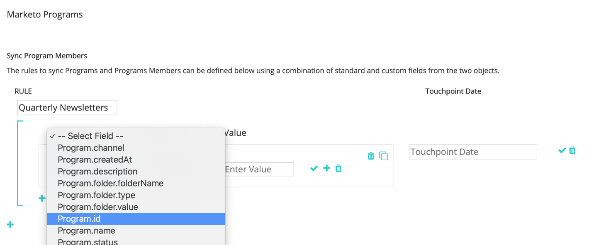
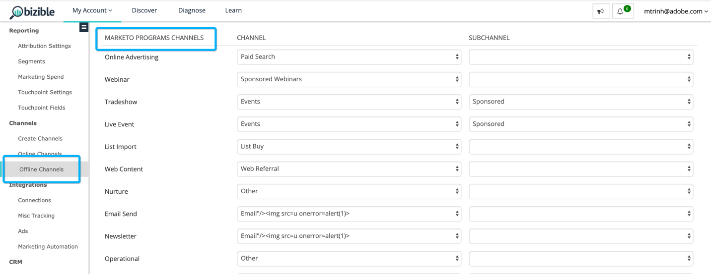

# [!DNL Marketo Engage] Integración de programas {#marketo-engage-programs-integration}

A través de [!DNL Marketo Measure] integración con [!DNL Marketo Engage] Programas, nuestros clientes pueden empezar a crear puntos de contacto para el seguimiento de atribuciones desde Membresías del programa Marketo. Esta capacidad permite a los especialistas en marketing iniciar el seguimiento de las suscripciones a programas desde correos electrónicos o programas de participación que, de lo contrario, no vería el [!DNL Marketo Measure] javascript y deben medirse dentro del recorrido de atribución.

## Disponibilidad {#availability}

Todos los niveles.

## Requisitos {#requirements}

* Instancia de Marketo de producción
* Instancia de Production Salesforce o Microsoft Dynamics
* Cualquier pago [!DNL Marketo Measure] suscripción
* Sincronización de personas de Marketo habilitada ([!DNL Marketo Measure] Configuración)
* Programas de Marketo habilitados ([!DNL Marketo Measure] Configuración)

## Instalación {#setup}

**Reglas**

1. Para empezar a configurar reglas en programas de Marketo, vaya a **[!UICONTROL Mi cuenta]** > **[!UICONTROL Configuración]** > **[!UICONTROL Programas]**. Haga clic en el **+** para comenzar a crear la primera regla.

   

   

1. Si lo desea, puede configurar un nombre para la regla si le ayuda a realizar un seguimiento de ellos. En primer lugar, seleccione el campo para definir la regla en la lista de campos Programa y Pertenencia a programas . Continúe creando la regla seleccionando el operador y el valor esperado que se va a comprobar.

   

1. Agregue otra instrucción dentro del mismo cuadro para configurar un criterio &quot;y&quot; en la regla o haga clic en el icono + fuera del cuadro para configurar una instrucción &quot;o&quot;.

   

1. Elija qué campo de fecha y hora debe utilizarse para asignar a la fecha del punto de contacto. Para ver la lista de valores disponibles en Marketo, introduzca una llave `{` y mostraremos los campos disponibles.

   

   >[!NOTE]
   >
   >Si la regla desea capturar la fecha de actividad o la fecha en la que un miembro del programa alcanzó un estado concreto, debe utilizar la variable [!DNL Marketo Engage] Integración de actividades y configure una regla para el tipo de actividad &quot;Cambiar estado en progresión&quot;.

   

La regla completada debería tener un aspecto similar al siguiente:

## Prueba {#test}

Después de crear algunas reglas, es posible que desee probarlas para comprobar que su instrucción coincide con sus Programas.

1. Para ejecutar una prueba, haga clic en el botón **[!UICONTROL PRUEBA]** como se muestra a continuación.

   

1. Aparecerá un modal en el que puede introducir en el ID de programa de Marketo.

   

   Una vez que introduzca el Id y haga clic en el [!UICONTROL Prueba] , nuestro motor de reglas revisará cada regla y determinará si el Programa se ajusta o no a alguna de las reglas. En el siguiente ejemplo, puede ver el Programa 1002, llamado [!DNL Marketo Measure] Ebook, tiene 5 miembros del programa y es elegible debido a la regla que se muestra.

   Las reglas se ejecutan sobre un tamaño de muestra de 5000 miembros. Si su programa contiene más de 5000 miembros, es posible que no verifiquemos la compatibilidad de todos los miembros. Esta herramienta simplemente sirve para comprobar que las reglas se construyen correctamente.

   

   Puede hacer clic en Recuento de miembros para ver una lista de Marketo People Id que cumplen los requisitos dentro del programa.

   

## Asignación de canales {#channel-mapping}

En la lista de canales de programa de Marketo, tendrá que asignar los valores a la variable [!DNL Marketo Measure] canales de marketing personalizados que ha creado en Configuración. Los puntos de contacto generados por estos programas heredarán los nombres de canal y subcanal que seleccione aquí.

1. Para empezar, vaya a **[!UICONTROL Mi cuenta]** > **[!UICONTROL Configuración]** > **[!UICONTROL Canales sin conexión]**.

1. En la parte superior, tendrá la opción de asignar a sus tipos de campaña de CRM y, a continuación, debajo, verá las opciones para sus canales de programa de Marketo.

1. Seleccione primero el Canal que debe asignarse al valor y, a continuación, seleccione de forma opcional el Subcanal. Una vez que haya terminado, haga clic en **[!UICONTROL Guardar]** en la parte inferior.

   

## Costes del programa {#program-costs}

A través de la importación de datos de Marketo Programs, los costes se descargan automáticamente de Period Costs y el coste registrado en Marketo se distribuye a lo largo del mes asignado. Por ejemplo, si se informa de 1000 dólares para enero de 2021, los 1000 dólares se dividen en 31 días. Los costes se encuentran en [!DNL Marketo Measure Discover].

## Cómo funciona {#how-it-works}

**Asignaciones de campos**

<table> 
 <colgroup> 
  <col> 
  <col> 
 </colgroup> 
 <tbody> 
  <tr> 
   <th>biz_ad_igns</th> 
   <th>Marketo</th> 
  </tr> 
  <tr> 
   <td>Identificación</td> 
   <td>Identificación</td> 
  </tr> 
  <tr> 
   <td>IS_DELETED</td> 
   <td>(compruebe si el programa sigue existiendo mediante API)</td> 
  </tr> 
  <tr> 
   <td>
NAME
</td> 
   <td>name</td> 
  </tr> 
 </tbody> 
</table>

| biz_campaign_Members | Marketo |
|---|---|
| Identificación | &quot;MarketoProgramMembership&quot;_ProgramId_Lead Id |
| MODIFIED_DATE | updateAt |
| CREATED_DATE | membershipDate |
| LEAD_ID | Id (pertenencia a la lista) |
| LEAD_EMAIL | Correo electrónico (pertenencia a la lista) |
| ESTADO | progressionStatus |
| HAS_RESPONDED | reachedStatus |
| CAMPAIGN_NAME | programName |
| CAMPAIGN_ID | programId |
| CAMPAIGN_TYPE | canal |

## Asignación de cookies {#cookie-mapping}

Como resultado de [!DNL Marketo Measure] integración con Marketo, la variable [!DNL Marketo Measure] El ID de cookie ahora también se asigna y sincroniza con la variable [!DNL Marketo Munchkin Id]. Esto ayuda a cerrar el espacio para atribuir el primer contacto anónimo a una sesión web en lugar de atribuir los toques de FT y LC a una actividad de Marketo. Imagine este escenario:

Marcar clics en un [!DNL Facebook] y llega a wayneenterprise.com donde se le olfatea [!DNL Marketo Measure] Id. 123 y [!DNL Marketo Munchkin Id] 456. No se rellena el formulario.

El equipo de Marketing de Wayne Enterprise envía una descarga de correo electrónico a posibles clientes específicos, uno de los cuales es `mark@email.com`.

`mark@email.com` recibe el correo electrónico y los clics a través de y aterriza en wayneenterprise.com. Esto se convierte en `mark@email.com's` segunda visita a `wayneenterprise.com` con los mismos ID de cookie, pero no había ningún rellenado de formulario, por lo que se debe [!DNL Marketo Measure], siguen siendo visitantes anónimos.

El equipo de marketing de Wayne Enterprise crea una regla de actividad de Marketo para generar puntos de contacto para un tipo de actividad &quot;Haga clic en Correo electrónico&quot;.

La implementación actual crearía un único punto de contacto de FT y LC para `mark@email.com` desde la actividad de Marketo desde el tipo de actividad &quot;Haga clic en Correo electrónico&quot;.

Con esta mejora de la asignación de cookies, el FT volvería y se acreditaría al [!DNL Facebook] y la LC se acreditarían al correo electrónico.

>[!NOTE]
>
>Con el comportamiento de asignación de cookies, puede encontrar algunos puntos de contacto LC que provienen de una visita web. Es posible que un posible cliente apareciera en Marketo sin ninguna actividad asociada, entonces [!DNL Marketo Measure] descargó ese posible cliente, coincidió con las cookies asociadas y luego lo rastreó en la sesión web más reciente, incluso si no había ninguna actividad de formulario que creara el posible cliente.

## Preguntas frecuentes {#faq}

**¿Cómo configuro la fecha del punto de contacto como la fecha de progresión o la fecha en la que se produjo el cambio de estado en mi miembro del programa?**

Si la regla desea capturar la fecha de actividad o la fecha en la que un miembro del programa alcanzó un estado concreto, debe utilizar la variable [!DNL Marketo Engage] Integración de actividades y configure una regla para el tipo de actividad &quot;Cambiar estado en progresión&quot;. De lo contrario, la función [!DNL Marketo Engage] La integración de programas solo hace que la fecha de pertenencia esté disponible, que es la primera fecha que introdujo a la persona de Marketo en el Programa, aunque haya varios estados.

**¿Puedo obtener una lista de opciones de fechas para la fecha del punto de contacto?**

Para obtener un déclencheur del autocompletado, comience introduciendo un horquillado `{` en el campo de texto, aparecen los campos disponibles.

**Si creo reglas de programa de Marketo y también tengo reglas de CRM Campaign, ¿se contarán dos veces?**

Depende de la definición de la regla, pero posiblemente sí. Debe evaluar el conjunto de reglas para que no tenga reglas que cubran un programa y una campaña, ya que no anularemos la duplicación ni detectaremos suscripciones similares. Una posible solución es copiar las reglas de Campaign en Programas si desea que Marketo sea la única fuente de verdad y, a continuación, eliminar las reglas de Campaign. Otra opción es agregar los criterios &quot;CreatedOn&quot; o &quot;CreatedDate&quot; en las reglas para que las reglas anteriores a una fecha determinada utilicen reglas y reglas de Campaign posteriores a una fecha determinada para utilizar las reglas de Programa. Hay muchas soluciones, pero tomará algo de planificación y coordinación.

**¿Los campos personalizados de pertenencia a programas de Marketo están disponibles para definir?**

Debido a limitaciones técnicas, no podemos admitir los campos personalizados de pertenencia a programas por ahora. Una vez que esos campos estén disponibles a través de API de Marketo adicionales, se expondrán a nosotros y serán visibles para que los use.

**¿Cómo sé si usar Programas o Actividades?**

La variable [!DNL Marketo Engage] La integración de programas es una forma sencilla de generar puntos de contacto en función de si una persona es o no miembro de un programa. Si le interesa definir una regla en función del momento en el que una persona cambia a un estado de programa determinado, la variable [!DNL Marketo Engage] La integración de actividades es la configuración que desea, específicamente el tipo de actividad &quot;Cambiar estado en progresión&quot;.
